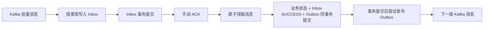
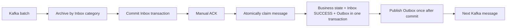

# Firefly

[简体中文](#简体中文) · [English](#english)

Firefly 是一个基于 Spring Boot、Kafka 和 MySQL 的流水线编排服务。它管理 Pipeline 配置与构建记录，按顺序推进 Stage，在 Job Chain 中调度 Job，并通过 Inbox/Outbox 保存消息处理证据。

Firefly is a pipeline orchestration service built with Spring Boot, Kafka, and MySQL. It manages Pipeline definitions and builds, advances ordered Stages, schedules Jobs in chains, and preserves message-processing evidence with Inbox and Outbox tables.

## 简体中文

### 执行模型

```text
Pipeline Build
└── Stage Build（按 stageOrder 串行）
    ├── Job Chain A（链内串行）
    │   ├── Job A1
    │   └── Job A2
    └── Job Chain B（与 Chain A 独立推进）
        └── Job B1
            └── Plugin Build（由 Job 触发）
```

- 同一个 Pipeline Build 的 Stage 按 `stage_order` 从小到大执行。
- 一个 Stage 可以包含多条 Job Chain；同一条链中的 Job 串行，不同链可以独立推进。
- Stage 只有在所有 Job Chain 的尾 Job 都成功后才会进入 `SUCCESS` 并触发下一个 Stage。
- 每个 Job 触发自己的 Plugin；当前内置 Plugin 类型为 `TEXT`。
- Build 状态为 `PENDING`、`RUNNING`、`SUCCESS`、`FAILURE`。
- Pipeline、Stage、Job 和 Plugin Build 都保存 `execution_attempt`，用于隔离失败重试产生的不同轮次消息。

### 核心能力

- 创建和查询包含 Stage、Job Chain、Job 与 Plugin 的 Pipeline 配置。
- 手动触发 Pipeline，并一次性创建完整的 Pipeline/Stage/Job/Plugin Build 拓扑。
- 使用四个 Kafka Topic 推进 Pipeline → Stage → Job → Plugin 状态。
- 将四类 Kafka 原始消息分别归档到四张 Inbox 表。
- 使用稳定的业务消息 UUID、Inbox 唯一约束和条件状态更新阻止重复业务执行。
- 使用 Outbox 将业务状态修改和待发送 Kafka 事件放进同一个 MySQL 事务。
- 使用数据库原子状态转换处理并行 Job Chain 的 Stage 汇聚，避免重复发送 Stage 终态消息。
- 在原 Pipeline Build 记录上重试失败构建，并跳过已经成功的 Stage 和 Job。
- 通过管理 API 人工恢复 Inbox 与 Outbox 异常，不使用数据库轮询器。

### 消息与事务模型



#### Inbox：保证入站消息可追踪并阻止重复执行

| Topic | Listener | Inbox 表 |
| --- | --- | --- |
| `pipeline_message` | `onPipelineMessage` | `pipeline_message` |
| `stage_message` | `onStageMessage` | `stage_message` |
| `job_message` | `onJobMessage` | `job_message` |
| `plugin_message` | `onPluginMessage` | `plugin_message` |

Inbox 状态转换：

```text
ARCHIVED ──领取──> PROCESSING ──业务事务提交──> SUCCESS
                         └──业务回滚──> FAILURE
PROCESSING ──人工确认并重置──> FAILURE ──人工重试──> PROCESSING
```

- Kafka 使用批量消费，每次最多拉取 `200` 条，`ack-mode` 为 `manual_immediate`。
- 每个 Listener 的 `concurrency` 当前为 `1`；同一批次的新消息在 Listener 线程中逐条处理。
- 整批消息成功写入 Inbox 后才 ACK；Inbox 写入失败不会 ACK。
- 每张 Inbox 表同时唯一约束 `message_uuid` 和 `(topic, kafka_partition, kafka_offset)`。
- 业务消息 UUID 根据消息类型、Build ID、`executionAttempt` 和状态确定性生成。
- `ARCHIVED`/`FAILURE` → `PROCESSING` 使用条件更新；只有领取成功的处理器能够执行业务。
- 业务状态修改、下游 Outbox 写入和 `PROCESSING` → `SUCCESS` 在同一个事务中提交或回滚。
- 单条消息失败不会中断同批后续消息；失败信息保存在 `last_error`。

#### Outbox：关闭 MySQL 提交与 Kafka 发送之间的丢消息窗口

Outbox 状态转换：

```text
PENDING ──领取──> PUBLISHING ──Kafka 确认──> SENT
                         └──发送异常──> FAILED
PUBLISHING ──人工确认并重置──> FAILED ──人工重试──> PUBLISHING
```

- 业务状态修改和 `outbox_event` 插入使用同一个 MySQL 事务。
- 事务提交后执行一次 Kafka 发布尝试；仓库中没有 Outbox 定时扫描或自动重试。
- `message_uuid` 是 Outbox 业务幂等键，数据库自增 `id` 仅用于定位记录。
- 发布使用原子领取和 `publisher_id` 所有权校验，避免两个线程同时发布同一条事件。
- 宕机可能留下 `PENDING` 或 `PUBLISHING`；发送异常会留下 `FAILED`，均由管理员明确处理。

> Kafka 已收到消息但应用尚未把 Outbox 改成 `SENT` 时，记录可能停在 `PUBLISHING`。重置前必须先核对 Kafka；再次发布可能产生重复消息，但下游 Inbox 会用稳定 UUID 阻止重复业务执行。

### 失败 Pipeline 重试

`POST /pipeline-builds/{pipelineBuildID}/retry` 只接受状态为 `FAILURE` 的 Pipeline Build。

重试过程：

1. 使用数据库条件更新将 Pipeline 从 `FAILURE` 改为 `RUNNING`，并递增 `execution_attempt`。
2. 继续使用原 Pipeline/Stage/Job/Plugin Build 记录，不创建新的 Pipeline Build。
3. 跳过已经为 `SUCCESS` 的 Stage 和 Job。
4. 将失败或未完成的 Stage、Job、Plugin 重置为 `PENDING`，并写入新的 `execution_attempt`。
5. 在同一事务中写入第一个待重试 Stage 的 Outbox 事件，提交后继续执行。

旧执行轮次的迟到消息因为 `executionAttempt` 不匹配，不能修改新一轮状态。

### 技术栈

| 组件 | 版本或用途 |
| --- | --- |
| Java | 25 |
| Maven | 3.9+ |
| Spring Boot | 3.5.4 |
| Spring Data JPA | MySQL 数据访问 |
| Spring Kafka | 批量消费与消息生产 |
| MySQL | 推荐 8.4 |
| Kafka | 本地示例使用 3.9.1、单节点 KRaft |
| HikariCP | 最大连接池大小为 30 |
| Testcontainers | MySQL 集成测试 |
| Embedded Kafka | Kafka 生产接线测试 |

### 项目结构

```text
pom.xml                              # Maven 父工程与模块聚合
firefly-app/
├── pom.xml                          # Spring Boot 应用模块
└── src/main/
    ├── java/firefly/
    │   ├── bean/                    # DTO、HTTP 请求与响应
    │   ├── constant/                # Build、消息、Outbox、Trigger 与 Plugin 枚举
    │   ├── controller/              # Pipeline 和人工恢复 API
    │   ├── dao/                     # Spring Data JPA Repository
    │   ├── model/                   # JPA Entity
    │   └── service/                 # 流水线、消息、构建与触发服务
    └── resources/
        ├── application.yaml         # 应用与环境变量配置
        └── v1.sql                   # 新数据库完整建表脚本

firefly-github/
└── pom.xml                          # GitHub 交互代码模块
```

### 快速开始

#### 1. 环境要求

- JDK 25
- Maven 3.9 或更高版本
- Docker

```bash
java -version
mvn -version
docker version
```

#### 2. 创建本地配置

```bash
cp .env.example .env
```

在 `.env` 中填写本地 MySQL 账号和密码。`.env` 已被 Git 忽略，`.env.example` 不包含真实凭据。生产环境应通过部署平台的 Secret 机制注入凭据。

#### 3. 启动 MySQL

```bash
docker volume create firefly-mysql-data

docker run -d \
  --name firefly-mysql \
  --restart unless-stopped \
  --env-file .env \
  -p 127.0.0.1:3306:3306 \
  -v firefly-mysql-data:/var/lib/mysql \
  -v "$PWD/firefly-app/src/main/resources/v1.sql:/docker-entrypoint-initdb.d/001-schema.sql:ro" \
  mysql:8.4
```

`v1.sql` 只会在空数据卷第一次初始化时自动执行。检查 MySQL：

```bash
docker exec firefly-mysql sh -c \
  'mysqladmin ping -u"$MYSQL_USER" --password="$MYSQL_PASSWORD"'
```

#### 4. 启动 Kafka

```bash
docker run -d \
  --name firefly-kafka \
  --restart unless-stopped \
  -p 127.0.0.1:9092:9092 \
  -e KAFKA_NODE_ID=1 \
  -e KAFKA_PROCESS_ROLES=broker,controller \
  -e KAFKA_LISTENERS=PLAINTEXT://:9092,CONTROLLER://:9093 \
  -e KAFKA_ADVERTISED_LISTENERS=PLAINTEXT://localhost:9092 \
  -e KAFKA_CONTROLLER_LISTENER_NAMES=CONTROLLER \
  -e KAFKA_LISTENER_SECURITY_PROTOCOL_MAP=CONTROLLER:PLAINTEXT,PLAINTEXT:PLAINTEXT \
  -e KAFKA_CONTROLLER_QUORUM_VOTERS=1@localhost:9093 \
  -e KAFKA_OFFSETS_TOPIC_REPLICATION_FACTOR=1 \
  -e KAFKA_TRANSACTION_STATE_LOG_REPLICATION_FACTOR=1 \
  -e KAFKA_TRANSACTION_STATE_LOG_MIN_ISR=1 \
  -e KAFKA_GROUP_INITIAL_REBALANCE_DELAY_MS=0 \
  -e KAFKA_NUM_PARTITIONS=3 \
  apache/kafka:3.9.1
```

创建四个 Topic：

```bash
for topic in pipeline_message stage_message job_message plugin_message; do
  docker exec firefly-kafka /opt/kafka/bin/kafka-topics.sh \
    --bootstrap-server localhost:9092 \
    --create \
    --if-not-exists \
    --topic "$topic" \
    --partitions 3 \
    --replication-factor 1
done
```

#### 5. 构建并启动

`application.yaml` 会自动导入仓库根目录的 `.env`：

```bash
mvn clean verify
mvn install -DskipTests
mvn -pl firefly-app spring-boot:run
```

也可以运行打包后的 JAR：

```bash
mvn clean package
java -jar firefly-app/target/firefly-0.0.1-SNAPSHOT.jar
```

默认地址为 `http://localhost:9999`。

### 配置

| 变量 | 默认值 | 必填 | 用途 |
| --- | --- | --- | --- |
| `MYSQL_USER` | 无 | 是 | 应用数据库账号 |
| `MYSQL_PASSWORD` | 无 | 是 | 应用数据库密码 |
| `MYSQL_ROOT_PASSWORD` | 无 | 启动本地 MySQL 时 | MySQL root 密码 |
| `MYSQL_DATABASE` | `firefly`（示例文件） | 启动本地 MySQL 时 | 数据库名 |
| `MYSQL_URL` | `jdbc:mysql://localhost:3306/firefly` | 否 | JDBC URL |
| `KAFKA_BOOTSTRAP_SERVERS` | `localhost:9092` | 否 | Kafka Broker |
| `SERVER_PORT` | `9999` | 否 | HTTP 端口 |

重要默认配置：

- JPA：`ddl-auto: none`、`open-in-view: false`。
- Kafka Consumer：关闭自动提交、`max-poll-records: 200`、`max.poll.interval.ms: 600000`。
- Kafka Listener：批量模式、手动立即 ACK、`concurrency: 1`。
- Kafka Producer：`acks: all`、启用幂等生产、同连接最多 5 个未确认请求。
- HikariCP：最小空闲连接 2、最大连接数 30。

### API

#### Pipeline API

| 方法 | 路径 | 说明 |
| --- | --- | --- |
| `POST` | `/create/pipeline` | 创建完整 Pipeline 配置，返回配置 UUID |
| `GET` | `/pipeline?uuid={uuid}` | 查询 Pipeline、排序后的 Stage 和二维 Job Chain |
| `POST` | `/manual_trigger/pipeline` | 创建并触发 Pipeline Build，返回 Build ID |
| `POST` | `/pipeline-builds/{pipelineBuildID}/retry` | 在原记录上重试失败 Pipeline |

创建示例包含两个顺序 Stage：Stage 1 有两个串行 Job，Stage 2 有两条单 Job Chain。

```bash
curl -X POST http://localhost:9999/create/pipeline \
  -H 'Content-Type: application/json' \
  -d '{
    "uuid": "1111111111111111111111111111111111111111111111111111111111111111",
    "name": "demo-pipeline",
    "triggerModel": "MANUAL",
    "triggerMatch": "ACCURATE",
    "triggerOrigin": "VOLCANO",
    "originInfo": {
      "ak": "<volcano-access-key>",
      "sk": "<volcano-secret-key>"
    },
    "stageConfigs": [
      {
        "uuid": "2222222222222222222222222222222222222222222222222222222222222222",
        "name": "stage-one-demo",
        "jobConfigs": [[
          {
            "uuid": "4444444444444444444444444444444444444444444444444444444444444444",
            "name": "stage1-job-one",
            "pluginType": "TEXT",
            "pluginRaw": {"text": "stage 1 job 1"}
          },
          {
            "uuid": "5555555555555555555555555555555555555555555555555555555555555555",
            "name": "stage1-job-two",
            "pluginType": "TEXT",
            "pluginRaw": {"text": "stage 1 job 2"}
          }
        ]]
      },
      {
        "uuid": "3333333333333333333333333333333333333333333333333333333333333333",
        "name": "stage-two-demo",
        "jobConfigs": [
          [{
            "uuid": "6666666666666666666666666666666666666666666666666666666666666666",
            "name": "stage2-job-one",
            "pluginType": "TEXT",
            "pluginRaw": {"text": "stage 2 chain 1"}
          }],
          [{
            "uuid": "7777777777777777777777777777777777777777777777777777777777777777",
            "name": "stage2-job-two",
            "pluginType": "TEXT",
            "pluginRaw": {"text": "stage 2 chain 2"}
          }]
        ]
      }
    ]
  }'
```

查询配置：

```bash
curl 'http://localhost:9999/pipeline?uuid=1111111111111111111111111111111111111111111111111111111111111111'
```

使用查询结果中的 Pipeline 数据库 ID 手动触发：

```bash
curl -X POST http://localhost:9999/manual_trigger/pipeline \
  -H 'Content-Type: application/json' \
  -d '{
    "pipelineId": 1,
    "uuid": "8888888888888888888888888888888888888888888888888888888888888888",
    "triggerModel": "MANUAL",
    "triggerMatch": "ACCURATE",
    "triggerOrigin": "VOLCANO"
  }'
```

重试失败 Pipeline：

```bash
curl -X POST http://localhost:9999/pipeline-builds/1/retry
```

成功响应示例：

```json
{
  "pipelineBuildID": 1,
  "executionAttempt": 1
}
```

Build 不存在、状态不是 `FAILURE` 或没有待重试 Stage 时返回 HTTP `409`。

#### Inbox 人工恢复 API

`category` 使用 `PIPELINE`、`STAGE`、`JOB`、`PLUGIN`；`status` 使用 `ARCHIVED`、`PROCESSING`、`SUCCESS`、`FAILURE`。

| 方法 | 路径 | 说明 |
| --- | --- | --- |
| `GET` | `/admin/kafka-messages/{category}/{messageUUID}` | 查询一条 Inbox 消息 |
| `GET` | `/admin/kafka-messages/{category}?status={status}` | 按状态分页查询 |
| `POST` | `/admin/kafka-messages/{category}/{messageUUID}/retry` | 重试 `ARCHIVED` 或 `FAILURE` |
| `POST` | `/admin/kafka-messages/{category}/{messageUUID}/reset-processing` | 将已确认遗留的 `PROCESSING` 重置为 `FAILURE` |

人工处理遗留 `PROCESSING`：

```bash
curl 'http://localhost:9999/admin/kafka-messages/JOB?status=PROCESSING&page=0&size=20'

curl -X POST \
  'http://localhost:9999/admin/kafka-messages/JOB/<message-uuid>/reset-processing?processorID=<processor-id>&reason=CONFIRMED_ABANDONED'

curl -X POST \
  'http://localhost:9999/admin/kafka-messages/JOB/<message-uuid>/retry'
```

`SUCCESS` 不能重试；`PROCESSING` 必须先使用匹配的 `processorID` 重置。

#### Outbox 人工恢复 API

`status` 使用 `PENDING`、`PUBLISHING`、`SENT`、`FAILED`。

| 方法 | 路径 | 说明 |
| --- | --- | --- |
| `GET` | `/admin/outbox-events/{outboxID}` | 查询一条 Outbox 事件 |
| `GET` | `/admin/outbox-events?status={status}` | 按状态分页查询 |
| `POST` | `/admin/outbox-events/{outboxID}/publish` | 发布 `PENDING` 或重试 `FAILED` |
| `POST` | `/admin/outbox-events/{outboxID}/reset-publishing` | 将已确认遗留的 `PUBLISHING` 重置为 `FAILED` |

人工处理遗留 `PUBLISHING`：

```bash
curl 'http://localhost:9999/admin/outbox-events?status=PUBLISHING&page=0&size=20'

curl -X POST \
  'http://localhost:9999/admin/outbox-events/1/reset-publishing?publisherID=<publisher-id>&reason=CONFIRMED_ABANDONED'

curl -X POST http://localhost:9999/admin/outbox-events/1/publish
```

`SENT` 不能再次发布；`PUBLISHING` 必须在核对 Kafka 后使用匹配的 `publisherID` 重置。

### 请求校验

- Pipeline、Stage、Job 和 Pipeline Build 请求中的 `uuid` 必须正好为 64 个字符。
- Pipeline、Stage 和 Job 名称长度必须为 10 到 64 个字符。
- `triggerModel`：`AUTOMATIC`、`MANUAL`。
- `triggerMatch`：`ACCURATE`、`PREFIX`。
- 当前可通过配置和构建入口执行的 Trigger Origin 为 `VOLCANO`。
- 当前 Plugin 类型为 `TEXT`。
- Bean Validation 失败返回 HTTP `400`。

### 数据库

`firefly-app/src/main/resources/v1.sql` 是新数据库的唯一完整建表脚本，共创建 18 张表：

| 分类 | 表 |
| --- | --- |
| 配置与拓扑 | `pipeline_config`, `stage_config`, `job_config`, `job_relation`, `text_plugin_config`, `volcano_config`, `volcano_engine` |
| Trigger 记录 | `github_trigger`, `volcano_trigger` |
| Build 记录 | `pipeline_build`, `stage_build`, `job_build`, `text_plugin_build` |
| Inbox | `pipeline_message`, `stage_message`, `job_message`, `plugin_message` |
| Outbox | `outbox_event` |

关键约束：

- 所有字段均为 `NOT NULL`；可选字符串使用空字符串，未设置时间使用 `1970-01-01 00:00:00`。
- `stage_config(pipeline_id, stage_order)` 保证同一 Pipeline 内 Stage 顺序唯一。
- `stage_build(pipeline_build_id, stage_id)` 防止同一 Pipeline Build 重复创建 Stage Build。
- 四张 Build 表使用 `execution_attempt` 标识执行轮次。
- 四张 Inbox 表分别约束业务 UUID 和 Kafka 位置唯一。
- `outbox_event.message_uuid` 唯一，`outbox_event.id` 为自增主键。
- JPA 使用 `ddl-auto: none`，应用不会自动修改表结构。

### 测试

```bash
mvn clean verify
```

测试套件覆盖 Spring 上下文、Controller 校验、Pipeline 响应组装、Stage 顺序、Build 状态转换、并行 Job Chain 汇聚、业务 UUID、Inbox 幂等与人工恢复、Outbox 事务与发布状态、失败 Pipeline 重试，以及 MySQL Testcontainers 和 Embedded Kafka 生产接线。

### 容器管理

```bash
docker ps --filter name=firefly
docker stop firefly-mysql firefly-kafka
docker start firefly-mysql firefly-kafka
docker logs firefly-mysql
docker logs firefly-kafka
```

---

## English

### Execution model

```text
Pipeline Build
└── Stage Build (serial by stageOrder)
    ├── Job Chain A (serial within the chain)
    │   ├── Job A1
    │   └── Job A2
    └── Job Chain B (advances independently from Chain A)
        └── Job B1
            └── Plugin Build (triggered by its Job)
```

- Stages in one Pipeline Build run in ascending `stage_order`.
- A Stage may contain multiple Job Chains. Jobs are serial within one chain, while different chains advance independently.
- A Stage becomes `SUCCESS` and triggers the next Stage only after every chain's tail Job succeeds.
- Each Job triggers its Plugin; `TEXT` is the built-in Plugin type.
- Build states are `PENDING`, `RUNNING`, `SUCCESS`, and `FAILURE`.
- Pipeline, Stage, Job, and Plugin Builds store `execution_attempt` to isolate messages from different retry attempts.

### Main capabilities

- Create and query Pipeline definitions containing Stages, Job Chains, Jobs, and Plugins.
- Manually trigger a Pipeline and create its complete Build topology.
- Advance Pipeline → Stage → Job → Plugin state through four Kafka topics.
- Archive the four inbound message categories in separate Inbox tables.
- Prevent duplicate business execution with deterministic UUIDs, unique constraints, and conditional state transitions.
- Commit business changes and outgoing Kafka events atomically through an Outbox table.
- Complete Stages safely when parallel Job Chains converge.
- Retry a failed Pipeline on the original Build records while skipping successful work.
- Recover exceptional Inbox and Outbox records through explicit administration APIs, without database polling.

### Message and transaction model



#### Inbox

| Topic | Listener | Inbox table |
| --- | --- | --- |
| `pipeline_message` | `onPipelineMessage` | `pipeline_message` |
| `stage_message` | `onStageMessage` | `stage_message` |
| `job_message` | `onJobMessage` | `job_message` |
| `plugin_message` | `onPluginMessage` | `plugin_message` |

```text
ARCHIVED ──claim──> PROCESSING ──business commit──> SUCCESS
                         └──business rollback──> FAILURE
PROCESSING ──operator reset──> FAILURE ──operator retry──> PROCESSING
```

- Listeners use batch mode with at most `200` records per poll and `manual_immediate` acknowledgment.
- Listener `concurrency` is currently `1`; new records in a batch are processed one by one on the listener thread.
- The complete batch is archived before acknowledgment. A database failure prevents the ACK.
- Each Inbox table uniquely constrains `message_uuid` and `(topic, kafka_partition, kafka_offset)`.
- Business UUIDs are deterministic from message type, Build ID, `executionAttempt`, and status.
- Conditional `ARCHIVED`/`FAILURE` → `PROCESSING` claims ensure that only one processor executes a message.
- Business changes, the downstream Outbox insert, and `PROCESSING` → `SUCCESS` commit or roll back together.
- One failed record does not stop later records in the same batch; error evidence is stored in `last_error`.

#### Outbox

```text
PENDING ──claim──> PUBLISHING ──Kafka acknowledgment──> SENT
                         └──send exception──> FAILED
PUBLISHING ──operator reset──> FAILED ──operator retry──> PUBLISHING
```

- Business state and the `outbox_event` row are written in the same MySQL transaction.
- One publication attempt starts after commit. There is no scheduled Outbox scan or automatic retry.
- `message_uuid` is the business idempotency key; the auto-increment `id` identifies the database row.
- Atomic claims and `publisher_id` ownership checks prevent concurrent publication of one event.
- Crashes may leave `PENDING` or `PUBLISHING`; send errors leave `FAILED`. Recovery is explicit and operator-driven.

> If Kafka accepts an event before Firefly marks it `SENT`, the row may remain `PUBLISHING`. Verify Kafka before resetting it. Republishing can create a duplicate Kafka record, but the downstream Inbox prevents duplicate business execution with the stable UUID.

### Failed Pipeline retry

`POST /pipeline-builds/{pipelineBuildID}/retry` accepts only a Pipeline Build in `FAILURE`.

The retry operation:

1. Atomically changes Pipeline `FAILURE` → `RUNNING` and increments `execution_attempt`.
2. Reuses the original Pipeline/Stage/Job/Plugin Build rows.
3. Skips Stages and Jobs already in `SUCCESS`.
4. Resets failed or unfinished Stage, Job, and Plugin Builds to `PENDING` with the new attempt.
5. Inserts the first retry Stage event into Outbox in the same transaction and continues after commit.

Late messages from an older attempt cannot mutate the new attempt because their `executionAttempt` no longer matches.

### Technology

| Component | Version or purpose |
| --- | --- |
| Java | 25 |
| Maven | 3.9+ |
| Spring Boot | 3.5.4 |
| Spring Data JPA | MySQL persistence |
| Spring Kafka | Batch consumption and message production |
| MySQL | 8.4 recommended |
| Kafka | Local example uses 3.9.1 in single-node KRaft mode |
| HikariCP | Maximum pool size 30 |
| Testcontainers | MySQL integration tests |
| Embedded Kafka | Production listener wiring tests |

### Project layout

```text
pom.xml                              # Maven parent and module aggregator
firefly-app/
├── pom.xml                          # Spring Boot application module
└── src/main/
    ├── java/firefly/
    │   ├── bean/                    # DTOs and HTTP request/response objects
    │   ├── constant/                # Build, message, Outbox, Trigger, and Plugin enums
    │   ├── controller/              # Pipeline and manual-recovery APIs
    │   ├── dao/                     # Spring Data JPA repositories
    │   ├── model/                   # JPA entities
    │   └── service/                 # Pipeline, message, Build, and Trigger services
    └── resources/
        ├── application.yaml         # Application and environment configuration
        └── v1.sql                   # Complete schema for a new database

firefly-github/
└── pom.xml                          # Module reserved for GitHub integration code
```

### Quick start

#### 1. Prerequisites

- JDK 25
- Maven 3.9 or later
- Docker

```bash
java -version
mvn -version
docker version
```

#### 2. Create local configuration

```bash
cp .env.example .env
```

Set the local MySQL credentials in `.env`. Git ignores this file, and `.env.example` contains no real credentials. Use your deployment platform's secret mechanism in production.

#### 3. Start MySQL and Kafka

Use the commands in the [Chinese quick-start section](#3-启动-mysql) to start MySQL 8.4, Kafka 3.9.1, and the four required topics. They are shell commands with no locale-specific values.

#### 4. Build and run

`application.yaml` automatically imports `.env` from the repository root:

```bash
mvn clean verify
mvn install -DskipTests
mvn -pl firefly-app spring-boot:run
```

Or run the packaged JAR:

```bash
mvn clean package
java -jar firefly-app/target/firefly-0.0.1-SNAPSHOT.jar
```

The default address is `http://localhost:9999`.

### Configuration

| Variable | Default | Required | Purpose |
| --- | --- | --- | --- |
| `MYSQL_USER` | none | yes | Application database username |
| `MYSQL_PASSWORD` | none | yes | Application database password |
| `MYSQL_ROOT_PASSWORD` | none | for local MySQL | MySQL root password |
| `MYSQL_DATABASE` | `firefly` in the example file | for local MySQL | Database name |
| `MYSQL_URL` | `jdbc:mysql://localhost:3306/firefly` | no | JDBC URL |
| `KAFKA_BOOTSTRAP_SERVERS` | `localhost:9092` | no | Kafka brokers |
| `SERVER_PORT` | `9999` | no | HTTP port |

Important defaults:

- JPA: `ddl-auto: none`, `open-in-view: false`.
- Kafka Consumer: auto commit disabled, `max-poll-records: 200`, `max.poll.interval.ms: 600000`.
- Kafka Listener: batch mode, manual immediate ACK, `concurrency: 1`.
- Kafka Producer: `acks: all`, idempotence enabled, at most 5 in-flight requests per connection.
- HikariCP: 2 minimum idle connections and a maximum pool size of 30.

### API

#### Pipeline APIs

| Method | Path | Purpose |
| --- | --- | --- |
| `POST` | `/create/pipeline` | Create a complete Pipeline definition and return its UUID |
| `GET` | `/pipeline?uuid={uuid}` | Read the Pipeline, ordered Stages, and two-dimensional Job Chains |
| `POST` | `/manual_trigger/pipeline` | Create and trigger a Pipeline Build; returns the Build ID |
| `POST` | `/pipeline-builds/{pipelineBuildID}/retry` | Retry a failed Pipeline on its original Build records |

The executable payload in the [Chinese API section](#pipeline-api) demonstrates two ordered Stages, serial Jobs within a chain, and multiple Job Chains.

Retry success response:

```json
{
  "pipelineBuildID": 1,
  "executionAttempt": 1
}
```

Retry returns HTTP `409` if the Build does not exist, is not in `FAILURE`, or has no unfinished Stage.

#### Inbox administration APIs

`category` is `PIPELINE`, `STAGE`, `JOB`, or `PLUGIN`. `status` is `ARCHIVED`, `PROCESSING`, `SUCCESS`, or `FAILURE`.

| Method | Path | Purpose |
| --- | --- | --- |
| `GET` | `/admin/kafka-messages/{category}/{messageUUID}` | Get one Inbox message |
| `GET` | `/admin/kafka-messages/{category}?status={status}` | Page through messages by status |
| `POST` | `/admin/kafka-messages/{category}/{messageUUID}/retry` | Retry `ARCHIVED` or `FAILURE` |
| `POST` | `/admin/kafka-messages/{category}/{messageUUID}/reset-processing` | Reset a confirmed abandoned `PROCESSING` message to `FAILURE` |

`SUCCESS` is terminal. A `PROCESSING` message must first be reset with its matching `processorID`.

#### Outbox administration APIs

`status` is `PENDING`, `PUBLISHING`, `SENT`, or `FAILED`.

| Method | Path | Purpose |
| --- | --- | --- |
| `GET` | `/admin/outbox-events/{outboxID}` | Get one Outbox event |
| `GET` | `/admin/outbox-events?status={status}` | Page through events by status |
| `POST` | `/admin/outbox-events/{outboxID}/publish` | Publish `PENDING` or retry `FAILED` |
| `POST` | `/admin/outbox-events/{outboxID}/reset-publishing` | Reset a confirmed abandoned `PUBLISHING` event to `FAILED` |

`SENT` is terminal. Verify Kafka before resetting `PUBLISHING`, and supply the matching `publisherID`.

### Validation

- Pipeline, Stage, Job, and Pipeline Build request UUIDs contain exactly 64 characters.
- Pipeline, Stage, and Job names contain 10 to 64 characters.
- `triggerModel`: `AUTOMATIC` or `MANUAL`.
- `triggerMatch`: `ACCURATE` or `PREFIX`.
- The configuration and Build entry points currently execute `VOLCANO` Trigger Origin.
- The current Plugin type is `TEXT`.
- Bean Validation failures return HTTP `400`.

### Database

`firefly-app/src/main/resources/v1.sql` is the single complete schema for new databases and creates 18 tables:

| Category | Tables |
| --- | --- |
| Configuration and topology | `pipeline_config`, `stage_config`, `job_config`, `job_relation`, `text_plugin_config`, `volcano_config`, `volcano_engine` |
| Trigger records | `github_trigger`, `volcano_trigger` |
| Build records | `pipeline_build`, `stage_build`, `job_build`, `text_plugin_build` |
| Inbox | `pipeline_message`, `stage_message`, `job_message`, `plugin_message` |
| Outbox | `outbox_event` |

All columns are `NOT NULL`. Stage order, Build identity, Inbox idempotency, and Outbox business UUIDs are protected by database constraints. JPA uses `ddl-auto: none`, so the application never updates the schema automatically.

### Tests

```bash
mvn clean verify
```

The suite covers Spring context startup, Controller validation, Pipeline response assembly, Stage ordering, Build transitions, parallel Job Chain convergence, business UUIDs, Inbox idempotency and manual recovery, Outbox transactions and publication states, failed Pipeline retries, MySQL Testcontainers, and production listener wiring with Embedded Kafka.

### Container management

```bash
docker ps --filter name=firefly
docker stop firefly-mysql firefly-kafka
docker start firefly-mysql firefly-kafka
docker logs firefly-mysql
docker logs firefly-kafka
```
