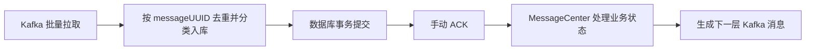
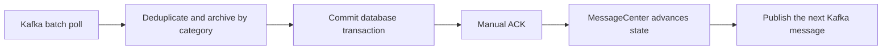

# Firefly

[简体中文](#简体中文) · [English](#english)

Firefly 是一个基于 Spring Boot、Kafka 和 MySQL 的流水线编排服务。它负责保存 Pipeline 配置、构建 Stage/Job 执行拓扑、归档 Kafka 业务消息，并根据执行结果推进构建状态。

Firefly is a pipeline orchestration service built with Spring Boot, Kafka, and MySQL. It stores Pipeline definitions, builds Stage/Job execution graphs, archives Kafka business messages, and advances build states from execution results.

## 简体中文

### 执行模型

```text
Pipeline
└── Stage（按 stageOrder 串行）
    ├── Job Chain A（链内串行）
    │   ├── Job A1
    │   └── Job A2
    └── Job Chain B（可与 Chain A 独立调度）
        └── Job B1
            └── Plugin（由 Job 触发）
```

- 同一 Pipeline Build 的 Stage 按 `stage_order` 从小到大执行。
- 一个 Stage 可以包含多条 Job Chain。
- 同一条 Job Chain 中的 Job 串行执行。
- 不同 Job Chain 可以独立调度。
- 每个 Job 触发自己的 Plugin；当前内置 Plugin 类型为 `TEXT`。
- 所有构建状态使用 `PENDING`、`RUNNING`、`SUCCESS`、`FAILURE`。

### 核心能力

- 创建与查询 Pipeline、Stage、Job Chain 和 Plugin 配置。
- 为每次触发创建 Pipeline、Stage、Job 和 Plugin Build 记录。
- 通过四个 Kafka Topic 推进 Pipeline → Stage → Job → Plugin 状态。
- 按消息类型将 Kafka 原始消息分类归档到四张消息表。
- 使用业务消息 UUID 和 Kafka 位置唯一约束实现归档幂等。
- 使用数据库原子状态转换确保 Stage 终态只由一个处理线程发布。
- 支持失败 Pipeline 原记录重试，并跳过已经成功的 Stage 和 Job。
- 使用 `executionAttempt` 隔离不同执行轮次的状态消息。
- 使用 Spring Data JPA 访问 MySQL。

### 消息处理流程



| Topic | Listener | 归档表 |
| --- | --- | --- |
| `pipeline_message` | `onPipelineMessage` | `pipeline_message` |
| `stage_message` | `onStageMessage` | `stage_message` |
| `job_message` | `onJobMessage` | `job_message` |
| `plugin_message` | `onPluginMessage` | `plugin_message` |

当前消费规则：

- Kafka Listener 使用批量模式，每次最多拉取 `200` 条。
- 每个 Topic 的 Listener `concurrency` 为 `1`。
- 消息先入库，数据库事务成功后才执行手动 ACK。
- 数据库写入失败时不会 ACK。
- ACK 后再执行 `MessageCenter`；单条业务处理失败不会阻塞同批其他消息。
- 业务失败的原始消息保留在归档表中，日志会输出 Topic、Partition 和 Offset，供人工处理。
- 消息表同时约束 `message_uuid` 与 `(topic, kafka_partition, kafka_offset)` 唯一。
- 业务消息 UUID 由消息类型、Build ID、`executionAttempt` 和状态稳定生成。

### 失败重试

`POST /pipeline-builds/{pipelineBuildID}/retry` 只接受状态为 `FAILURE` 的 Pipeline Build。

重试过程：

1. 使用数据库条件更新原子地把 Pipeline 从 `FAILURE` 改为 `RUNNING`。
2. 在同一条 Pipeline Build 记录上递增 `executionAttempt`。
3. 保留已经成功的 Stage 和 Job。
4. 将失败或尚未执行的 Stage、Job 和 Plugin 重置为 `PENDING`。
5. 数据库事务提交后，从第一个未成功的 Stage 继续发送消息。

重试不会创建新的 Pipeline Build 记录。

### 技术栈

| 组件 | 版本或用途 |
| --- | --- |
| Java | 25 |
| Maven | 3.9+ |
| Spring Boot | 3.5.4 |
| Spring Data JPA | 数据持久化 |
| Spring Kafka | 批量消费和消息生产 |
| MySQL | 推荐 8.4 |
| Kafka | 示例使用 3.9.1，单节点 KRaft |
| HikariCP | Spring Boot 管理的连接池 |
| Testcontainers | MySQL 集成测试 |
| Embedded Kafka | Kafka 生产接线测试 |

### 项目结构

```text
src/main/java/firefly
├── bean/                   # DTO、API 请求和响应
├── constant/               # 状态、Topic、触发方式和 Plugin 类型
├── controller/             # HTTP API
├── dao/                    # Spring Data JPA Repository
├── model/                  # JPA Entity
└── service/
    ├── messagecenter/      # 消息归档、监听和状态推进
    ├── pipelinebuild/      # Pipeline 构建与失败重试
    ├── stagebuild/         # Stage 构建状态
    ├── jobbuild/           # Job 构建与 Job Chain 推进
    ├── pluginbuild/        # Plugin 构建
    └── trigger/            # Trigger 适配与消息生产

src/main/resources
├── application.yaml        # 环境变量入口
└── v1.sql                  # 新数据库的完整建表脚本
```

### 快速开始

#### 1. 环境要求

- JDK 25
- Maven 3.9 或更高版本
- Docker

```bash
java -version
mvn -version
docker version
```

#### 2. 创建本地私密配置

```bash
cp .env.example .env
```

编辑 `.env`，为以下变量填写本地值：

- `MYSQL_USER`：应用使用的非 root 数据库账号。
- `MYSQL_PASSWORD`：应用数据库密码。
- `MYSQL_ROOT_PASSWORD`：仅用于初始化和管理 MySQL。

`.env` 已被 Git 忽略，仓库中的 `.env.example` 不包含任何凭据值。生产环境应通过 Secret Manager、容器 Secret 或部署平台注入环境变量，不要提交真实凭据。

#### 3. 启动 MySQL

```bash
docker volume create firefly-mysql-data

docker run -d \
  --name firefly-mysql \
  --restart unless-stopped \
  --env-file .env \
  -p 127.0.0.1:3306:3306 \
  -v firefly-mysql-data:/var/lib/mysql \
  -v "$PWD/src/main/resources/v1.sql:/docker-entrypoint-initdb.d/001-schema.sql:ro" \
  mysql:8.4
```

MySQL 镜像会根据 `.env` 中的 `MYSQL_DATABASE`、`MYSQL_USER`、`MYSQL_PASSWORD` 和 `MYSQL_ROOT_PASSWORD` 初始化数据库。`v1.sql` 只会在空数据卷第一次初始化时自动执行。

检查 MySQL：

```bash
docker exec firefly-mysql sh -c \
  'mysqladmin ping -u"$MYSQL_USER" --password="$MYSQL_PASSWORD"'
```

#### 4. 启动 Kafka

```bash
docker run -d \
  --name firefly-kafka \
  --restart unless-stopped \
  -p 127.0.0.1:9092:9092 \
  -e KAFKA_NODE_ID=1 \
  -e KAFKA_PROCESS_ROLES=broker,controller \
  -e KAFKA_LISTENERS=PLAINTEXT://:9092,CONTROLLER://:9093 \
  -e KAFKA_ADVERTISED_LISTENERS=PLAINTEXT://localhost:9092 \
  -e KAFKA_CONTROLLER_LISTENER_NAMES=CONTROLLER \
  -e KAFKA_LISTENER_SECURITY_PROTOCOL_MAP=CONTROLLER:PLAINTEXT,PLAINTEXT:PLAINTEXT \
  -e KAFKA_CONTROLLER_QUORUM_VOTERS=1@localhost:9093 \
  -e KAFKA_OFFSETS_TOPIC_REPLICATION_FACTOR=1 \
  -e KAFKA_TRANSACTION_STATE_LOG_REPLICATION_FACTOR=1 \
  -e KAFKA_TRANSACTION_STATE_LOG_MIN_ISR=1 \
  -e KAFKA_GROUP_INITIAL_REBALANCE_DELAY_MS=0 \
  -e KAFKA_NUM_PARTITIONS=3 \
  apache/kafka:3.9.1
```

创建四个 Topic：

```bash
for topic in pipeline_message stage_message job_message plugin_message; do
  docker exec firefly-kafka /opt/kafka/bin/kafka-topics.sh \
    --bootstrap-server localhost:9092 \
    --create \
    --if-not-exists \
    --topic "$topic" \
    --partitions 3 \
    --replication-factor 1
done
```

检查 Kafka：

```bash
docker exec firefly-kafka /opt/kafka/bin/kafka-topics.sh \
  --bootstrap-server localhost:9092 \
  --list
```

#### 5. 构建并启动应用

`application.yaml` 会自动读取仓库根目录下未提交的 `.env`：

```bash
mvn clean verify
mvn spring-boot:run
```

也可以打包后运行：

```bash
mvn clean package
java -jar target/firefly-0.0.1-SNAPSHOT.jar
```

默认地址为 `http://localhost:9999`。

### 配置

| 变量 | 默认值 | 必填 | 用途 |
| --- | --- | --- | --- |
| `MYSQL_USER` | 无 | 是 | 应用数据库账号 |
| `MYSQL_PASSWORD` | 无 | 是 | 应用数据库密码 |
| `MYSQL_ROOT_PASSWORD` | 无 | 启动本地 MySQL 时 | MySQL 管理密码 |
| `MYSQL_DATABASE` | `firefly`（示例文件） | 启动本地 MySQL 时 | 数据库名 |
| `MYSQL_URL` | `jdbc:mysql://localhost:3306/firefly` | 否 | JDBC URL |
| `KAFKA_BOOTSTRAP_SERVERS` | `localhost:9092` | 否 | Kafka Broker |
| `SERVER_PORT` | `9999` | 否 | HTTP 端口 |

JPA 使用 `ddl-auto: none`，应用不会自动修改表结构。新库结构以 `src/main/resources/v1.sql` 为准。

### API

#### 创建 Pipeline 配置

```http
POST /create/pipeline
Content-Type: application/json
```

下面的示例包含两个顺序 Stage。第一个 Stage 有一条包含两个串行 Job 的链；第二个 Stage 有两条单 Job 链。

```bash
curl -X POST http://localhost:9999/create/pipeline \
  -H 'Content-Type: application/json' \
  -d '{
    "uuid": "1111111111111111111111111111111111111111111111111111111111111111",
    "name": "demo-pipeline",
    "triggerModel": "MANUAL",
    "triggerMatch": "ACCURATE",
    "triggerOrigin": "VOLCANO",
    "originInfo": {
      "ak": "<volcano-access-key>",
      "sk": "<volcano-secret-key>"
    },
    "stageConfigs": [
      {
        "uuid": "2222222222222222222222222222222222222222222222222222222222222222",
        "name": "stage-one-demo",
        "jobConfigs": [
          [
            {
              "uuid": "4444444444444444444444444444444444444444444444444444444444444444",
              "name": "stage1-job-one",
              "pluginType": "TEXT",
              "pluginRaw": {
                "text": "stage 1 job 1"
              }
            },
            {
              "uuid": "5555555555555555555555555555555555555555555555555555555555555555",
              "name": "stage1-job-two",
              "pluginType": "TEXT",
              "pluginRaw": {
                "text": "stage 1 job 2"
              }
            }
          ]
        ]
      },
      {
        "uuid": "3333333333333333333333333333333333333333333333333333333333333333",
        "name": "stage-two-demo",
        "jobConfigs": [
          [
            {
              "uuid": "6666666666666666666666666666666666666666666666666666666666666666",
              "name": "stage2-job-one",
              "pluginType": "TEXT",
              "pluginRaw": {
                "text": "stage 2 chain 1"
              }
            }
          ],
          [
            {
              "uuid": "7777777777777777777777777777777777777777777777777777777777777777",
              "name": "stage2-job-two",
              "pluginType": "TEXT",
              "pluginRaw": {
                "text": "stage 2 chain 2"
              }
            }
          ]
        ]
      }
    ]
  }'
```

接口返回请求中的 Pipeline UUID。

#### 查询 Pipeline 配置

```bash
curl 'http://localhost:9999/pipeline?uuid=1111111111111111111111111111111111111111111111111111111111111111'
```

响应包含 Pipeline 数据库 ID、配置字段、按 `stageOrder` 排序的 Stage，以及二维 Job Chain。

#### 手动触发 Pipeline

`pipelineId` 来自 Pipeline 查询接口：

```bash
curl -X POST http://localhost:9999/manual_trigger/pipeline \
  -H 'Content-Type: application/json' \
  -d '{
    "pipelineId": 1,
    "uuid": "8888888888888888888888888888888888888888888888888888888888888888",
    "triggerModel": "MANUAL",
    "triggerMatch": "ACCURATE",
    "triggerOrigin": "VOLCANO"
  }'
```

接口返回 Pipeline Build ID。

#### 重试失败 Pipeline

```bash
curl -X POST http://localhost:9999/pipeline-builds/1/retry
```

成功响应：

```json
{
  "pipelineBuildID": 1,
  "executionAttempt": 1
}
```

Pipeline Build 不存在或不是 `FAILURE` 时返回 HTTP `409`。

### 请求校验

- Pipeline、Stage、Job 和 Pipeline Build 请求中的 `uuid` 必须正好为 `64` 个字符。
- Pipeline、Stage 和 Job 名称长度必须为 `10` 到 `64` 个字符。
- `triggerModel`：`AUTOMATIC`、`MANUAL`。
- `triggerMatch`：`ACCURATE`、`PREFIX`。
- 当前可执行的 Trigger Origin 为 `VOLCANO`。
- 当前 Plugin 类型为 `TEXT`。
- 非法请求返回 HTTP `400`。

### 数据库

`v1.sql` 为新数据库创建 17 张表：

| 分类 | 表 |
| --- | --- |
| 配置与拓扑 | `pipeline_config`, `stage_config`, `job_config`, `job_relation`, `text_plugin_config`, `volcano_config`, `volcano_engine` |
| Trigger 记录 | `github_trigger`, `volcano_trigger` |
| Build 记录 | `pipeline_build`, `stage_build`, `job_build`, `text_plugin_build` |
| Kafka 归档 | `pipeline_message`, `stage_message`, `job_message`, `plugin_message` |

关键约束：

- `stage_config(pipeline_id, stage_order)` 保证同一 Pipeline 内 Stage 顺序唯一。
- `stage_build(pipeline_build_id, stage_id)` 避免同一 Pipeline Build 重复创建 Stage Build。
- 四张 Build 表使用 `execution_attempt` 标识执行轮次。
- 四张消息表分别约束业务 UUID 和 Kafka 位置唯一。

### 测试

```bash
mvn clean verify
```

完整测试包含：

- Spring Boot 应用上下文。
- Controller 参数校验。
- Pipeline 响应组装。
- Stage 顺序及数据库唯一约束。
- Stage 原子终态转换。
- 业务消息 UUID 与归档幂等。
- Kafka 批量 ACK 和失败隔离。
- 四个 Topic 到生产 Listener 的 Embedded Kafka 接线。
- 使用 MySQL 8.4 Testcontainers 的 JPA 集成测试。

### 容器管理

```bash
docker ps --filter name=firefly
docker stop firefly-mysql firefly-kafka
docker start firefly-mysql firefly-kafka
docker logs firefly-mysql
docker logs firefly-kafka
```

---

## English

### Execution model

```text
Pipeline
└── Stage (serial by stageOrder)
    ├── Job Chain A (serial within the chain)
    │   ├── Job A1
    │   └── Job A2
    └── Job Chain B (independently schedulable)
        └── Job B1
            └── Plugin (triggered by its Job)
```

- Stages in one Pipeline Build run in ascending `stage_order`.
- A Stage can contain multiple Job Chains.
- Jobs are serial within one chain.
- Different chains can be scheduled independently.
- Each Job triggers its Plugin; `TEXT` is the built-in Plugin type.
- Build states are `PENDING`, `RUNNING`, `SUCCESS`, and `FAILURE`.

### Main capabilities

- Create and query Pipeline, Stage, Job Chain, and Plugin definitions.
- Create Pipeline, Stage, Job, and Plugin Build records for a trigger.
- Advance state through four Kafka topics.
- Archive each Kafka message category in its own MySQL table.
- Deduplicate archived messages by business UUID and Kafka position.
- Use an atomic database transition so only one worker publishes a Stage terminal event.
- Retry a failed Pipeline on the same build records while skipping successful work.
- Separate retry messages with `executionAttempt`.
- Persist application data with Spring Data JPA.

### Message processing



| Topic | Listener | Archive table |
| --- | --- | --- |
| `pipeline_message` | `onPipelineMessage` | `pipeline_message` |
| `stage_message` | `onStageMessage` | `stage_message` |
| `job_message` | `onJobMessage` | `job_message` |
| `plugin_message` | `onPluginMessage` | `plugin_message` |

Current consumer behavior:

- Kafka listeners use batch mode and poll at most `200` records.
- Listener `concurrency` is `1` for each topic.
- A message batch is archived before manual acknowledgment.
- A database failure prevents acknowledgment.
- `MessageCenter` runs after ACK; one failed business record does not block the remaining records in the batch.
- Failed business records remain in the archive tables, and logs include their topic, partition, and offset for manual handling.
- Every archive table uniquely constrains `message_uuid` and `(topic, kafka_partition, kafka_offset)`.
- Business UUIDs are derived from message type, Build ID, `executionAttempt`, and status.

### Failed Pipeline retry

`POST /pipeline-builds/{pipelineBuildID}/retry` accepts only a Pipeline Build in `FAILURE`.

The retry operation:

1. Atomically claims the failed Pipeline by changing `FAILURE` to `RUNNING`.
2. Increments `executionAttempt` on the same Pipeline Build.
3. Keeps successful Stages and Jobs.
4. Resets failed or unexecuted Stages, Jobs, and Plugins to `PENDING`.
5. Publishes the first unfinished Stage after the database transaction commits.

No new Pipeline Build record is created.

### Technology

| Component | Version or purpose |
| --- | --- |
| Java | 25 |
| Maven | 3.9+ |
| Spring Boot | 3.5.4 |
| Spring Data JPA | Persistence |
| Spring Kafka | Batch consumption and message production |
| MySQL | 8.4 recommended |
| Kafka | 3.9.1 single-node KRaft in the example |
| HikariCP | Spring Boot managed connection pool |
| Testcontainers | MySQL integration tests |
| Embedded Kafka | Production listener wiring tests |

### Project layout

```text
src/main/java/firefly
├── bean/                   # DTOs and API models
├── constant/               # States, topics, triggers, and Plugin types
├── controller/             # HTTP APIs
├── dao/                    # Spring Data JPA repositories
├── model/                  # JPA entities
└── service/
    ├── messagecenter/      # Archiving, listeners, and state progression
    ├── pipelinebuild/      # Pipeline builds and retry
    ├── stagebuild/         # Stage build state
    ├── jobbuild/           # Job builds and Job Chain progression
    ├── pluginbuild/        # Plugin builds
    └── trigger/            # Trigger adapters and message production

src/main/resources
├── application.yaml        # Environment-variable entry points
└── v1.sql                  # Complete schema for a new database
```

### Quick start

#### 1. Prerequisites

- JDK 25
- Maven 3.9 or newer
- Docker

```bash
java -version
mvn -version
docker version
```

#### 2. Create private local configuration

```bash
cp .env.example .env
```

Edit `.env` and supply local values for:

- `MYSQL_USER`: a non-root application database user.
- `MYSQL_PASSWORD`: the application database password.
- `MYSQL_ROOT_PASSWORD`: used only to initialize and administer MySQL.

`.env` is ignored by Git, and the committed `.env.example` contains no credential values. In production, inject these variables through a Secret Manager, container secrets, or the deployment platform.

#### 3. Start MySQL

```bash
docker volume create firefly-mysql-data

docker run -d \
  --name firefly-mysql \
  --restart unless-stopped \
  --env-file .env \
  -p 127.0.0.1:3306:3306 \
  -v firefly-mysql-data:/var/lib/mysql \
  -v "$PWD/src/main/resources/v1.sql:/docker-entrypoint-initdb.d/001-schema.sql:ro" \
  mysql:8.4
```

The image initializes MySQL from `MYSQL_DATABASE`, `MYSQL_USER`, `MYSQL_PASSWORD`, and `MYSQL_ROOT_PASSWORD` in `.env`. `v1.sql` runs automatically only when an empty data volume is initialized.

Check MySQL without placing credentials in the command:

```bash
docker exec firefly-mysql sh -c \
  'mysqladmin ping -u"$MYSQL_USER" --password="$MYSQL_PASSWORD"'
```

#### 4. Start Kafka

```bash
docker run -d \
  --name firefly-kafka \
  --restart unless-stopped \
  -p 127.0.0.1:9092:9092 \
  -e KAFKA_NODE_ID=1 \
  -e KAFKA_PROCESS_ROLES=broker,controller \
  -e KAFKA_LISTENERS=PLAINTEXT://:9092,CONTROLLER://:9093 \
  -e KAFKA_ADVERTISED_LISTENERS=PLAINTEXT://localhost:9092 \
  -e KAFKA_CONTROLLER_LISTENER_NAMES=CONTROLLER \
  -e KAFKA_LISTENER_SECURITY_PROTOCOL_MAP=CONTROLLER:PLAINTEXT,PLAINTEXT:PLAINTEXT \
  -e KAFKA_CONTROLLER_QUORUM_VOTERS=1@localhost:9093 \
  -e KAFKA_OFFSETS_TOPIC_REPLICATION_FACTOR=1 \
  -e KAFKA_TRANSACTION_STATE_LOG_REPLICATION_FACTOR=1 \
  -e KAFKA_TRANSACTION_STATE_LOG_MIN_ISR=1 \
  -e KAFKA_GROUP_INITIAL_REBALANCE_DELAY_MS=0 \
  -e KAFKA_NUM_PARTITIONS=3 \
  apache/kafka:3.9.1
```

Create the four topics:

```bash
for topic in pipeline_message stage_message job_message plugin_message; do
  docker exec firefly-kafka /opt/kafka/bin/kafka-topics.sh \
    --bootstrap-server localhost:9092 \
    --create \
    --if-not-exists \
    --topic "$topic" \
    --partitions 3 \
    --replication-factor 1
done
```

Check Kafka:

```bash
docker exec firefly-kafka /opt/kafka/bin/kafka-topics.sh \
  --bootstrap-server localhost:9092 \
  --list
```

#### 5. Build and run

`application.yaml` automatically imports the uncommitted `.env` in the repository root:

```bash
mvn clean verify
mvn spring-boot:run
```

Or package and run the executable JAR:

```bash
mvn clean package
java -jar target/firefly-0.0.1-SNAPSHOT.jar
```

The default URL is `http://localhost:9999`.

### Configuration

| Variable | Default | Required | Purpose |
| --- | --- | --- | --- |
| `MYSQL_USER` | none | yes | Application database username |
| `MYSQL_PASSWORD` | none | yes | Application database password |
| `MYSQL_ROOT_PASSWORD` | none | for local MySQL | MySQL administration password |
| `MYSQL_DATABASE` | `firefly` in the example file | for local MySQL | Database name |
| `MYSQL_URL` | `jdbc:mysql://localhost:3306/firefly` | no | JDBC URL |
| `KAFKA_BOOTSTRAP_SERVERS` | `localhost:9092` | no | Kafka brokers |
| `SERVER_PORT` | `9999` | no | HTTP port |

JPA uses `ddl-auto: none`; the application never changes the schema automatically. Use `src/main/resources/v1.sql` to initialize a new database.

### API

#### Create a Pipeline definition

```http
POST /create/pipeline
Content-Type: application/json
```

The Chinese example above is directly executable and demonstrates ordered Stages, serial Jobs within a chain, and multiple Job Chains.

#### Query a Pipeline definition

```bash
curl 'http://localhost:9999/pipeline?uuid=1111111111111111111111111111111111111111111111111111111111111111'
```

The response contains the Pipeline database ID, configuration fields, Stages ordered by `stageOrder`, and two-dimensional Job Chains.

#### Manually trigger a Pipeline

```bash
curl -X POST http://localhost:9999/manual_trigger/pipeline \
  -H 'Content-Type: application/json' \
  -d '{
    "pipelineId": 1,
    "uuid": "8888888888888888888888888888888888888888888888888888888888888888",
    "triggerModel": "MANUAL",
    "triggerMatch": "ACCURATE",
    "triggerOrigin": "VOLCANO"
  }'
```

The response is the Pipeline Build ID.

#### Retry a failed Pipeline

```bash
curl -X POST http://localhost:9999/pipeline-builds/1/retry
```

Example success response:

```json
{
  "pipelineBuildID": 1,
  "executionAttempt": 1
}
```

The endpoint returns HTTP `409` when the Pipeline Build does not exist or is not in `FAILURE`.

### Validation

- Pipeline, Stage, Job, and Pipeline Build request UUIDs contain exactly `64` characters.
- Pipeline, Stage, and Job names contain between `10` and `64` characters.
- `triggerModel`: `AUTOMATIC` or `MANUAL`.
- `triggerMatch`: `ACCURATE` or `PREFIX`.
- The currently executable Trigger Origin is `VOLCANO`.
- The current Plugin type is `TEXT`.
- Invalid requests return HTTP `400`.

### Database

`v1.sql` creates 17 tables for a new database:

| Category | Tables |
| --- | --- |
| Configuration and topology | `pipeline_config`, `stage_config`, `job_config`, `job_relation`, `text_plugin_config`, `volcano_config`, `volcano_engine` |
| Trigger records | `github_trigger`, `volcano_trigger` |
| Build records | `pipeline_build`, `stage_build`, `job_build`, `text_plugin_build` |
| Kafka archives | `pipeline_message`, `stage_message`, `job_message`, `plugin_message` |

Important constraints:

- `stage_config(pipeline_id, stage_order)` keeps Stage order unique within one Pipeline.
- `stage_build(pipeline_build_id, stage_id)` prevents duplicate Stage Builds in one Pipeline Build.
- The four Build tables use `execution_attempt` to identify an execution attempt.
- The four archive tables uniquely constrain both business UUID and Kafka position.

### Tests

```bash
mvn clean verify
```

The suite covers:

- Spring Boot context startup.
- Controller validation.
- Pipeline response assembly.
- Stage ordering and database uniqueness.
- Atomic Stage terminal transitions.
- Business UUID and archive idempotency.
- Kafka batch acknowledgment and failure isolation.
- Embedded Kafka wiring from all four topics to production listeners.
- JPA integration with MySQL 8.4 Testcontainers.

### Container management

```bash
docker ps --filter name=firefly
docker stop firefly-mysql firefly-kafka
docker start firefly-mysql firefly-kafka
docker logs firefly-mysql
docker logs firefly-kafka
```
