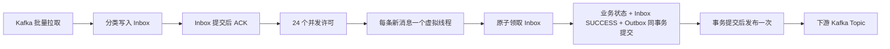
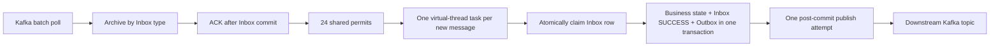

# Firefly

[简体中文](#简体中文) · [English](#english)

Firefly 是一个基于 Spring Boot、Kafka 和 MySQL 的流水线编排服务，提供顺序 Stage、串行或并行 Job Chain、插件执行、失败重试以及 Inbox/Outbox 消息可靠性能力。

Firefly is a pipeline orchestration service built with Spring Boot, Kafka, and MySQL. It supports ordered Stages, serial or parallel Job Chains, plugin execution, failed-build retry, and reliable messaging through Inbox and Outbox patterns.

## 简体中文

### 项目概览

Firefly 将流水线定义和执行记录分离：Pipeline、Stage、Job 与 Plugin 都有独立的配置和 Build 数据。运行时由四类 Kafka 事件推进状态，同时将入站消息和待发送事件持久化到 MySQL，确保故障能够被定位并由管理员显式恢复。

核心能力：

- 创建和查询包含 Stage、Job Chain、Job 与 Plugin 的 Pipeline 配置。
- 手动触发 Pipeline，并创建完整的 Pipeline/Stage/Job/Plugin Build 拓扑。
- 同一 Pipeline Build 中的 Stage 按 `stage_order` 串行推进。
- 同一 Job Chain 内的 Job 串行执行，不同 Job Chain 可以并行推进。
- 使用数据库锁和条件状态转换汇聚并行 Job Chain，确保 Stage 终态只触发一次。
- 使用最多 24 个虚拟线程并行处理已归档的 Kafka 业务消息。
- 使用稳定的业务消息 UUID、Inbox 唯一约束和原子领取避免重复业务执行。
- 使用 Outbox 将业务状态修改和下游 Kafka 事件写入同一个 MySQL 事务。
- 在原 Pipeline Build 上重试失败执行，跳过已经成功的 Stage 和 Job。
- 通过管理 API 人工恢复 Inbox 和 Outbox 异常，不扫描或轮询数据库。

### Maven 模块

```text
firefly/
├── pom.xml                         # Maven 父工程和 Reactor 聚合入口
├── firefly-app/
│   ├── pom.xml                     # Spring Boot 可执行应用
│   └── src/
│       ├── main/java/firefly/      # Controller、Service、Repository、Entity 与 DTO
│       ├── main/resources/
│       │   ├── application.yaml    # 应用配置
│       │   └── v1.sql              # 新环境完整数据库结构
│       └── test/                   # 单元测试和集成测试
└── firefly-github/
    └── pom.xml                     # GitHub 交互代码的独立 Maven 模块边界
```

根工程的 `artifactId` 是 `firefly-parent`，负责统一 Java 版本、插件版本和模块构建顺序。`firefly-app` 的 Maven `artifactId` 保持为 `firefly`，并依赖 `firefly-github`。

### 执行模型

```text
Pipeline Build
└── Stage 1 Build                         按 stage_order 串行
    ├── Job Chain A                      链内串行
    │   ├── Job A1 → Plugin A1
    │   └── Job A2 → Plugin A2
    └── Job Chain B                      可与 Chain A 并行
        └── Job B1 → Plugin B1
└── Stage 2 Build                         Stage 1 成功后触发
```

- Build 状态包括 `PENDING`、`RUNNING`、`SUCCESS` 和 `FAILURE`。
- Pipeline、Stage、Job 和 Plugin Build 都保存 `execution_attempt`。
- 每条 Job Chain 只触发当前可运行的 Job，前一个 Job 成功后才触发下一个 Job。
- Stage 只有在所有 Job Chain 的尾 Job 都为 `SUCCESS` 后才能成功。
- 任意 Plugin 失败会使对应 Job 失败，并继续向上将 Stage 和 Pipeline 标记为失败。
- 当前内置的 `TEXT` Plugin 是用于验证执行链路的最小模拟插件。

### Kafka、虚拟线程与消息可靠性



#### 消费配置

| 项目 | 当前值 |
| --- | --- |
| Topic | `pipeline_message`、`stage_message`、`job_message`、`plugin_message` |
| Consumer Group | `firefly` |
| Listener 模式 | 批量消费 |
| 单次最大记录数 | `200` |
| ACK 模式 | `manual_immediate` |
| 每个 Listener 的 concurrency | `1` |
| 业务处理并发上限 | 每个应用实例共享 `24` 个许可 |
| 执行线程 | Java 25 虚拟线程，每条新消息一个任务 |

四个 Listener 共用同一个 `Semaphore(24)`，因此单个应用实例同时最多执行 24 条 Kafka 业务消息，而不是每个 Topic 各 24 条。批次先整体写入对应 Inbox 表并 ACK，随后才提交虚拟线程任务；业务失败不会依赖 Kafka 重投，而是保存在数据库中等待人工恢复。

#### Inbox

| 消息类别 | Listener | Inbox 表 |
| --- | --- | --- |
| `PIPELINE` | `onPipelineMessage` | `pipeline_message` |
| `STAGE` | `onStageMessage` | `stage_message` |
| `JOB` | `onJobMessage` | `job_message` |
| `PLUGIN` | `onPluginMessage` | `plugin_message` |

```text
ARCHIVED ──原子领取──> PROCESSING ──业务事务提交──> SUCCESS
                            └──业务回滚──> FAILURE
PROCESSING ──人工核对并重置──> FAILURE ──人工重试──> PROCESSING
```

- 每张 Inbox 表唯一约束 `message_uuid` 和 `(topic, kafka_partition, kafka_offset)`。
- 业务消息 UUID 根据消息类型、Build ID、`executionAttempt` 和状态确定性生成；同一逻辑事件再次发送时 UUID 不变。
- 只有成功将 `ARCHIVED` 或 `FAILURE` 原子更新为 `PROCESSING` 的处理器可以执行业务。
- 业务状态修改、下游 Outbox 插入和 Inbox 的 `PROCESSING → SUCCESS` 在同一个事务中提交。
- 单条消息失败不会中断同批其他虚拟线程，错误信息保存在 `last_error`。
- `SUCCESS` 是终态；仓库中没有 Inbox 定时扫描或自动重试。

#### Outbox

```text
PENDING ──原子领取──> PUBLISHING ──Kafka 确认──> SENT
                             └──发送异常──> FAILED
PUBLISHING ──人工核对并重置──> FAILED ──人工发布──> PUBLISHING
```

- 下游事件和业务状态修改在同一个 MySQL 事务中提交。
- 事务提交后只进行一次 Kafka 发布尝试，没有 Outbox 轮询器。
- `message_uuid` 是业务幂等键，`id` 是数据库自增主键。
- `publisher_id` 和条件更新防止多个线程同时发布同一事件。
- `SENT` 是终态；`PENDING`、`PUBLISHING` 和 `FAILED` 由管理员确认后处理。

> 如果 Kafka 已收到消息，但应用在写入 `SENT` 前宕机，Outbox 可能停在 `PUBLISHING`。重置前应先核对 Kafka；重新发布可能产生重复消息，下游 Inbox 会使用稳定 UUID 阻止重复业务执行。

### 失败 Pipeline 重试

`POST /pipeline-builds/{pipelineBuildID}/retry` 只接受状态为 `FAILURE` 的 Pipeline Build：

1. 使用条件更新将 Pipeline 从 `FAILURE` 改为 `RUNNING`，同时递增 `execution_attempt`。
2. 继续使用原 Pipeline、Stage、Job 和 Plugin Build 记录，不生成新的 Pipeline Build。
3. 保留已经成功的 Stage 和 Job，不修改它们的 `execution_attempt`。
4. 将失败或未完成的节点重置为 `PENDING` 并写入新的执行轮次。
5. 在同一个事务中写入第一个待执行 Stage 的 Outbox 事件，提交后恢复消息链路。

旧轮次的迟到消息因为 `executionAttempt` 不匹配，不能修改新轮次状态。

### 技术栈

| 组件 | 版本或用途 |
| --- | --- |
| Java | 25，包含虚拟线程 |
| Maven | 3.9+，多模块 Reactor 构建 |
| Spring Boot | 3.5.4 |
| Spring Data JPA | MySQL 数据访问 |
| Spring Kafka | Kafka 批量消费和生产 |
| MySQL | 本地示例使用 8.4 |
| Kafka | 本地示例使用 3.9.1 单节点 KRaft |
| HikariCP | 数据库连接池，最大连接数 30 |
| Testcontainers | MySQL 集成测试 |
| Embedded Kafka | Kafka 生产接线测试 |

### 快速开始

#### 1. 环境要求

- JDK 25
- Maven 3.9 或更高版本
- Docker

```bash
java -version
mvn -version
docker version
```

#### 2. 创建本地环境配置

```bash
cp .env.example .env
```

在 `.env` 中填写本机使用的 MySQL 账号和密码。`.env` 和其他 `.env.*` 文件默认被 Git 忽略，只有不包含凭据的 `.env.example` 会提交到仓库。生产环境应通过部署平台的 Secret 机制注入配置。

#### 3. 启动 MySQL

```bash
docker volume create firefly-mysql-data

docker run -d \
  --name firefly-mysql \
  --restart unless-stopped \
  --env-file .env \
  -p 127.0.0.1:3306:3306 \
  -v firefly-mysql-data:/var/lib/mysql \
  -v "$PWD/firefly-app/src/main/resources/v1.sql:/docker-entrypoint-initdb.d/001-schema.sql:ro" \
  mysql:8.4
```

`v1.sql` 是新环境的完整建表脚本，只会在空数据卷第一次初始化时自动执行。

```bash
docker exec firefly-mysql sh -c \
  'mysqladmin ping -u"$MYSQL_USER" --password="$MYSQL_PASSWORD"'
```

#### 4. 启动 Kafka

```bash
docker run -d \
  --name firefly-kafka \
  --restart unless-stopped \
  -p 127.0.0.1:9092:9092 \
  -e KAFKA_NODE_ID=1 \
  -e KAFKA_PROCESS_ROLES=broker,controller \
  -e KAFKA_LISTENERS=PLAINTEXT://:9092,CONTROLLER://:9093 \
  -e KAFKA_ADVERTISED_LISTENERS=PLAINTEXT://localhost:9092 \
  -e KAFKA_CONTROLLER_LISTENER_NAMES=CONTROLLER \
  -e KAFKA_LISTENER_SECURITY_PROTOCOL_MAP=CONTROLLER:PLAINTEXT,PLAINTEXT:PLAINTEXT \
  -e KAFKA_CONTROLLER_QUORUM_VOTERS=1@localhost:9093 \
  -e KAFKA_OFFSETS_TOPIC_REPLICATION_FACTOR=1 \
  -e KAFKA_TRANSACTION_STATE_LOG_REPLICATION_FACTOR=1 \
  -e KAFKA_TRANSACTION_STATE_LOG_MIN_ISR=1 \
  -e KAFKA_GROUP_INITIAL_REBALANCE_DELAY_MS=0 \
  -e KAFKA_NUM_PARTITIONS=3 \
  apache/kafka:3.9.1
```

创建应用需要的四个 Topic：

```bash
for topic in pipeline_message stage_message job_message plugin_message; do
  docker exec firefly-kafka /opt/kafka/bin/kafka-topics.sh \
    --bootstrap-server localhost:9092 \
    --create \
    --if-not-exists \
    --topic "$topic" \
    --partitions 3 \
    --replication-factor 1
done
```

#### 5. 构建与运行

从仓库根目录执行完整构建：

```bash
mvn clean verify
```

开发环境运行 Spring Boot 应用：

```bash
mvn install -DskipTests
mvn -pl firefly-app spring-boot:run
```

或者运行打包后的可执行 JAR：

```bash
mvn clean package -DskipTests
java -jar firefly-app/target/firefly-0.0.1-SNAPSHOT.jar
```

默认服务地址为 `http://localhost:9999`。Spring Boot Maven 插件将运行目录固定为仓库根目录，因此应用可以读取根目录的 `.env`。

### 配置

| 环境变量 | 默认值 | 必填 | 用途 |
| --- | --- | --- | --- |
| `MYSQL_USER` | 无 | 是 | 应用数据库账号 |
| `MYSQL_PASSWORD` | 无 | 是 | 应用数据库密码 |
| `MYSQL_ROOT_PASSWORD` | 无 | 启动本地 MySQL 时 | MySQL root 密码 |
| `MYSQL_DATABASE` | `firefly`（示例文件） | 启动本地 MySQL 时 | 数据库名 |
| `MYSQL_URL` | `jdbc:mysql://localhost:3306/firefly` | 否 | JDBC URL |
| `KAFKA_BOOTSTRAP_SERVERS` | `localhost:9092` | 否 | Kafka Broker 地址 |
| `SERVER_PORT` | `9999` | 否 | HTTP 端口 |

其他关键默认值：

- JPA：`ddl-auto: none`、`open-in-view: false`。
- Kafka Consumer：关闭自动提交，`auto-offset-reset: earliest`，`max-poll-records: 200`。
- Kafka Listener：批量模式、手动立即 ACK、`concurrency: 1`。
- Kafka Producer：`acks: all`、启用幂等生产、最多 5 个未确认请求。
- HikariCP：最小空闲连接 2，最大连接数 30。

### HTTP API

#### Pipeline

| 方法 | 路径 | 说明 |
| --- | --- | --- |
| `POST` | `/create/pipeline` | 创建完整 Pipeline 配置，返回配置 UUID |
| `GET` | `/pipeline?uuid={uuid}` | 查询 Pipeline、顺序 Stage 和二维 Job Chain |
| `POST` | `/manual_trigger/pipeline` | 创建并触发 Pipeline Build，返回 Build ID |
| `POST` | `/pipeline-builds/{pipelineBuildID}/retry` | 在原记录上重试失败的 Pipeline Build |

UUID 字段必须是 64 个字符，Pipeline、Stage 和 Job 名称必须是 10–64 个字符。以下请求创建一个包含单 Stage、单 Job Chain 和 `TEXT` Plugin 的配置：

```bash
curl -X POST http://localhost:9999/create/pipeline \
  -H 'Content-Type: application/json' \
  -d '{
    "uuid": "1111111111111111111111111111111111111111111111111111111111111111",
    "name": "demo-pipeline",
    "triggerModel": "MANUAL",
    "triggerMatch": "ACCURATE",
    "triggerOrigin": "VOLCANO",
    "originInfo": {
      "ak": "<volcano-access-key>",
      "sk": "<volcano-secret-key>"
    },
    "stageConfigs": [{
      "uuid": "2222222222222222222222222222222222222222222222222222222222222222",
      "name": "demo-stage-one",
      "jobConfigs": [[{
        "uuid": "3333333333333333333333333333333333333333333333333333333333333333",
        "name": "demo-job-one",
        "pluginType": "TEXT",
        "pluginRaw": {"text": "hello-firefly"}
      }]]
    }]
  }'
```

查询配置，并从返回值中取得内部 `id`：

```bash
curl 'http://localhost:9999/pipeline?uuid=1111111111111111111111111111111111111111111111111111111111111111'
```

使用该 `id` 触发 Build；请求中的 `uuid` 是本次触发的 64 字符业务 UUID：

```bash
curl -X POST http://localhost:9999/manual_trigger/pipeline \
  -H 'Content-Type: application/json' \
  -d '{
    "pipelineId": 1,
    "uuid": "4444444444444444444444444444444444444444444444444444444444444444",
    "triggerModel": "MANUAL",
    "triggerMatch": "ACCURATE",
    "triggerOrigin": "VOLCANO"
  }'
```

#### Inbox 人工恢复

路径中的 `category` 使用 `PIPELINE`、`STAGE`、`JOB` 或 `PLUGIN`。

| 方法 | 路径 | 说明 |
| --- | --- | --- |
| `GET` | `/admin/kafka-messages/{category}/{messageUUID}` | 查询单条 Inbox 消息 |
| `GET` | `/admin/kafka-messages/{category}?status={status}` | 按状态分页查询 |
| `POST` | `/admin/kafka-messages/{category}/{messageUUID}/retry` | 人工重试 `ARCHIVED` 或 `FAILURE` 消息 |
| `POST` | `/admin/kafka-messages/{category}/{messageUUID}/reset-processing` | 使用当前 `processorID` 将遗留的 `PROCESSING` 重置为 `FAILURE` |

分页查询支持 Spring Data 的 `page`、`size` 和 `sort` 参数。重置接口要求提供当前记录中的 `processorID`，可选参数 `reason` 默认为 `MANUAL_RESET`。

```bash
curl 'http://localhost:9999/admin/kafka-messages/JOB?status=FAILURE&page=0&size=20'

curl -X POST \
  'http://localhost:9999/admin/kafka-messages/JOB/{messageUUID}/retry'
```

#### Outbox 人工恢复

| 方法 | 路径 | 说明 |
| --- | --- | --- |
| `GET` | `/admin/outbox-events/{outboxID}` | 查询单条 Outbox 事件 |
| `GET` | `/admin/outbox-events?status={status}` | 按状态分页查询 |
| `POST` | `/admin/outbox-events/{outboxID}/publish` | 人工发布 `PENDING` 或 `FAILED` 事件 |
| `POST` | `/admin/outbox-events/{outboxID}/reset-publishing` | 使用当前 `publisherID` 将遗留的 `PUBLISHING` 重置为 `FAILED` |

### 测试

```bash
mvn clean verify
```

测试套件包含普通单元测试、基于 Testcontainers 的 MySQL 集成测试，以及验证四个生产 Listener 接线的 Embedded Kafka 测试。运行完整测试需要本机 Docker 可用。

---

## English

### Overview

Firefly separates pipeline definitions from execution records. Pipeline, Stage, Job, and Plugin each have configuration and Build data. Four Kafka event types advance runtime state, while inbound messages and outbound events are stored in MySQL so failures remain observable and recoverable through explicit operator actions.

Key capabilities:

- Create and query Pipeline definitions containing Stages, Job Chains, Jobs, and Plugins.
- Trigger a Pipeline manually and create its complete Pipeline/Stage/Job/Plugin Build graph.
- Advance Stages serially by `stage_order` within one Pipeline Build.
- Run Jobs serially inside a chain while allowing independent Job Chains to progress in parallel.
- Converge parallel chains with database locks and conditional state transitions so a Stage terminal event is emitted once.
- Process archived Kafka business messages concurrently with at most 24 virtual threads.
- Prevent duplicate business execution with stable business-message UUIDs, Inbox uniqueness, and atomic claiming.
- Commit business state and downstream Kafka events together through an Outbox.
- Retry a failed Pipeline on the original Build records while skipping successful Stages and Jobs.
- Recover Inbox and Outbox failures through administration APIs without polling the database.

### Maven modules

```text
firefly/
├── pom.xml                         # Maven parent and Reactor entry point
├── firefly-app/
│   ├── pom.xml                     # Executable Spring Boot application
│   └── src/
│       ├── main/java/firefly/      # Controllers, services, repositories, entities, and DTOs
│       ├── main/resources/
│       │   ├── application.yaml    # Application configuration
│       │   └── v1.sql              # Complete schema for a new environment
│       └── test/                   # Unit and integration tests
└── firefly-github/
    └── pom.xml                     # Maven boundary for GitHub interaction code
```

The root `firefly-parent` project centralizes Java and Maven plugin configuration and defines Reactor build order. The `firefly-app` module keeps the Maven `artifactId` `firefly` and depends on `firefly-github`.

### Execution model

```text
Pipeline Build
└── Stage 1 Build                         serial by stage_order
    ├── Job Chain A                      serial inside the chain
    │   ├── Job A1 → Plugin A1
    │   └── Job A2 → Plugin A2
    └── Job Chain B                      may progress beside Chain A
        └── Job B1 → Plugin B1
└── Stage 2 Build                         starts after Stage 1 succeeds
```

- Build states are `PENDING`, `RUNNING`, `SUCCESS`, and `FAILURE`.
- Pipeline, Stage, Job, and Plugin Builds all store `execution_attempt`.
- A Job Chain starts only its currently runnable Job; the next Job starts after its predecessor succeeds.
- A Stage succeeds only after every Job Chain tail has reached `SUCCESS`.
- A Plugin failure fails its Job and propagates failure to the Stage and Pipeline.
- The built-in `TEXT` Plugin is a minimal mock used to exercise the complete execution path.

### Kafka, virtual threads, and reliable messaging



#### Consumer settings

| Item | Current value |
| --- | --- |
| Topics | `pipeline_message`, `stage_message`, `job_message`, `plugin_message` |
| Consumer group | `firefly` |
| Listener mode | Batch |
| Maximum records per poll | `200` |
| ACK mode | `manual_immediate` |
| Listener concurrency | `1` per listener |
| Business-processing limit | `24` shared permits per application instance |
| Execution threads | Java 25 virtual threads, one task per new message |

All four listeners share one `Semaphore(24)`. A single application instance therefore executes no more than 24 Kafka business messages at once, rather than 24 for each topic. A batch is committed to its Inbox and acknowledged before virtual-thread tasks are submitted. Business failures are recovered from MySQL instead of relying on Kafka redelivery.

#### Inbox

| Category | Listener | Inbox table |
| --- | --- | --- |
| `PIPELINE` | `onPipelineMessage` | `pipeline_message` |
| `STAGE` | `onStageMessage` | `stage_message` |
| `JOB` | `onJobMessage` | `job_message` |
| `PLUGIN` | `onPluginMessage` | `plugin_message` |

```text
ARCHIVED ──atomic claim──> PROCESSING ──business commit──> SUCCESS
                               └──business rollback──> FAILURE
PROCESSING ──operator reset after verification──> FAILURE ──manual retry──> PROCESSING
```

- Every Inbox table uniquely constrains `message_uuid` and `(topic, kafka_partition, kafka_offset)`.
- A business UUID is derived deterministically from message type, Build ID, `executionAttempt`, and state. Resending the same logical event preserves its UUID.
- Only a processor that atomically changes `ARCHIVED` or `FAILURE` to `PROCESSING` may run the business operation.
- Business state, downstream Outbox rows, and `PROCESSING → SUCCESS` commit in one transaction.
- One failed message does not stop other virtual-thread tasks from the same batch; diagnostic text is stored in `last_error`.
- `SUCCESS` is terminal. There is no Inbox scheduler, scanner, or automatic retry.

#### Outbox

```text
PENDING ──atomic claim──> PUBLISHING ──Kafka acknowledgment──> SENT
                                └──send exception──> FAILED
PUBLISHING ──operator reset after verification──> FAILED ──manual publish──> PUBLISHING
```

- A downstream event and its business-state update commit in one MySQL transaction.
- Exactly one normal publish attempt runs after commit; there is no Outbox poller.
- `message_uuid` is the business idempotency key, while `id` is the auto-increment database key.
- `publisher_id` ownership and conditional updates prevent concurrent publication of one event.
- `SENT` is terminal. Operators explicitly handle `PENDING`, `PUBLISHING`, and `FAILED` records.

> If Kafka accepted an event but the application stopped before recording `SENT`, the row can remain `PUBLISHING`. Verify Kafka before resetting it. Republishing may produce a duplicate event, which the downstream Inbox suppresses with the stable UUID.

### Failed Pipeline retry

`POST /pipeline-builds/{pipelineBuildID}/retry` accepts only a Pipeline Build in `FAILURE`:

1. Conditionally transition the Pipeline from `FAILURE` to `RUNNING` and increment `execution_attempt`.
2. Reuse the original Pipeline, Stage, Job, and Plugin Build rows; no new Pipeline Build is created.
3. Preserve successful Stages and Jobs without changing their `execution_attempt`.
4. Reset failed or unfinished nodes to `PENDING` with the new attempt number.
5. Insert the first runnable Stage event into the Outbox in the same transaction and resume after commit.

Late messages from an older attempt cannot change the new attempt because their `executionAttempt` no longer matches.

### Technology

| Component | Version or purpose |
| --- | --- |
| Java | 25, including virtual threads |
| Maven | 3.9+, multi-module Reactor build |
| Spring Boot | 3.5.4 |
| Spring Data JPA | MySQL persistence |
| Spring Kafka | Batch consumption and production |
| MySQL | 8.4 in the local example |
| Kafka | 3.9.1 single-node KRaft in the local example |
| HikariCP | Connection pool, maximum size 30 |
| Testcontainers | MySQL integration tests |
| Embedded Kafka | Production listener-wiring tests |

### Quick start

#### 1. Requirements

- JDK 25
- Maven 3.9 or newer
- Docker

```bash
java -version
mvn -version
docker version
```

#### 2. Create local configuration

```bash
cp .env.example .env
```

Fill in the local MySQL user and passwords in `.env`. Git ignores `.env` and other `.env.*` files; only the credential-free `.env.example` is tracked. Inject production credentials through the deployment platform's secret mechanism.

#### 3. Start MySQL

```bash
docker volume create firefly-mysql-data

docker run -d \
  --name firefly-mysql \
  --restart unless-stopped \
  --env-file .env \
  -p 127.0.0.1:3306:3306 \
  -v firefly-mysql-data:/var/lib/mysql \
  -v "$PWD/firefly-app/src/main/resources/v1.sql:/docker-entrypoint-initdb.d/001-schema.sql:ro" \
  mysql:8.4
```

`v1.sql` is the complete schema for a new environment. The MySQL image runs it only when initializing an empty volume.

```bash
docker exec firefly-mysql sh -c \
  'mysqladmin ping -u"$MYSQL_USER" --password="$MYSQL_PASSWORD"'
```

#### 4. Start Kafka

```bash
docker run -d \
  --name firefly-kafka \
  --restart unless-stopped \
  -p 127.0.0.1:9092:9092 \
  -e KAFKA_NODE_ID=1 \
  -e KAFKA_PROCESS_ROLES=broker,controller \
  -e KAFKA_LISTENERS=PLAINTEXT://:9092,CONTROLLER://:9093 \
  -e KAFKA_ADVERTISED_LISTENERS=PLAINTEXT://localhost:9092 \
  -e KAFKA_CONTROLLER_LISTENER_NAMES=CONTROLLER \
  -e KAFKA_LISTENER_SECURITY_PROTOCOL_MAP=CONTROLLER:PLAINTEXT,PLAINTEXT:PLAINTEXT \
  -e KAFKA_CONTROLLER_QUORUM_VOTERS=1@localhost:9093 \
  -e KAFKA_OFFSETS_TOPIC_REPLICATION_FACTOR=1 \
  -e KAFKA_TRANSACTION_STATE_LOG_REPLICATION_FACTOR=1 \
  -e KAFKA_TRANSACTION_STATE_LOG_MIN_ISR=1 \
  -e KAFKA_GROUP_INITIAL_REBALANCE_DELAY_MS=0 \
  -e KAFKA_NUM_PARTITIONS=3 \
  apache/kafka:3.9.1
```

Create the four application topics:

```bash
for topic in pipeline_message stage_message job_message plugin_message; do
  docker exec firefly-kafka /opt/kafka/bin/kafka-topics.sh \
    --bootstrap-server localhost:9092 \
    --create \
    --if-not-exists \
    --topic "$topic" \
    --partitions 3 \
    --replication-factor 1
done
```

#### 5. Build and run

Run the complete Reactor build from the repository root:

```bash
mvn clean verify
```

Run the Spring Boot application during development:

```bash
mvn install -DskipTests
mvn -pl firefly-app spring-boot:run
```

Or run the executable JAR:

```bash
mvn clean package -DskipTests
java -jar firefly-app/target/firefly-0.0.1-SNAPSHOT.jar
```

The default base URL is `http://localhost:9999`. The Spring Boot Maven plugin keeps the working directory at the repository root so the application can load the root `.env` file.

### Configuration

| Environment variable | Default | Required | Purpose |
| --- | --- | --- | --- |
| `MYSQL_USER` | none | yes | Application database user |
| `MYSQL_PASSWORD` | none | yes | Application database password |
| `MYSQL_ROOT_PASSWORD` | none | for local MySQL startup | MySQL root password |
| `MYSQL_DATABASE` | `firefly` in the example file | for local MySQL startup | Database name |
| `MYSQL_URL` | `jdbc:mysql://localhost:3306/firefly` | no | JDBC URL |
| `KAFKA_BOOTSTRAP_SERVERS` | `localhost:9092` | no | Kafka broker address |
| `SERVER_PORT` | `9999` | no | HTTP port |

Other important defaults:

- JPA: `ddl-auto: none`, `open-in-view: false`.
- Kafka Consumer: auto-commit disabled, `auto-offset-reset: earliest`, `max-poll-records: 200`.
- Kafka Listener: batch mode, immediate manual ACK, `concurrency: 1`.
- Kafka Producer: `acks: all`, idempotence enabled, at most 5 in-flight requests.
- HikariCP: minimum idle 2, maximum pool size 30.

### HTTP API

#### Pipeline

| Method | Path | Description |
| --- | --- | --- |
| `POST` | `/create/pipeline` | Create a complete Pipeline definition and return its UUID |
| `GET` | `/pipeline?uuid={uuid}` | Read a Pipeline with ordered Stages and two-dimensional Job Chains |
| `POST` | `/manual_trigger/pipeline` | Create and trigger a Pipeline Build; returns its Build ID |
| `POST` | `/pipeline-builds/{pipelineBuildID}/retry` | Retry a failed Pipeline on its existing Build rows |

UUID fields must contain exactly 64 characters, and Pipeline, Stage, and Job names must contain 10–64 characters. The Chinese quick-start section contains complete create, query, and trigger examples that can be used unchanged.

#### Manual Inbox recovery

Use `PIPELINE`, `STAGE`, `JOB`, or `PLUGIN` for the `category` path variable.

| Method | Path | Description |
| --- | --- | --- |
| `GET` | `/admin/kafka-messages/{category}/{messageUUID}` | Read one Inbox message |
| `GET` | `/admin/kafka-messages/{category}?status={status}` | Page through messages by status |
| `POST` | `/admin/kafka-messages/{category}/{messageUUID}/retry` | Retry an `ARCHIVED` or `FAILURE` message |
| `POST` | `/admin/kafka-messages/{category}/{messageUUID}/reset-processing` | Reset abandoned `PROCESSING` to `FAILURE` with its current `processorID` |

Pagination accepts Spring Data `page`, `size`, and `sort` parameters. The reset endpoint requires the current `processorID`; optional `reason` defaults to `MANUAL_RESET`.

#### Manual Outbox recovery

| Method | Path | Description |
| --- | --- | --- |
| `GET` | `/admin/outbox-events/{outboxID}` | Read one Outbox event |
| `GET` | `/admin/outbox-events?status={status}` | Page through events by status |
| `POST` | `/admin/outbox-events/{outboxID}/publish` | Publish a `PENDING` or `FAILED` event once |
| `POST` | `/admin/outbox-events/{outboxID}/reset-publishing` | Reset abandoned `PUBLISHING` to `FAILED` with its current `publisherID` |

### Tests

```bash
mvn clean verify
```

The suite contains regular unit tests, MySQL integration tests backed by Testcontainers, and Embedded Kafka tests that verify all four production listeners. Docker must be available for the complete suite.
