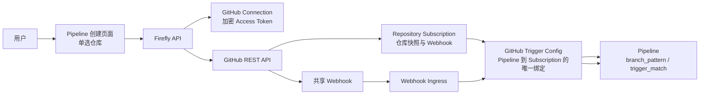
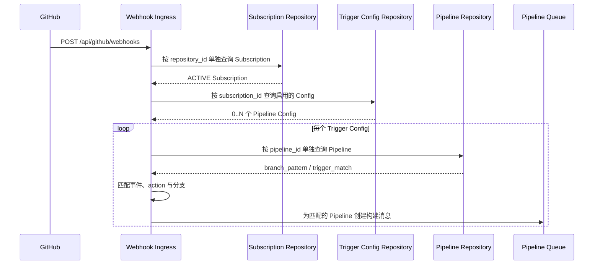

# GitHub Repository Selection Tech Design

## 1. 文档信息

| 项目 | 内容 |
| --- | --- |
| 状态 | Proposed |
| 日期 | 2026-08-17 |
| 适用范围 | Firefly GitHub OAuth2、Repository Subscription、Webhook 与 Pipeline Trigger |
| 核心约束 | 每条 Pipeline 只能绑定一个 GitHub 仓库；绑定成功后不可修改 |

## 2. 背景

Firefly 已通过 GitHub OAuth App 获取用户授权的 access token，并能够查询仓库、保存仓库订阅、注册 Webhook 和处理 Webhook 事件。

创建 GitHub 类型的 Pipeline 时，用户需要从当前 OAuth Connection 可以访问的仓库中手动选择一个仓库。Firefly 必须保存 GitHub 返回的权威仓库信息，并把 Pipeline 永久绑定到该仓库。一个仓库可以被多条 Pipeline 共享，但一条 Pipeline 不能绑定多个仓库，也不能在创建后改绑到其他仓库。

本设计继续遵守以下数据访问约束：

- 不创建数据库外键约束。
- 不使用 SQL `JOIN`。
- 表之间的逻辑引用、一致性和生命周期约束均由应用代码实现。
- 允许使用主键、唯一索引和普通索引。

## 3. 目标

1. OAuth 完成后列出当前 access token 可以访问的 GitHub 仓库。
2. Pipeline 创建页面只允许单选一个仓库。
3. Firefly 不信任前端提交的仓库元数据，保存前必须从 GitHub 重新查询。
4. 每条 GitHub Pipeline 必须且只能保存一个仓库绑定。
5. Pipeline 创建成功后不得修改仓库绑定。
6. 同一仓库只注册一个 Webhook，该 Webhook 可以触发多条 Pipeline。
7. `branch_pattern` 和 `trigger_match` 继续作为 Pipeline 属性独立配置和修改。
8. GitHub 仓库改名或转移后，可以刷新仓库快照字段，但不得改变 Pipeline 绑定的 GitHub Repository ID。

## 4. 非目标

- 不支持一条 Pipeline 同时监听多个仓库。
- 不支持在 Pipeline 编辑页面更换仓库。
- 不为每条 Pipeline 单独注册 GitHub Webhook。
- 不把 OAuth access token 复制到仓库或 Pipeline 表。
- 不通过数据库外键或 SQL `JOIN` 实现关联关系。
- 本次不重新设计 Stage、Job 和 Pipeline 执行模型。

## 5. 约束粒度

“只允许选择一个仓库”的约束粒度是 **Pipeline**：

- 一个 OAuth Connection 可以访问多个仓库。
- 每次创建 Pipeline 时，仓库选择控件只能选中一个仓库。
- 不同 Pipeline 可以绑定不同仓库。
- 多条 Pipeline 可以绑定同一个仓库。
- Pipeline 一旦创建成功，其仓库绑定不可修改。

因此，仓库与 Pipeline 的关系是：一个 Repository Subscription 对应零到多条 Pipeline，一条 Pipeline 对应且只对应一个 Repository Subscription。

## 6. 总体架构



仓库身份使用 GitHub 返回的数值型 `repository.id`。`owner`、`repository_name`、`full_name` 和 URL 等字段是可刷新的快照，不作为不可变身份。

## 7. 用户流程

### 7.1 OAuth 与仓库列表

1. 用户完成 GitHub OAuth2 授权。
2. Firefly 保存加密后的 OAuth App access token，并返回 `connectionId`。
3. Pipeline 创建页面调用仓库列表接口。
4. Firefly 校验 Connection 为 `ACTIVE`，解密 token，然后调用 GitHub 查询仓库。
5. 页面使用单选框展示仓库，不提供多选能力。

建议展示：

- `fullName`
- 私有或公开标识
- 默认分支
- 仓库 HTML URL
- Repository Subscription 状态

### 7.2 选择并保存仓库

用户选中一个仓库后，前端只提交仓库定位信息，不提交需要持久化的仓库快照：

```http
PUT /api/github/connections/{connectionId}/repositories/{owner}/{repository}/subscription
Content-Type: application/json
```

```json
{
  "registrationMode": "AUTO",
  "events": ["push", "pull_request"]
}
```

服务端必须执行：

1. 查询并校验 `connectionId` 对应的 Connection 为 `ACTIVE`。
2. 解密该 Connection 的 access token。
3. 调用 `GET /repos/{owner}/{repository}` 重新获取仓库权威数据。
4. 使用 `github_repository_id` 查询 Repository Subscription。
5. 已存在时复用记录，并刷新相同仓库的快照字段。
6. 不存在时保存 Repository Subscription，并按照 `AUTO` 或 `MANUAL` 模式处理 Webhook。
7. 返回公开的 `subscriptionId`，供 Pipeline 创建请求使用。

前端不得提交或覆盖以下权威字段：

- `githubRepositoryId`
- `nodeId`
- `fullName`
- `htmlUrl`
- `cloneUrl`
- `defaultBranch`
- `privateRepository`

### 7.3 创建 Pipeline

创建 GitHub Pipeline 时，`originInfo.subscriptionId` 是单值字段：

```json
{
  "uuid": "64-character-pipeline-uuid",
  "name": "firefly-main-build",
  "triggerModel": "AUTOMATIC",
  "triggerMatch": "SOURCE_BRANCH",
  "triggerOrigin": "GITHUB",
  "branchPattern": "main",
  "originInfo": {
    "subscriptionId": "01JREPOSITORYABC",
    "events": ["push"],
    "pullRequestActions": ["opened", "synchronize", "reopened"],
    "ignoreDeletePush": true
  },
  "stageConfigs": []
}
```

服务端在创建 Pipeline 的同一数据库事务中：

1. 保存 Pipeline，取得 `pipeline_id`。
2. 根据公开 `subscriptionId` 单独查询 Repository Subscription。
3. 验证 Subscription 存在且状态为 `ACTIVE`。
4. 验证当前 `pipeline_id` 尚未存在 GitHub Trigger Config。
5. 插入唯一的 `pipeline_id -> subscription_id` 绑定。
6. 保存 `origin_id`，完成 Pipeline 创建。

如果任意校验失败，Pipeline 创建事务必须回滚。

## 8. 数据模型

### 8.1 `github_repository_subscription`

该表保存 GitHub 仓库权威信息快照以及仓库级 Webhook：

| 字段 | 说明 |
| --- | --- |
| `id` | 内部主键 |
| `public_id` | 对外 Subscription ID |
| `connection_id` | OAuth Connection 的逻辑引用，不使用 FK |
| `github_repository_id` | GitHub 仓库不可变数值 ID，全局唯一 |
| `node_id` | GitHub GraphQL Node ID |
| `owner` | 仓库当前 owner 快照 |
| `repository_name` | 仓库当前名称快照 |
| `full_name` | 当前 `owner/name` 快照 |
| `html_url` | 浏览器访问 URL |
| `clone_url` | HTTPS Clone URL |
| `default_branch` | 默认分支快照 |
| `private_repository` | 是否为私有仓库，建议新增 |
| `webhook_id` | GitHub Webhook ID |
| `registration_mode` | `AUTO` 或 `MANUAL` |
| `events` | 仓库级 Webhook 事件集合 |
| `status` | Subscription 生命周期状态 |

保留以下唯一约束：

```sql
UNIQUE INDEX uidx_github_subscription_repository (github_repository_id)
```

它保证同一个 GitHub 仓库只对应一条 Repository Subscription 和一个共享 Webhook。

### 8.2 `github_trigger_config`

该表保存 Pipeline 与 Repository Subscription 的不可变逻辑绑定：

| 字段 | 说明 |
| --- | --- |
| `pipeline_id` | Pipeline 内部 ID 的逻辑引用，不使用 FK |
| `subscription_id` | Repository Subscription 内部 ID 的逻辑引用，不使用 FK |
| `enabled` | 是否允许 Webhook 触发 |
| `disabled_reason` | 禁用原因 |
| `events` | Pipeline 关注的 GitHub 事件 |
| `pull_request_actions` | Pipeline 关注的 PR action |
| `ignore_delete_push` | 是否忽略分支删除 Push |

保留以下唯一约束：

```sql
UNIQUE INDEX uidx_github_trigger_config_pipeline (pipeline_id)
```

该唯一索引提供并发兜底，保证一条 Pipeline 最多只能创建一条 GitHub Trigger Config。应用代码还必须保证 GitHub 自动触发 Pipeline 创建时 `subscription_id` 必填，从而实现“恰好一个仓库”。

### 8.3 Pipeline 属性

以下字段继续保存在 `pipeline_config`，不移动到 `github_trigger_config`：

- `branch_pattern`
- `trigger_match`
- `trigger_mode`
- `trigger_origin`

Repository Subscription 决定“事件来自哪个仓库”，Pipeline 属性决定“该仓库事件是否匹配这条 Pipeline”。

## 9. 仓库绑定不可变设计

### 9.1 不可变边界

Pipeline 创建事务成功提交后，`github_trigger_config.subscription_id` 永久不可修改。

以下操作不属于修改绑定，可以允许：

- GitHub 仓库改名后刷新 `owner`、`repository_name` 和 `full_name`。
- GitHub 仓库转移后刷新仓库 URL。
- 更新 Pipeline 的 `branch_pattern` 或 `trigger_match`。
- 更新 Pipeline 关注的事件或 Pull Request action。
- 临时禁用或重新启用 Trigger Config。

以上操作都必须保持 `github_repository_id` 和 `github_trigger_config.subscription_id` 不变。

### 9.2 API 约束

Pipeline 更新 API 不应接收仓库或 `subscriptionId` 字段。仓库信息在详情响应中返回为只读数据：

```json
{
  "repository": {
    "subscriptionId": "01JREPOSITORYABC",
    "repositoryId": 123456789,
    "fullName": "zoujian/firefly",
    "htmlUrl": "https://github.com/zoujian/firefly",
    "editable": false
  }
}
```

如果为了兼容旧客户端，更新 DTO 暂时仍包含 `subscriptionId`，服务端必须先查询现有 Trigger Config：

- 请求值与已保存值相同：忽略该字段，继续更新其他允许字段。
- 请求值与已保存值不同：拒绝请求，不写入任何数据。

建议返回：

```http
409 Conflict
```

```json
{
  "code": "GITHUB_REPOSITORY_IMMUTABLE",
  "message": "The GitHub repository of an existing pipeline cannot be changed"
}
```

### 9.3 持久化约束

Repository 层不得提供修改 `subscription_id` 的通用更新方法。更新 Trigger Config 时应显式更新允许变化的字段，禁止把完整客户端对象直接覆盖到实体。

并发创建同一 Pipeline 的 Trigger Config 时：

1. 两个请求都在应用层执行存在性检查。
2. 最多一个请求通过 `uidx_github_trigger_config_pipeline` 唯一索引提交。
3. 另一个请求捕获唯一约束异常，转换为稳定的 `409 GITHUB_TRIGGER_ALREADY_EXISTS`。

### 9.4 更换仓库

Firefly 不提供“更换仓库”操作。用户需要：

1. 新建一条 Pipeline 并选择目标仓库。
2. 验证新 Pipeline 工作正常。
3. 根据需要删除或禁用旧 Pipeline。

这种方式保留历史 Pipeline Build 与原仓库的稳定关系，避免同一 Pipeline 的历史记录跨越多个仓库。

## 10. Webhook 与多 Pipeline 分发

一个 Repository Subscription 对应一个 GitHub Webhook。多条 Pipeline 选择同一个 Subscription 时，不创建额外 Webhook。

Webhook 处理流程：



上述读取均为独立查询，不使用 SQL `JOIN`。一次合法 Webhook Delivery 可以匹配并触发多条 Pipeline。

## 11. 仓库列表与分页

仓库列表接口：

```http
GET /api/github/connections/{connectionId}/repositories?page=1&perPage=50
```

响应建议包含分页信息和单选所需字段：

```json
{
  "items": [
    {
      "id": 123456789,
      "nodeId": "R_kgDOExample",
      "name": "firefly",
      "fullName": "zoujian/firefly",
      "htmlUrl": "https://github.com/zoujian/firefly",
      "cloneUrl": "https://github.com/zoujian/firefly.git",
      "defaultBranch": "main",
      "privateRepository": false,
      "subscriptionId": "01JREPOSITORYABC",
      "subscriptionStatus": "ACTIVE"
    }
  ],
  "page": 1,
  "perPage": 50,
  "hasNext": false
}
```

合并 GitHub 仓库与本地 Subscription 状态时：

1. 调用 GitHub 获取当前页仓库。
2. 单独查询当前 Connection 的 Subscription 列表。
3. 在 Java 内存中以 `github_repository_id` 建立 Map。
4. 生成响应 DTO。

不允许为了标记 Subscription 状态编写 SQL `JOIN`。

## 12. 生命周期与异常处理

### 12.1 Repository Subscription 状态

| 状态 | Pipeline 创建 | Webhook 触发 |
| --- | --- | --- |
| `PROVISIONING` | 拒绝 | 拒绝 |
| `ACTIVE` | 允许 | 允许 |
| `DELETING` | 拒绝 | 拒绝 |
| `DELETED` | 拒绝 | 拒绝 |
| `ERROR` | 拒绝 | 拒绝 |
| `ORPHANED` | 拒绝 | 拒绝 |

Pipeline 只能绑定 `ACTIVE` Subscription。

### 12.2 删除仓库订阅

普通删除 Repository Subscription 前，必须按 `subscription_id` 单独查询 Trigger Config：

- 存在任意绑定 Pipeline：返回 `409 GITHUB_SUBSCRIPTION_IN_USE`。
- 不存在绑定 Pipeline：按照 Registration Mode 删除或处理 Webhook。

强制断开 OAuth Connection 等系统级操作无法保留正常触发能力时：

1. 查询该 Connection 的 Subscription。
2. 分别查询并禁用对应 Trigger Config。
3. 保留原 `subscription_id`，不得把 Pipeline 改绑到其他仓库。
4. 后续 Webhook 不得触发这些 Pipeline。

### 12.3 GitHub 仓库改名、转移或失去访问权限

- GitHub 返回同一个 `repository.id`：刷新仓库快照，Pipeline 绑定保持不变。
- GitHub 返回另一个 `repository.id`：视为另一个仓库，不能覆盖现有绑定。
- Token 无权访问或仓库删除：记录错误并停止触发，不能自动选择其他仓库。

## 13. 错误码

| HTTP 状态 | 错误码 | 场景 |
| --- | --- | --- |
| 400 | `GITHUB_SUBSCRIPTION_REQUIRED` | GitHub Pipeline 未选择仓库 |
| 400 | `GITHUB_SUBSCRIPTION_NOT_ACTIVE` | 选择的 Subscription 不为 `ACTIVE` |
| 404 | `GITHUB_CONNECTION_NOT_FOUND` | OAuth Connection 不存在 |
| 404 | `GITHUB_REPOSITORY_NOT_FOUND` | GitHub 仓库不存在或 Token 无权访问 |
| 409 | `GITHUB_REPOSITORY_IMMUTABLE` | 尝试修改已有 Pipeline 的仓库 |
| 409 | `GITHUB_TRIGGER_ALREADY_EXISTS` | Pipeline 已经存在 GitHub Trigger Config |
| 409 | `GITHUB_SUBSCRIPTION_IN_USE` | 删除仍被 Pipeline 使用的 Subscription |
| 502 | `GITHUB_API_ERROR` | GitHub API 调用失败 |

对于 GitHub 返回的 404，不向客户端区分“仓库不存在”和“没有访问权限”，避免暴露私有仓库存在性。

## 14. 安全设计

- OAuth access token 只保存在 `github_connection`，必须加密存储。
- 仓库列表和仓库详情查询只能在服务端携带 token 调用 GitHub。
- 前端不得接触 access token 或 Webhook Secret。
- 选择仓库时必须重新调用 GitHub 校验访问权限，不能只信任列表页缓存。
- 所有对外接口使用 `public_id`，不暴露内部数据库主键。
- Webhook 请求继续校验签名、Hook ID、Repository ID 和 Delivery ID。
- 日志中不得输出 token、OAuth code 或 Webhook Secret。

## 15. 可观测性

建议记录以下结构化字段：

- `connectionPublicId`
- `subscriptionPublicId`
- `githubRepositoryId`
- `pipelineId`
- `deliveryId`
- `eventType`
- `subscriptionStatus`
- `errorCode`

建议指标：

- 仓库列表 GitHub API 延迟和错误率。
- Repository Subscription 创建、复用和失败次数。
- Pipeline 仓库不可变校验拒绝次数。
- 每个 Webhook Delivery 匹配的 Pipeline 数量。
- Subscription 不活跃导致的 Webhook 拒绝次数。

## 16. 测试方案

### 16.1 仓库选择

- OAuth Connection 无效时不能查询仓库。
- 仓库列表只返回 token 可访问的仓库。
- 页面和请求模型只允许提交一个 `subscriptionId`。
- 保存前会重新调用 GitHub 获取仓库详情。
- 前端伪造的仓库 ID、URL、默认分支不会被保存。
- 相同 `github_repository_id` 重复选择时复用 Subscription。
- GitHub 仓库改名后刷新快照但不创建新 Subscription。

### 16.2 Pipeline 创建与不可变性

- GitHub 自动触发 Pipeline 未选择仓库时创建失败。
- 选择非 `ACTIVE` Subscription 时创建失败。
- 一个 Pipeline 只能插入一条 Trigger Config。
- 并发创建 Trigger Config 时只有一个请求成功。
- 更新请求不包含仓库字段时可以修改允许的 Pipeline 属性。
- 提交相同 `subscriptionId` 时保持原绑定。
- 提交不同 `subscriptionId` 时返回 `409 GITHUB_REPOSITORY_IMMUTABLE`。
- 仓库绑定修改失败时其他字段也不应部分写入。

### 16.3 Webhook 分发

- 同一仓库只有一个 Webhook。
- 同一 Subscription 绑定多条 Pipeline 时，一次 Delivery 可以触发多条 Pipeline。
- 每条 Pipeline 独立应用 `branch_pattern` 和 `trigger_match`。
- 不匹配分支的 Pipeline 不触发。
- Subscription 非 `ACTIVE` 时不触发任何 Pipeline。
- Trigger Config 被禁用时不触发对应 Pipeline。

### 16.4 删除和断开连接

- Subscription 被 Pipeline 使用时普通删除返回 `409`。
- 强制断开 Connection 后相关 Trigger Config 被禁用。
- 禁用过程中不修改任何 Pipeline 的 `subscription_id`。
- 残留 Webhook 请求不能触发已禁用的 Pipeline。

## 17. 实施顺序

1. 为仓库列表增加分页响应和本地 Subscription 状态。
2. 如业务界面需要展示私有属性，在 Subscription 增加 `private_repository` 快照字段。
3. Pipeline 创建页面实现仓库单选，并只提交一个 `subscriptionId`。
4. Service 层增加“恰好一个 Active Subscription”的创建校验。
5. Pipeline 更新 DTO 移除仓库字段，并增加服务端不可变防御校验。
6. Subscription 删除前增加使用状态检查。
7. 补充仓库选择、并发创建、不可变绑定和多 Pipeline 分发测试。

## 18. 验收标准

- 用户创建 GitHub Pipeline 时只能选择一个仓库。
- Firefly 保存的是 GitHub API 返回的仓库权威信息。
- Pipeline 创建后，界面和 API 均不能把它改绑到另一个仓库。
- 同一仓库可以绑定多条 Pipeline，GitHub 中仍然只有一个 Firefly Webhook。
- 一次 Webhook 可以根据各 Pipeline 的分支规则触发零到多条 Pipeline。
- 所有关联查询均不使用 SQL `JOIN`，数据库中不存在 FK 约束。
- Repository Subscription 不活跃或 Trigger Config 被禁用时，不会触发 Pipeline。
