# GitHub OAuth2 Tech Design

## 1. 文档信息

| 项目 | 内容 |
| --- | --- |
| 状态 | Proposed |
| 目标模块 | `firefly-github`、`firefly-app` |
| 主要能力 | GitHub OAuth2、Repository Webhook、Webhook 驱动 CI/CD |
| 首期认证方式 | GitHub OAuth App |
| 长期演进方向 | GitHub App |

## 2. 背景

Firefly 已经具有 Pipeline、Stage、Job、Plugin 的配置与执行模型，也具备
Kafka Inbox/Outbox 和 `TriggerCenter`。当前仓库包含独立的
`firefly-github` Maven 模块，但该模块尚未实现 GitHub 连接能力；GitHub
触发相关代码仅保存仓库 URL，尚未覆盖授权、Token 管理、Webhook 生命周期、
消息验签、幂等和自动 Pipeline 匹配。

本设计为 Firefly 增加以下完整链路：

1. Firefly 用户通过 GitHub OAuth2 授权 Firefly。
2. Firefly 获取并安全保存 GitHub Access Token。
3. 用户选择 GitHub 仓库并建立 Repository Subscription。
4. Firefly 调用 GitHub REST API 创建或更新 Repository Webhook。
5. GitHub 向 Firefly 投递 `push`、`pull_request` 等事件。
6. Firefly 验签、持久化并异步处理 Webhook Delivery。
7. Firefly 根据仓库、事件、action 和 ref 匹配 Pipeline，并创建 CI/CD Build。

## 3. 目标与非目标

### 3.1 目标

- 支持 GitHub OAuth2 Authorization Code Flow。
- 使用一次性 `state` 和 PKCE S256 防止授权流程被劫持。
- 获取 GitHub Token 后重新查询 GitHub 用户身份。
- 加密保存 Token，并提供失效、重授权和撤销状态。
- 使用 GitHub REST API 创建、更新、测试和删除 Repository Webhook。
- 使用 HMAC-SHA256 校验 `X-Hub-Signature-256`。
- 使用 `X-GitHub-Delivery` 防止重放和重复触发。
- 同一仓库仅创建一个 Firefly Webhook，多条 Pipeline 共享订阅。
- 支持按事件、Pull Request action 和 Git ref 匹配自动 Pipeline。
- Webhook HTTP 接收与 Pipeline 构建异步解耦。
- 复用 Firefly 已有 Inbox/Outbox、Kafka 和 `TriggerCenter` 能力。
- 为错误恢复、审计、监控和人工重试提供数据基础。

### 3.2 非目标

- 本阶段不实现 GitHub App Installation Token。
- 本阶段不实现 GitHub Enterprise Server 多实例管理，但配置应允许替换
  OAuth/API Base URL。
- 本阶段不实现 GitHub Actions Workflow 管理。
- 本阶段不负责 Runner 或构建容器调度。
- 本阶段不支持任意 GitHub Event；只开放经过定义和测试的事件。
- 本阶段不在前端或日志中暴露 GitHub Access Token。

## 4. 关键技术决策

### 4.1 首期使用 OAuth App

当前需求明确要求通过 OAuth2 获取用户 Token，再由 Firefly 代表用户调用
GitHub API，因此首期选择 GitHub OAuth App。

长期建议迁移到 GitHub App：GitHub App 具有更细粒度的仓库权限、用户可选择
安装仓库、Installation Token 有较短有效期，也更适合无人值守自动化。模块
内部应通过 `GitHubCredentialProvider` 抽象 Token 来源，为后续迁移保留边界。

### 4.2 Webhook 与 Pipeline 是一对多关系

同一 Firefly 环境中的同一 GitHub Repository 只创建一个 Webhook。Repository
Subscription 负责 Webhook 生命周期，多条 Pipeline 通过触发配置引用同一个
Subscription。

不采用“每条 Pipeline 创建一个 Webhook”，原因包括：

- 避免 GitHub 仓库中出现大量重复 Hook。
- 避免同一 Delivery 被 Firefly 接收多次。
- 简化 Secret 轮换、删除、测试和故障恢复。
- 支持多条 Pipeline 在 Firefly 内部独立匹配同一事件。

### 4.3 HTTP 接收与业务处理异步解耦

Webhook Controller 只负责原始报文限制、签名校验、Repository 校验、Delivery
持久化和 Outbox 入队，然后返回 `202 Accepted`。Pipeline 匹配和 Build 创建由
Kafka Consumer 异步执行。

GitHub 要求 Webhook 接收端在 10 秒内返回 2XX；同步创建完整 Pipeline Build
会放大数据库或 Kafka 延迟，不适合放在 HTTP 请求内。

### 4.4 使用 Repository ID 作为稳定身份

业务关联以 GitHub `repository.id` 为准，`owner/repository` 仅用于展示和 API
路径。仓库可能重命名或转移，Repository ID 不会因名称变化而改变。

### 4.5 Token 与 Webhook Secret 分开管理

- Access Token 用于 Firefly 主动调用 GitHub API。
- Webhook Secret 用于验证 GitHub 主动投递的请求。
- 每个 Repository Subscription 使用独立的 Webhook Secret。
- 两者都只保存密文，但具有独立密钥用途和轮换流程。

## 5. 总体架构

```mermaid
flowchart LR
    U["Firefly 用户"] --> OA["OAuth API"]
    OA --> GO["GitHub OAuth"]
    GO --> CB["OAuth Callback"]
    CB --> CS["GitHub Connection"]

    CS --> RS["Repository Subscription"]
    RS --> GC["GitHub REST Client"]
    GC --> GH["GitHub Repository Webhook"]

    GH --> WI["Webhook Ingress"]
    WI --> SV["签名与仓库校验"]
    SV --> DI["Delivery Inbox"]
    DI --> OB["Outbox / Kafka"]
    OB --> EP["GitHub Event Processor"]
    EP --> PM["Pipeline Matcher"]
    PM --> PB["Pipeline Build"]
    PB --> TC["TriggerCenter"]
```



## 6. 模块职责

### 6.1 `firefly-github`

`firefly-github` 只负责 GitHub 协议、通用领域模型和扩展端口，不依赖
`firefly-app`。

建议包结构：

```text
firefly.github
├── config       GitHub 配置与 Spring Boot 自动装配
├── oauth        Authorization URL、state、PKCE、Token Exchange
├── client       GitHub REST Client、错误和 Rate Limit
├── repository   Repository 查询、身份标准化
├── webhook      Webhook 管理、签名校验、事件解析
├── model        GitHub 请求、响应和标准事件模型
├── exception    统一异常模型
└── port         凭据、state、事件持久化等扩展接口
```

主要接口：

```text
GitHubOAuthService
GitHubRepositoryClient
GitHubWebhookClient
GitHubWebhookSignatureVerifier
GitHubEventParser
GitHubCredentialProvider
OAuthStateStore
```

### 6.2 `firefly-app`

`firefly-app` 负责 Firefly 业务和持久化：

- GitHub Connection 与 Firefly 用户/租户的归属关系。
- Token 和 Webhook Secret 的加密存储。
- Repository Subscription。
- Pipeline GitHub Trigger 配置。
- Webhook Delivery Inbox 和 Delivery-Pipeline 幂等记录。
- GitHub 标准事件到 `GithubMessageEntity` 的转换。
- 调用现有 `PipelineBuildService`、Outbox 和 `TriggerCenter`。
- 管理 API 的认证、授权和租户隔离。

## 7. OAuth2 连接设计

### 7.1 OAuth App 配置

每个环境使用独立的 GitHub OAuth App：

- Development
- Staging
- Production

配置项：

```text
GITHUB_CLIENT_ID
GITHUB_CLIENT_SECRET
GITHUB_REDIRECT_URI
GITHUB_OAUTH_BASE_URL=https://github.com
GITHUB_API_BASE_URL=https://api.github.com
GITHUB_API_VERSION=2026-03-10
GITHUB_PUBLIC_BASE_URL
GITHUB_OAUTH_STATE_TTL=10m
GITHUB_CONNECT_TIMEOUT=3s
GITHUB_READ_TIMEOUT=10s
```

`GITHUB_CLIENT_SECRET` 必须由部署平台 Secret、KMS 或 Vault 注入，不得提交到
Git 仓库。

### 7.2 发起授权

```http
GET /api/github/oauth/authorize
```

服务端执行：

1. 校验当前 Firefly 用户身份。
2. 生成至少 256 bit 的随机 `state`。
3. 生成 PKCE `code_verifier`。
4. 计算 `code_challenge = BASE64URL(SHA256(code_verifier))`。
5. 将 Firefly 用户、`state`、`code_verifier`、过期时间绑定保存。
6. 重定向至 GitHub Authorization Endpoint。

Authorization URL 参数：

```text
client_id
redirect_uri
scope
state
code_challenge
code_challenge_method=S256
```

`state` 必须一次性使用。多实例部署使用 Redis 或数据库实现
`OAuthStateStore`，不能使用单实例内存作为生产默认实现。

### 7.3 OAuth 回调

```http
GET /api/github/oauth/callback?code={code}&state={state}
```

处理顺序：

1. 校验 `state` 存在、未过期、属于当前用户且未使用。
2. 原子消费 `state`，阻止重复 Callback。
3. 使用 `code`、`client_secret`、`redirect_uri` 和 `code_verifier` 换 Token。
4. 检查 Token 响应中的实际 `scope`。
5. 使用 Token 调用 `GET /user`，确认 GitHub 用户 ID 和 login。
6. 加密保存 Token，创建或更新 GitHub Connection。
7. 返回 Connection 信息，不向前端返回 Access Token。

建议响应：

```json
{
  "connectionId": "01JEXAMPLE",
  "githubUserId": 123456,
  "login": "octocat",
  "status": "ACTIVE",
  "scopes": ["admin:repo_hook"]
}
```

### 7.4 OAuth Scope 策略

| 场景 | Scope |
| --- | --- |
| 创建、更新、测试和删除 Repository Webhook | `admin:repo_hook` |
| 创建、更新和 ping Webhook，不删除 | `write:repo_hook` |
| 公共仓库代码操作 | `public_repo` |
| 私有仓库代码读取及完整仓库操作 | `repo` |

MVP 建议申请 `admin:repo_hook`，符合最小权限原则。如果 CI/CD 还需要由 Firefly
使用 HTTPS Token 拉取私有仓库，则需要额外申请权限很大的 `repo` scope。该能力
必须在授权页面单独说明；长期应使用 GitHub App 的 Contents read 权限和短期
Installation Token。

## 8. Token 安全与生命周期

### 8.1 存储原则

- 数据库只保存密文、IV/Nonce 和密钥版本。
- 生产环境优先使用 KMS 或 Vault Envelope Encryption。
- 本地开发可以使用 AES-256-GCM，但密钥仍通过环境变量注入。
- Token 只在调用 GitHub API 前于内存中短暂解密。
- Authorization Header、Token、Client Secret 和 Webhook Secret 不得写日志。
- DTO、Exception 和 Entity 的字符串输出必须排除敏感字段。

### 8.2 Connection 状态

```text
PENDING → ACTIVE → INVALID → REAUTH_REQUIRED
                   └──────→ REVOKED
```

当 GitHub API 返回 Token `401` 时：

1. 将 Connection 标记为 `REAUTH_REQUIRED`。
2. 停止使用该 Token 发起新的管理操作。
3. 保留已有 Webhook 接收能力，因为验签不依赖 Access Token。
4. 通知用户重新授权。

## 9. Repository Subscription 与 Webhook 生命周期

### 9.1 创建订阅

```http
PUT /api/github/connections/{connectionId}/repositories/{owner}/{repository}/subscription
```

服务端执行：

1. 校验 Connection 属于当前用户/租户且状态为 `ACTIVE`。
2. 解密 Token，并查询目标 Repository。
3. 保存 Repository ID、Node ID、Full Name、默认分支和 Clone URL。
4. 生成该 Subscription 独立的高熵 Webhook Secret。
5. 查询该仓库现有 Webhook。
6. 根据 Firefly Callback URL 查找已存在的 Hook。
7. 已存在则更新，不存在则创建。
8. 保存 GitHub 返回的 `webhook_id`。
9. 调用 ping/test 接口验证配置。

Webhook 创建请求：

```json
{
  "name": "web",
  "active": true,
  "events": ["push", "pull_request"],
  "config": {
    "url": "https://firefly.example/api/github/webhooks/01JEXAMPLE",
    "content_type": "json",
    "secret": "<high-entropy-secret>",
    "insecure_ssl": "0"
  }
}
```

Webhook 管理采用 Upsert 语义。创建请求遇到超时或不确定结果时，必须先重新
查询 GitHub 当前 Webhook，再决定是否重试，不能直接重复 POST。

### 9.2 删除订阅

```http
DELETE /api/github/subscriptions/{subscriptionId}
```

处理顺序：

1. Subscription 标记为 `DELETING`。
2. 使用 Connection Token 删除 GitHub Webhook。
3. 删除成功或 GitHub 返回 Hook 不存在后标记为 `DELETED`。
4. 禁用所有引用该 Subscription 的 Pipeline Trigger。
5. 保留历史 Delivery 和 Trigger 审计记录。

### 9.3 Subscription 状态

```text
PROVISIONING → ACTIVE
      └──────→ ERROR → PROVISIONING
ACTIVE → DELETING → DELETED
```

## 10. Pipeline GitHub Trigger 配置

当前 Pipeline 已包含：

- `trigger_origin`
- `trigger_mode`
- `trigger_match`
- `origin_id`

当 `trigger_origin=GITHUB` 时，`origin_id` 指向
`github_pipeline_trigger.id`。

建议的强类型配置：

```json
{
  "subscriptionId": "01JEXAMPLE",
  "events": ["push", "pull_request"],
  "branchPattern": "refs/heads/main",
  "pullRequestActions": [
    "opened",
    "reopened",
    "synchronize",
    "ready_for_review"
  ],
  "ignoreDeletePush": true
}
```

`TriggerMatch` 语义：

| 类型 | 行为 | 示例 |
| --- | --- | --- |
| `ACCURATE` | ref 完全相等 | `refs/heads/main` |
| `PREFIX` | ref 以前缀开始 | `refs/heads/release/` |

## 11. Webhook 接收设计

### 11.1 接口

```http
POST /api/github/webhooks/{subscriptionPublicId}
```

`subscriptionPublicId` 是随机公开 ID，只用于定位 Subscription，不是安全凭据。

### 11.2 接收顺序

1. 限制请求体大小，建议最大 2 MiB。
2. 保留未经修改的原始请求字节。
3. 根据 Public ID 查询 `ACTIVE` Subscription。
4. 解密该 Subscription 的 Webhook Secret。
5. 读取并校验 `X-Hub-Signature-256`。
6. 使用常量时间算法比较 HMAC-SHA256。
7. 读取 `X-GitHub-Delivery` 和 `X-GitHub-Event`。
8. 解析最小字段并校验 payload 中 Repository ID 与 Subscription 一致。
9. 原子插入 Delivery Inbox；重复 Delivery 直接返回成功。
10. 同一事务写入 Outbox。
11. 返回 `202 Accepted`。

签名必须基于原始请求体计算。不能将 JSON 反序列化后重新序列化再验签，因为
空格、字段顺序或 Unicode 表示变化都会改变 HMAC。

## 12. 标准事件模型

`firefly-github` 将 GitHub 原始 JSON 转换成稳定的内部模型，主应用不直接依赖
完整 GitHub Payload：

```text
deliveryId
eventType
action
repositoryId
repositoryFullName
repositoryUrl
cloneUrl
defaultBranch
ref
headSha
baseRef
senderId
senderLogin
receivedAt
```

### 12.1 Push

映射规则：

```text
ref     = payload.ref
headSha = payload.after
```

默认忽略：

- `deleted=true`。
- `after` 为全零 SHA。
- Tag Push，除非 Pipeline 明确订阅 Tag。

### 12.2 Pull Request

映射规则：

```text
ref     = pull_request.head.ref
headSha = pull_request.head.sha
baseRef = pull_request.base.ref
```

默认 action 白名单：

```text
opened
reopened
synchronize
ready_for_review
```

其他 action 只有在 Pipeline Trigger 明确支持后才能触发。

## 13. 消息可靠性与幂等

### 13.1 Delivery Inbox

`X-GitHub-Delivery` 是 GitHub Delivery 唯一标识。GitHub 手工重投同一个
Delivery 时该值保持不变，因此以其作为幂等键。

接收事务：

```text
INSERT github_webhook_delivery
+ INSERT outbox_event(topic=github_webhook_message)
+ COMMIT
```

如果 Delivery 已存在：

- 不重复写 Outbox。
- 不重复触发 Pipeline。
- 返回成功，避免 GitHub 将请求标记为失败。

### 13.2 Delivery-Pipeline 幂等

一个 Delivery 可能匹配多条 Pipeline，因此增加唯一约束：

```text
UNIQUE (delivery_id, pipeline_id)
```

该记录用于保证：

- 同一个 Delivery 可以触发多条 Pipeline。
- 每条 Pipeline 最多创建一个 Build。
- 单条 Pipeline 失败可独立重试。
- 服务重启后不会重复生成 Build。

### 13.3 异步处理

建议新增 Kafka Topic：

```text
github_webhook_message
```

Consumer 流程：

1. 原子领取 Delivery Inbox。
2. 查询该 Subscription 下启用的自动 Pipeline。
3. 按事件、action、ref 和 `TriggerMatch` 过滤。
4. 原子插入 Delivery-Pipeline 幂等记录。
5. 调用现有 `PipelineBuildService.buildPipeline`。
6. 构造增强后的 `GithubMessageEntity`。
7. 交给现有 `TriggerCenter`。
8. 更新 Delivery-Pipeline 和 Delivery 状态。

## 14. 数据模型

### 14.1 `github_connection`

| 字段 | 类型/约束 | 说明 |
| --- | --- | --- |
| `id` | BIGINT PK | 内部 ID |
| `public_id` | VARCHAR UNIQUE | 对外 Connection ID |
| `tenant_id` | BIGINT INDEX | 租户归属 |
| `firefly_user_id` | BIGINT INDEX | 授权用户 |
| `github_user_id` | BIGINT | GitHub 不可变用户 ID |
| `github_login` | VARCHAR | 展示用 login |
| `access_token_ciphertext` | TEXT | Token 密文 |
| `token_nonce` | VARBINARY | AEAD nonce |
| `encryption_key_version` | VARCHAR | 密钥版本 |
| `scopes` | JSON | 实际授权 Scope |
| `status` | VARCHAR | Connection 状态 |
| `last_validated_at` | DATETIME(6) | 最近验证时间 |
| `created_at` / `updated_at` | DATETIME(6) | 审计时间 |

唯一性建议：

```text
UNIQUE (tenant_id, firefly_user_id, github_user_id)
```

### 14.2 `github_repository_subscription`

| 字段 | 类型/约束 | 说明 |
| --- | --- | --- |
| `id` | BIGINT PK | 内部 ID |
| `public_id` | VARCHAR UNIQUE | Webhook URL 使用的随机 ID |
| `connection_id` | BIGINT FK | GitHub Connection |
| `github_repository_id` | BIGINT | GitHub Repository ID |
| `node_id` | VARCHAR | GitHub Node ID |
| `owner` | VARCHAR | Repository Owner |
| `repository_name` | VARCHAR | Repository Name |
| `full_name` | VARCHAR | `owner/repository` |
| `html_url` | VARCHAR | GitHub 页面地址 |
| `clone_url` | VARCHAR | HTTPS Clone URL |
| `default_branch` | VARCHAR | 默认分支 |
| `webhook_id` | BIGINT | GitHub Hook ID |
| `webhook_secret_ciphertext` | TEXT | Secret 密文 |
| `webhook_secret_nonce` | VARBINARY | AEAD nonce |
| `events` | JSON | Webhook 订阅事件 |
| `status` | VARCHAR | Subscription 状态 |
| `last_error` | VARCHAR | 最近错误摘要 |
| `created_at` / `updated_at` | DATETIME(6) | 审计时间 |

唯一性建议：

```text
UNIQUE (connection_id, github_repository_id)
```

### 14.3 `github_pipeline_trigger`

| 字段 | 类型/约束 | 说明 |
| --- | --- | --- |
| `id` | BIGINT PK | Trigger Config ID |
| `pipeline_id` | BIGINT UNIQUE | Pipeline ID |
| `subscription_id` | BIGINT FK | Repository Subscription |
| `enabled` | BOOLEAN | 是否启用 |
| `events` | JSON | 允许事件 |
| `branch_pattern` | VARCHAR | Ref 匹配值 |
| `trigger_match` | VARCHAR | `ACCURATE` / `PREFIX` |
| `pull_request_actions` | JSON | PR action 白名单 |
| `ignore_delete_push` | BOOLEAN | 是否忽略删除 Push |

### 14.4 `github_webhook_delivery`

| 字段 | 类型/约束 | 说明 |
| --- | --- | --- |
| `delivery_id` | VARCHAR PK | `X-GitHub-Delivery` |
| `subscription_id` | BIGINT INDEX | Repository Subscription |
| `event_type` | VARCHAR | `X-GitHub-Event` |
| `action` | VARCHAR | Payload action |
| `repository_id` | BIGINT | GitHub Repository ID |
| `payload` | LONGTEXT/JSON | 原始或标准化 Payload |
| `status` | VARCHAR | Delivery 状态 |
| `processing_attempt` | INT | 处理次数 |
| `last_error` | VARCHAR | 最近错误摘要 |
| `received_at` | DATETIME(6) | 接收时间 |
| `processing_finished_at` | DATETIME(6) | 完成时间 |

### 14.5 `github_delivery_pipeline`

| 字段 | 类型/约束 | 说明 |
| --- | --- | --- |
| `id` | BIGINT PK | 内部 ID |
| `delivery_id` | VARCHAR | Delivery ID |
| `pipeline_id` | BIGINT | Pipeline ID |
| `pipeline_build_id` | BIGINT NULL | 成功创建的 Build ID |
| `status` | VARCHAR | 处理状态 |
| `last_error` | VARCHAR | 最近错误摘要 |
| `created_at` / `updated_at` | DATETIME(6) | 审计时间 |

唯一性：

```text
UNIQUE (delivery_id, pipeline_id)
```

## 15. HTTP API

### 15.1 管理 API

| 方法 | 路径 | 用途 |
| --- | --- | --- |
| `GET` | `/api/github/oauth/authorize` | 发起 OAuth |
| `GET` | `/api/github/oauth/callback` | OAuth Callback |
| `GET` | `/api/github/connections` | 查询当前用户连接 |
| `DELETE` | `/api/github/connections/{id}` | 断开连接并清理 Webhook |
| `GET` | `/api/github/connections/{id}/repositories` | 查询可用仓库 |
| `PUT` | `/api/github/connections/{id}/repositories/{owner}/{repo}/subscription` | Upsert Webhook |
| `DELETE` | `/api/github/subscriptions/{id}` | 删除 Webhook |
| `POST` | `/api/github/subscriptions/{id}/ping` | 测试 Webhook |
| `GET` | `/api/github/deliveries/{deliveryId}` | 查询 Delivery 状态 |
| `POST` | `/api/github/deliveries/{deliveryId}/retry` | 人工重试失败 Delivery |

管理 API 必须经过 Firefly 用户认证、租户隔离和资源权限校验。

### 15.2 公网 Webhook API

| 方法 | 路径 | 认证方式 |
| --- | --- | --- |
| `POST` | `/api/github/webhooks/{publicId}` | HMAC-SHA256 Signature |

Webhook API 不使用 Firefly Session 或 Bearer Token；它通过 Subscription Secret
对原始请求体验签。

## 16. GitHub REST Client 设计

所有请求统一设置：

```http
Authorization: Bearer <token>
Accept: application/vnd.github+json
X-GitHub-Api-Version: 2026-03-10
User-Agent: firefly-github
```

客户端要求：

- 明确 Connect Timeout 和 Read Timeout。
- 限制响应体大小。
- 将 GitHub 错误转换为稳定的 Firefly 错误码。
- 记录 Request ID、Rate Limit 和响应状态，但不记录 Token。
- GET 请求可进行有限次数、带抖动的指数退避重试。
- 创建 Webhook 等非幂等请求遇到不确定结果时先查询，不盲目重试。
- 遇到 `Retry-After` 时严格等待。
- `X-RateLimit-Remaining=0` 时等待至 `X-RateLimit-Reset`。
- OAuth/API Host 使用配置白名单，避免 SSRF。

## 17. 错误处理

| 场景 | HTTP/状态 | 处理 |
| --- | --- | --- |
| OAuth state 缺失、过期或重复 | 400 | 终止授权，不换 Token |
| 用户拒绝授权 | 400/业务状态 | 返回可读错误 |
| Token Exchange 失败 | 502 | 保存非敏感诊断信息 |
| Token 失效 | Connection `REAUTH_REQUIRED` | 要求重新授权 |
| 用户无仓库 Webhook 管理权限 | 403 | 不创建 Subscription |
| Webhook 创建结果不确定 | `PROVISIONING`/`ERROR` | 查询 GitHub 后恢复 |
| Webhook 签名缺失或错误 | 401/403 | 不保存业务 Delivery |
| Repository ID 不匹配 | 403 | 拒绝伪造或错投请求 |
| Delivery 重复 | 202/200 | 不重复入队 |
| Kafka 不可用 | Delivery + Outbox 可恢复 | 不丢失事件 |
| Pipeline 创建失败 | Delivery-Pipeline `FAILURE` | 支持单 Pipeline 重试 |
| 未支持的事件/action | Delivery `SUCCESS/IGNORED` | 不触发 Pipeline |

## 18. 安全要求

- OAuth 使用 Authorization Code Flow、一次性 `state` 和 PKCE S256。
- OAuth state 与当前 Firefly 用户、租户和过期时间绑定。
- Access Token、Client Secret、Webhook Secret 加密存储。
- 所有敏感信息在日志、Metrics Label 和错误响应中脱敏。
- Webhook URL 不携带 API Key 或其他凭据。
- Webhook 必须使用 HTTPS，GitHub SSL Verification 必须开启。
- 基于原始请求体校验 `X-Hub-Signature-256`。
- HMAC 使用常量时间比较。
- 使用 `X-GitHub-Delivery` 防重放。
- Payload Repository ID 必须与 Subscription Repository ID 相同。
- 限制请求体大小和 Content Type。
- 只订阅必要事件，并对白名单之外的事件显式忽略。
- 管理 API 必须实施用户授权和租户数据隔离。
- GitHub IP Allowlist 可作为附加防护，但不能代替签名校验。
- 原始 Payload 设置保留周期，建议 7 至 30 天。

## 19. 可观测性

### 19.1 Metrics

建议指标：

```text
firefly_github_oauth_total{result}
firefly_github_api_requests_total{operation,status}
firefly_github_api_latency_seconds{operation}
firefly_github_rate_limit_remaining{connection}
firefly_github_webhook_received_total{event,result}
firefly_github_webhook_signature_failure_total
firefly_github_webhook_duplicate_total
firefly_github_delivery_processing_total{result}
firefly_github_delivery_processing_latency_seconds
firefly_github_pipeline_trigger_total{event,result}
```

不允许将 Token、Secret、完整 Repository URL 或高基数 Delivery ID 作为 Metric
Label。

### 19.2 日志上下文

结构化日志可以包含：

```text
connectionPublicId
subscriptionPublicId
repositoryId
deliveryId
eventType
pipelineId
pipelineBuildId
githubRequestId
```

### 19.3 告警

- OAuth Token Exchange 持续失败。
- Webhook 签名失败率异常增长。
- Webhook Delivery `FAILURE` 堆积。
- Outbox `PENDING`/`FAILED` 堆积。
- Connection 大量进入 `REAUTH_REQUIRED`。
- GitHub Rate Limit 接近耗尽。

## 20. 测试方案

### 20.1 单元测试

- Authorization URL 参数编码。
- OAuth state 创建、过期、重复消费和用户不匹配。
- PKCE S256 challenge。
- Token 响应和错误解析。
- 实际 Scope 少于请求 Scope。
- Token、Secret 和 Header 日志脱敏。
- Repository URL 和 Full Name 标准化。
- Webhook Upsert 决策。
- GitHub 官方 HMAC 测试向量。
- 缺少、格式错误和不匹配的 Signature。
- Push 和 Pull Request 标准事件转换。
- `ACCURATE` 和 `PREFIX` ref 匹配。
- Delivery 和 Delivery-Pipeline 去重。

### 20.2 集成测试

- 使用 WireMock 模拟 OAuth 和 GitHub REST API。
- 使用 Testcontainers MySQL 验证新表和唯一约束。
- 使用 Embedded Kafka 验证 Delivery Outbox 到 Consumer。
- 同一 Delivery 并发到达只能落一条 Inbox。
- 一个 Delivery 可触发多条匹配 Pipeline。
- 同一 Delivery + Pipeline 只能创建一个 Build。
- Pipeline 创建事务失败后状态可恢复。
- Spring Boot ApplicationContext 和自动装配测试。

### 20.3 GitHub 沙箱验收

使用独立测试 OAuth App 和测试 Repository：

1. 完成真实 OAuth 授权。
2. Firefly 正确显示授权 GitHub 用户。
3. 创建 Repository Subscription 和 Webhook。
4. GitHub ping/test 成功。
5. Push 目标分支只触发一次 Pipeline。
6. 手工 Redelivery 不产生第二个 Pipeline Build。
7. Pull Request `synchronize` 触发一次。
8. 非目标分支不触发。
9. 修改 Payload 后签名验证失败。
10. 删除 Subscription 后 GitHub Webhook 被删除。
11. Token 撤销后 Connection 进入 `REAUTH_REQUIRED`。

## 21. 发布与迁移计划

### Phase 1：基础连接

- GitHub REST Client。
- OAuth state + PKCE。
- Token Exchange 和 Connection 加密存储。
- Connection 管理 API。

### Phase 2：Repository Subscription

- Repository 查询。
- Webhook Upsert、Ping、Delete。
- 独立 Webhook Secret。
- Subscription 状态机。

### Phase 3：Webhook Ingress

- 原始报文限制和 HMAC 验签。
- Repository ID 校验。
- Delivery Inbox、Outbox 和 Kafka Topic。
- 重复 Delivery 处理。

### Phase 4：Pipeline 触发

- GitHub Pipeline Trigger 配置。
- Event/action/ref 匹配。
- Delivery-Pipeline 幂等。
- 接入现有 `PipelineBuildService` 和 `TriggerCenter`。

### Phase 5：运维与生产加固

- 人工重试和查询 API。
- Metrics、日志和告警。
- Secret 轮换。
- GitHub 沙箱端到端验收。
- 数据保留和清理任务。

### Phase 6：GitHub App 演进

- 抽象 `GitHubCredentialProvider`。
- 支持 Installation Token。
- 使用 Repository Contents read、Webhooks write 等细粒度权限。
- 将 OAuth App 高权限 `repo` 使用场景迁移到 GitHub App。

## 22. 验收标准

- 用户能够通过 GitHub OAuth 建立 Connection。
- Firefly 能获取、验证、加密保存并安全使用 Token。
- Firefly 能创建、更新、测试和删除 Repository Webhook。
- Webhook 接口能在 10 秒内返回 2XX。
- 未签名或被篡改的请求不能进入 Delivery Inbox。
- Payload Repository ID 不匹配时请求被拒绝。
- GitHub Redelivery 不会重复创建 Pipeline Build。
- 多条 Pipeline 可以共享一个 Repository Subscription。
- Push/PR 能按事件、action 和 ref 准确匹配。
- GitHub、Kafka 或数据库短暂故障后消息可观察、可恢复。
- Connection、Subscription、Delivery 和 Delivery-Pipeline 状态可查询。
- 私有仓库代码权限与 Webhook 管理权限被明确区分。
- 完整测试套件及 GitHub 沙箱验收通过。

## 23. 参考资料

- [GitHub OAuth App Authorization](https://docs.github.com/en/apps/oauth-apps/building-oauth-apps/authorizing-oauth-apps)
- [GitHub OAuth App Scopes](https://docs.github.com/en/apps/oauth-apps/building-oauth-apps/scopes-for-oauth-apps)
- [GitHub Repository Webhook REST API](https://docs.github.com/en/rest/repos/webhooks)
- [Validating Webhook Deliveries](https://docs.github.com/en/webhooks/using-webhooks/validating-webhook-deliveries)
- [Best Practices for Webhooks](https://docs.github.com/en/webhooks/using-webhooks/best-practices-for-using-webhooks)
- [GitHub REST API Rate Limits](https://docs.github.com/en/rest/using-the-rest-api/rate-limits-for-the-rest-api)
- [About Creating GitHub Apps](https://docs.github.com/en/apps/creating-github-apps/about-creating-github-apps/about-creating-github-apps)
