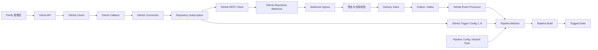

# GitHub OAuth2 Tech Design

## 1. 文档信息

| 项目 | 内容 |
| --- | --- |
| 状态 | Proposed |
| 目标模块 | `firefly-github`、`firefly-app` |
| 主要能力 | GitHub OAuth2、Repository Webhook、Webhook 驱动 CI/CD |
| 首期认证方式 | GitHub OAuth App |
| MVP 使用模型 | 单用户、单 Firefly 环境 |
| 长期演进方向 | GitHub App |

## 2. 背景

Firefly 已经具有 Pipeline、Stage、Job、Plugin 的配置与执行模型，也具备
Kafka Inbox/Outbox 和 `TriggerCenter`。当前仓库包含独立的
`firefly-github` Maven 模块，但该模块尚未实现 GitHub 连接能力；GitHub
触发相关代码仅保存仓库 URL，尚未覆盖授权、Token 管理、Webhook 生命周期、
消息验签、幂等和自动 Pipeline 匹配。

本设计为 Firefly 增加以下完整链路：

1. Firefly 用户通过 GitHub OAuth2 授权 Firefly。
2. Firefly 获取并安全保存 GitHub Access Token。
3. 用户选择 GitHub 仓库并建立 Repository Subscription。
4. Firefly 调用 GitHub REST API 创建或更新 Repository Webhook。
5. GitHub 向 Firefly 投递 `push`、`pull_request` 等事件。
6. Firefly 验签、持久化并异步处理 Webhook Delivery。
7. Firefly 根据仓库、事件、action 和标准化分支名匹配 Pipeline，并创建 CI/CD
   Build。

## 3. 目标与非目标

### 3.1 目标

- 支持 GitHub OAuth2 Authorization Code Flow。
- 使用一次性 `state` 和 PKCE S256 防止授权流程被劫持。
- 获取 GitHub Token 后重新查询 GitHub 用户身份。
- 加密保存 Token，并提供失效、重授权和撤销状态。
- 使用 GitHub REST API 创建、更新、测试和删除 Repository Webhook。
- 使用 HMAC-SHA256 校验 `X-Hub-Signature-256`。
- 使用 `X-GitHub-Delivery` 防止重放和重复触发。
- 单个 Firefly 环境内，每个 GitHub Repository 仅创建一个独占的 Firefly
  Webhook，多条 Pipeline 共享该 Repository Subscription。
- 支持按事件、Pull Request action 和标准化分支名匹配自动 Pipeline。
- Webhook HTTP 接收与 Pipeline 构建异步解耦。
- 复用 Firefly 已有 Kafka Inbox/Outbox 和 `TriggerCenter` 能力，并为 GitHub
  Webhook 新增独立的 Delivery Inbox。
- 为错误恢复、审计、监控和人工重试提供数据基础。

### 3.2 非目标

- 本阶段不实现 GitHub App Installation Token。
- 本阶段不实现 GitHub Enterprise Server 多实例管理，但配置应允许替换
  OAuth/API Base URL。
- 本阶段不实现 GitHub Actions Workflow 管理。
- 本阶段不负责 Runner 或构建容器调度。
- 本阶段不支持任意 GitHub Event；只开放经过定义和测试的事件。
- 本阶段不在前端或日志中暴露 GitHub Access Token。
- MVP 不引入 Firefly 用户、租户或多用户资源隔离模型；一个 Firefly 环境只连接
  一个 GitHub 用户。多用户和多租户能力需要后续独立设计。

## 4. 关键技术决策

### 4.1 首期使用 OAuth App

当前需求明确要求通过 OAuth2 获取用户 Token，再由 Firefly 代表用户调用
GitHub API，因此首期选择 GitHub OAuth App。

长期建议迁移到 GitHub App：GitHub App 具有更细粒度的仓库权限、用户可选择
安装仓库、Installation Token 有较短有效期，也更适合无人值守自动化。模块
内部应通过 `GitHubCredentialProvider` 抽象 Token 来源，为后续迁移保留边界。

### 4.2 Webhook 与 Pipeline 是一对多关系

MVP 中，同一 Firefly 环境里的每个 GitHub Repository 只创建一个独占 Webhook。
Repository Subscription 负责该 Webhook 的完整生命周期，多条 Pipeline 通过
`github_trigger_config` 引用同一个 Subscription。数据库以不可变的
`github_repository_id` 施加全局唯一约束，而不是以 Connection 或仓库名称限定
唯一性。

不采用“每条 Pipeline 创建一个 Webhook”，原因包括：

- 避免 GitHub 仓库中出现大量重复 Hook。
- 避免同一 Delivery 被 Firefly 接收多次。
- 简化 Secret 轮换、删除、测试和故障恢复。
- 支持多条 Pipeline 在 Firefly 内部独立匹配同一事件。

如果以后支持多用户或多租户，必须重新评估 Webhook 的所有权和唯一键；MVP 的
全局唯一约束不得未经迁移直接沿用。

### 4.3 HTTP 接收与业务处理异步解耦

Webhook Controller 只负责原始报文限制、签名校验、Repository 校验、Delivery
持久化和 Outbox 入队，然后返回 `202 Accepted`。Pipeline 匹配和 Build 创建由
Kafka Consumer 异步执行。

GitHub 要求 Webhook 接收端在 10 秒内返回 2XX；同步创建完整 Pipeline Build
会放大数据库或 Kafka 延迟，不适合放在 HTTP 请求内。

### 4.4 使用 Repository ID 作为稳定身份

业务关联以 GitHub `repository.id` 为准，`owner/repository` 仅用于展示和 API
路径。仓库可能重命名或转移，Repository ID 不会因名称变化而改变。

### 4.5 Token 与 Webhook Secret 分开管理

- Access Token 用于 Firefly 主动调用 GitHub API。
- Webhook Secret 用于验证 GitHub 主动投递的请求。
- 每个 Repository Subscription 使用独立的 Webhook Secret。
- 两者都只保存密文，但具有独立密钥用途和轮换流程。

### 4.6 MVP 使用单用户模型

MVP 不依赖当前代码库中尚不存在的 Firefly User/Tenant 模型。一个 Firefly
部署的 `github_connection` 表最多保留一行，该行代表当前唯一 GitHub Connection；
非 `ACTIVE` 状态不会为第二个 GitHub 用户释放并行连接名额。管理员必须先完成或
强制完成现有 Connection 的断开流程，才能连接其他 GitHub 用户。管理 API 由部署层
的管理员认证或内网访问控制保护。OAuth `state` 仍必须绑定发起授权的浏览器会话，
以防止登录 CSRF，但不会写入不存在的 `tenant_id` 或 `firefly_user_id`。

### 4.7 配置 Trigger 与运行期 Trigger 分离

- `github_trigger_config` 是 Pipeline 的静态 GitHub 触发配置，在创建或更新
  Pipeline 时维护。
- `github_trigger` 保留为运行期审计记录，只在 Webhook 实际匹配并触发 Pipeline
  时创建。
- `pipeline_config.origin_id` 在 `trigger_origin=GITHUB` 时指向
  `github_trigger_config.id`。
- `GithubMessageEntity.triggerID` 指向本次触发创建的 `github_trigger.id`。

两张表不得合并或复用 ID，以免配置关系和运行历史产生语义冲突。

## 5. 总体架构



## 6. 模块职责

### 6.1 `firefly-github`

`firefly-github` 只负责 GitHub 协议、通用领域模型和扩展端口，不依赖
`firefly-app`。

建议包结构：

```text
firefly.github
├── config       GitHub 配置与 Spring Boot 自动装配
├── oauth        Authorization URL、state、PKCE、Token Exchange
├── client       GitHub REST Client、错误和 Rate Limit
├── repository   Repository 查询、身份标准化
├── webhook      Webhook 管理、签名校验、事件解析
├── model        GitHub 请求、响应和标准事件模型
├── exception    统一异常模型
└── port         凭据、state、事件持久化等扩展接口
```

主要接口：

```text
GitHubOAuthService
GitHubRepositoryClient
GitHubWebhookClient
GitHubWebhookSignatureVerifier
GitHubEventParser
GitHubCredentialProvider
OAuthStateStore
```

### 6.2 `firefly-app`

`firefly-app` 负责 Firefly 业务和持久化：

- 单用户 MVP 的 GitHub Connection 及表中最多一行的唯一约束。
- Token 和 Webhook Secret 的加密存储。
- Repository Subscription。
- Pipeline 通用分支匹配属性与 `github_trigger_config`。
- 运行期 `github_trigger` 审计记录。
- Webhook Delivery Inbox 和 Delivery-Pipeline 幂等记录。
- GitHub 标准事件到 `GithubMessageEntity` 的转换。
- 调用现有 `PipelineBuildService`、Outbox 和 `TriggerCenter`。
- 管理 API 的部署级管理员访问控制。

## 7. OAuth2 连接设计

### 7.1 OAuth App 配置

每个环境使用独立的 GitHub OAuth App：

- Development
- Staging
- Production

配置项：

```text
GITHUB_CLIENT_ID
GITHUB_CLIENT_SECRET
GITHUB_REDIRECT_URI
GITHUB_OAUTH_BASE_URL=https://github.com
GITHUB_API_BASE_URL=https://api.github.com
GITHUB_API_VERSION=2026-03-10
GITHUB_PUBLIC_BASE_URL
GITHUB_OAUTH_STATE_TTL=10m
GITHUB_CONNECT_TIMEOUT=3s
GITHUB_READ_TIMEOUT=10s
```

`GITHUB_CLIENT_SECRET` 必须由部署平台 Secret、KMS 或 Vault 注入，不得提交到
Git 仓库。

### 7.2 发起授权

```http
GET /api/github/oauth/authorize
```

服务端执行：

1. 校验部署级管理员访问权限。
2. 生成至少 256 bit 的随机 `state`。
3. 生成 PKCE `code_verifier`。
4. 计算 `code_challenge = BASE64URL(SHA256(code_verifier))`。
5. 生成浏览器会话随机值，写入名为 `firefly_github_oauth_session` 的
   `HttpOnly`、`Secure`、`SameSite=Lax` Cookie；`Path=/api/github/oauth`，
   `Max-Age` 与 `GITHUB_OAUTH_STATE_TTL` 相同。
6. 将 `state`、浏览器会话随机值、`code_verifier`、创建时间和过期时间绑定保存。
7. 重定向至 GitHub Authorization Endpoint。

Authorization URL 参数：

```text
client_id
redirect_uri
scope
state
code_challenge
code_challenge_method=S256
```

`state` 必须一次性使用。多实例部署使用 Redis 或数据库实现
`OAuthStateStore`，不能使用单实例内存作为生产默认实现。服务端 state 过期时间是
授权有效性的最终依据；即使浏览器仍发送 Cookie，已过期的 state 也必须拒绝。

### 7.3 OAuth 回调

```http
GET /api/github/oauth/callback?code={code}&state={state}
```

处理顺序：

1. 校验 `state` 存在、未过期、与当前浏览器会话随机值一致且未使用。
2. 原子消费 `state`，阻止重复 Callback；一旦进入 Callback，无论成功、用户拒绝
   还是校验失败，都使用 `Max-Age=0` 清除 OAuth 会话 Cookie。
3. 使用 `code`、`client_secret`、`redirect_uri` 和 `code_verifier` 换 Token。
4. 检查 Token 响应中的实际 `scope`。
5. 使用 Token 调用 `GET /user`，确认 GitHub 用户 ID 和 login。
6. 在数据库事务中按固定 `singleton_key=DEFAULT` 保存 Connection：
   - 表中无记录时尝试 INSERT；`UNIQUE(singleton_key)` 是并发请求的最终仲裁。
   - 已有记录且 `github_user_id` 相同时执行 UPDATE，替换 Token 密文、scope、login
     和校验时间，不得 INSERT 第二行；普通重授权恢复为 `ACTIVE`，但若当前状态是
     `DISCONNECTING`，则保持该状态并使用新 Token 继续远端 Hook 清理，不能静默取消
     管理员已发起的断开操作。
   - 已有记录属于其他 GitHub 用户时返回 `409 GITHUB_CONNECTION_ALREADY_EXISTS`，
     要求管理员先断开现有 Connection；新交换的 Token 不得落库或写日志，并应尽力
     通过 GitHub OAuth Application API 撤销。
   - INSERT 遇到唯一键冲突时重新读取当前行，并按上述同用户/不同用户分支处理，
     不得把数据库异常直接暴露给调用方。
7. 返回 Connection 信息，不向前端返回 Access Token。

建议响应：

```json
{
  "connectionId": "01JEXAMPLE",
  "githubUserId": 123456,
  "login": "octocat",
  "status": "ACTIVE",
  "scopes": ["admin:repo_hook"]
}
```

### 7.4 OAuth Scope 策略

| 场景 | Scope |
| --- | --- |
| 创建、更新、测试和删除 Repository Webhook | `admin:repo_hook` |
| 创建、更新和 ping Webhook，不删除 | `write:repo_hook` |
| 公共仓库代码操作 | `public_repo` |
| 私有仓库代码读取及完整仓库操作 | `repo` |

MVP 建议申请 `admin:repo_hook`，符合最小权限原则。如果 CI/CD 还需要由 Firefly
使用 HTTPS Token 拉取私有仓库，则需要额外申请权限很大的 `repo` scope。该能力
必须在授权页面单独说明；长期应使用 GitHub App 的 Contents read 权限和短期
Installation Token。

## 8. Token 安全与生命周期

### 8.1 存储原则

- 数据库只保存密文、IV/Nonce 和密钥版本。
- 生产环境优先使用 KMS 或 Vault Envelope Encryption。
- 本地开发可以使用 AES-256-GCM，但密钥仍通过环境变量注入。
- Token 只在调用 GitHub API 前于内存中短暂解密。
- Authorization Header、Token、Client Secret 和 Webhook Secret 不得写日志。
- DTO、Exception 和 Entity 的字符串输出必须排除敏感字段。

### 8.2 Connection 状态

```text
PENDING → ACTIVE → INVALID → REAUTH_REQUIRED
                   └──────→ REVOKED
ACTIVE/REAUTH_REQUIRED/REVOKED → DISCONNECTING
```

当 GitHub API 返回 Token `401` 时：

1. 将 Connection 标记为 `REAUTH_REQUIRED`。
2. 停止使用该 Token 发起新的管理操作。
3. 保留已有 Webhook 接收能力，因为验签不依赖 Access Token。
4. 通知用户重新授权。

GitHub OAuth App Web Application Flow 的 Token Exchange 不返回 `refresh_token`，
因此 MVP 不实现定时刷新或 refresh flow。Access Token 没有可依赖的固定过期时间，
但可能被用户、OAuth App、安全策略撤销，也会因一年未使用而被 GitHub 自动撤销。
`REAUTH_REQUIRED` 的恢复路径是由同一 GitHub 用户重新完成 OAuth 授权；新 Token
原子替换旧密文后 Connection 回到 `ACTIVE`。不得在后台无限重试已经返回 `401` 的
Token。

## 9. Repository Subscription 与 Webhook 生命周期

### 9.1 创建订阅

```http
PUT /api/github/connections/{connectionId}/repositories/{owner}/{repository}/subscription
```

服务端执行：

1. 校验单用户环境中的 Connection 状态为 `ACTIVE`。
2. 解密 Token，并查询目标 Repository。
3. 以 GitHub Repository ID 查询现有 Subscription；已被当前环境订阅时执行
   Upsert，不得再创建第二条 Subscription 或第二个 Webhook。
4. 保存 Repository ID、Node ID、Full Name、默认分支和 Clone URL。
5. 首次创建时生成该 Subscription 独立的高熵 Webhook Secret。
6. 查询该仓库现有 Webhook。
7. 根据 Firefly Callback URL 查找已存在的 Hook。
8. 已存在则更新，不存在则创建；同一仓库不得为不同 Pipeline 创建额外 Hook。
9. 保存 GitHub 返回的 `webhook_id`，再调用 ping/test 接口验证配置。
10. GitHub 创建 Webhook 时可能自动发送 ping。若 ping 早于步骤 9 到达，接收端可在
    `PROVISIONING` Subscription 上暂存已通过签名与 Repository ID 校验的
    `X-GitHub-Hook-ID`；REST 响应返回后必须与 `webhook_id` 比较，一致才激活，
    不一致则进入 `ERROR` 并告警。

Webhook 创建请求：

```json
{
  "name": "web",
  "active": true,
  "events": ["push", "pull_request"],
  "config": {
    "url": "https://firefly.example/api/github/webhooks/01JEXAMPLE",
    "content_type": "json",
    "secret": "<high-entropy-secret>",
    "insecure_ssl": "0"
  }
}
```

Webhook 管理采用 Upsert 语义。创建请求遇到超时或不确定结果时，必须先重新
查询 GitHub 当前 Webhook，再决定是否重试，不能直接重复 POST。

MVP 的 Repository Webhook 固定订阅 `push` 和 `pull_request`。每条
`github_trigger_config.events` 是 Firefly 内部的过滤子集；新增或删除 Pipeline
不会为仓库新增 Webhook，也不需要改变 GitHub 侧 Hook 数量。

### 9.2 删除订阅

```http
DELETE /api/github/subscriptions/{subscriptionId}
```

处理顺序：

1. 在同一个本地事务中将 Subscription 标记为 `DELETING`，并将所有引用它的
   `github_trigger_config` 设为 `enabled=false`、
   `disabled_reason=SUBSCRIPTION_DELETED`，但保留配置和 Pipeline；重新订阅同一仓库
   后不自动启用，必须由管理员显式启用，避免意外恢复 CI/CD。
2. 使用 Connection Token 删除 GitHub Webhook。
3. 删除成功或 GitHub 返回 Hook 不存在后标记为 `DELETED`。
4. 保留历史 Delivery 和 Trigger 审计记录。

步骤 1 保证删除开始后不再产生新 Build；GitHub 远端删除成功后再提交终态。删除
失败保持 `DELETING` 并进入有限重试，不能物理删除 Subscription 或历史记录。

### 9.3 Subscription 状态

```text
PROVISIONING → ACTIVE
      └──────→ ERROR → PROVISIONING
ACTIVE → DELETING → DELETED
                └→ ORPHANED
```

### 9.4 断开 Connection 与孤儿 Webhook

```http
DELETE /api/github/connections/{connectionId}
```

断开流程：

1. 使用条件更新将 Connection 从可用状态改为 `DISCONNECTING`，拒绝新建/更新
   Subscription，并在同一事务中将全部非终态 Subscription 改为 `DELETING`、禁用
   相关 Trigger Config。
2. 对每条 Subscription 使用当前 Token 删除 GitHub Webhook；Hook 不存在视为成功。
3. 全部远端 Hook 删除成功后，将 Subscription 标记为 `DELETED`，清除 Token 密文，
   记录审计事件后物理删除唯一 Connection 行，使新的 GitHub 用户可以连接。
4. 部分失败时 Connection 保持 `DISCONNECTING`，成功项不回滚，失败项按退避策略
   重试并告警。

若 Token 已是 `REAUTH_REQUIRED`、`REVOKED` 或 GitHub 持续返回 `401`，远端 Hook
不能可靠删除。此时支持两条显式恢复路径：

- 同一 GitHub 用户重新授权，恢复 `ACTIVE` Token 后继续清理。
- 管理员确认风险后执行 force-local-disconnect：将未删除 Hook 的 Subscription
  标记为 `ORPHANED`，保留 repository/webhook ID 和最后错误用于人工清理，清除
  Token 并删除 Connection 行。该操作必须二次确认、写审计日志并触发告警。

`ORPHANED` 只表示 Firefly 已放弃远端管理，不代表 GitHub Hook 已删除。由于 Hook
仍持有旧 Callback URL，接收端必须拒绝非 `ACTIVE`/`PROVISIONING` Subscription 的
业务事件。历史 Subscription 的 `connection_id` 允许在 Connection 删除时置空，
不得因级联删除丢失审计线索。

### 9.5 Webhook Secret 轮换

每个 Subscription 支持 `active_secret` 与一个 `pending_secret`。轮换必须遵守以下
顺序，避免 GitHub 已使用新 Secret 而接收端尚未接受的竞态：

1. 生成新 Secret，加密保存为 `pending_secret`；接收端先发布为新旧 Secret 双验签，
   但仍将旧 Secret 标记为 active。
2. 调用 GitHub Update Repository Webhook API，将 Hook Secret 更新为新值；更新完整
   Hook 配置时必须同时提交 Secret，避免 GitHub 清空已有 Secret。
3. 主动调用 ping，并等待接收端记录“使用 pending Secret 验签成功”；仅收到 2XX
   或旧 Secret 验签成功不能视为轮换完成。
4. 将 pending 原子提升为 active，旧 Secret 进入有上限的宽限窗口；窗口结束后
   清除旧密文。宽限窗口只用于吸收已在途 Delivery，不接受无限期双 Secret。

GitHub 更新失败时保留旧 active Secret，撤销或重试 pending，不影响现有验签。
GitHub 更新成功但验证超时时保持双验签、状态标记为 `ROTATION_VERIFYING` 并告警，
由调和任务查询 Hook 后继续 ping 或执行显式回滚。轮换操作、密钥版本、开始/完成
时间和失败原因必须审计，但不得记录 Secret 明文。

## 10. Pipeline GitHub Trigger 配置

当前 Pipeline 已包含：

- `trigger_origin`
- `trigger_mode`
- `trigger_match`
- `origin_id`

`branch_pattern` 和 `trigger_match` 是 Pipeline 自身的通用触发属性，不属于
GitHub 特有配置。`pipeline_config` 保留已有 `trigger_match`，并新增：

```text
branch_pattern VARCHAR(512) NOT NULL DEFAULT ''
```

当 `trigger_origin=GITHUB` 时，`origin_id` 指向
`github_trigger_config.id`。`github_trigger_config` 只保存 GitHub 特有的
Repository Subscription、事件和 Pull Request action 等配置，不保存
`branch_pattern` 或 `trigger_match`。

建议的强类型配置：

```json
{
  "subscriptionId": "01JEXAMPLE",
  "events": ["push", "pull_request"],
  "pullRequestActions": [
    "opened",
    "reopened",
    "synchronize",
    "ready_for_review"
  ],
  "ignoreDeletePush": true
}
```

Pipeline 请求中的通用触发属性单独表示：

```json
{
  "triggerOrigin": "GITHUB",
  "triggerMode": "AUTOMATIC",
  "triggerMatch": "ACCURATE",
  "branchPattern": "main"
}
```

`TriggerMatch` 语义：

| 类型 | 行为 | 示例 |
| --- | --- | --- |
| `ACCURATE` | 标准化后的分支名完全相等 | `main` |
| `PREFIX` | 标准化后的分支名以前缀开始 | `release/` |

对于 GitHub 自动触发 Pipeline，`branch_pattern` 使用不带 `refs/heads/` 前缀的
分支名，不能为空：

- Push 必须先执行守卫：只有 `payload.ref` 以 `refs/heads/` 开头时才去掉前缀并进入
  分支匹配；其他 ref（包括 `refs/tags/*`）直接标记为 `IGNORED`，不得把原始 ref
  写入 `matchBranch`。
- Pull Request 默认使用目标分支 `pull_request.base.ref`；源分支
  `pull_request.head.ref` 仅保存在标准事件中，不参与 MVP 匹配。
- Tag Push 不进入分支匹配；MVP 直接标记为 `IGNORED`。
- `trigger_mode=MANUAL` 的 Pipeline 永远不会被 Webhook 自动触发。

匹配查询必须同时满足：

1. `pipeline_config.trigger_origin=GITHUB`。
2. `pipeline_config.trigger_mode=AUTOMATIC`。
3. `github_trigger_config.enabled=true`。
4. `github_trigger_config.subscription_id` 等于本次 Delivery 的 Subscription。
5. Event 和 Pull Request action 命中 GitHub Trigger Config。
6. 标准化后的分支名按照 Pipeline 的 `trigger_match` 与 `branch_pattern` 命中。

### 10.1 Trigger Config 维护与级联规则

创建 GitHub 自动触发 Pipeline 时，沿用当前 `PipelineConfigServiceImpl` 的写入模型，
在同一个事务内执行：

1. 先插入 `pipeline_config`，临时使用 `origin_id=-1` 并获得 `pipeline_id`。
2. 插入 `github_trigger_config(pipeline_id, subscription_id, ...)` 并获得 config ID。
3. 回填 `pipeline_config.origin_id=github_trigger_config.id`。

任何一步失败都回滚。更新时同时校验两个方向的 ID 仍一致，不允许把其他 Pipeline
的 Trigger Config 绑定过来。删除 Pipeline 时，在同一事务删除关联
`github_trigger_config`；数据库外键使用 `ON DELETE CASCADE` 作为兜底，
`pipeline_config.origin_id` 是应用维护的弱引用，不建立反向外键以避免循环约束。

删除 Subscription 不删除 Pipeline 或 Trigger Config，而是按 §9.2 禁用配置。
重新订阅不会自动恢复这些配置；管理员更新 Pipeline 并显式启用后，才允许再次
参与匹配。

## 11. Webhook 接收设计

### 11.1 接口

```http
POST /api/github/webhooks/{subscriptionPublicId}
```

`subscriptionPublicId` 是随机公开 ID，只用于定位 Subscription，不是安全凭据。

### 11.2 接收顺序

1. 校验 Content-Type，仅接受 `application/json`（允许 `charset` 参数）；其他类型
   返回 `415 Unsupported Media Type`，不进入业务处理。
2. 限制请求体大小，建议最大 2 MiB；超限返回 `413 Payload Too Large`。
3. 保留未经修改的原始请求字节。
4. 根据 Public ID 查询 Subscription；业务事件只接受 `ACTIVE`，`ping` 可接受
   `PROVISIONING` 或 `ACTIVE`。
5. 解密该 Subscription 当前有效的 Webhook Secret 集合。
6. 读取并校验 `X-Hub-Signature-256`，使用常量时间算法逐一比较 HMAC-SHA256；
   Secret 轮换期间记录命中的密钥版本。
7. 读取并校验非空的 `X-GitHub-Delivery`、`X-GitHub-Event` 和
   `X-GitHub-Hook-ID`。
8. 按事件类型解析最小字段并校验 payload 中 Repository ID 与 Subscription 一致；
   `ping` 使用 §11.3 的专用模型，不通过 push/PR 解析器。
9. 原子插入 Delivery Inbox；重复 Delivery 直接返回成功。
10. 对业务事件在同一事务写入 Outbox；对 `ping` 直接写入终态，不进入 Kafka。
11. 返回 `202 Accepted`。

签名必须基于原始请求体计算。不能将 JSON 反序列化后重新序列化再验签，因为
空格、字段顺序或 Unicode 表示变化都会改变 HMAC。

### 11.3 Ping Delivery

`X-GitHub-Event: ping` 必须在通用事件反序列化之前分流。验签、Delivery ID 和
Repository ID 校验与业务事件相同，并额外执行：

1. 将 `X-GitHub-Hook-ID` 与 `payload.hook.hook_id` 比较，两者必须相同；GitHub
   官方 ping schema 的 Hook ID 字段不是 `payload.hook.id`，也不是 payload 顶层字段。
2. Subscription 已保存 `webhook_id` 时，二者还必须与其一致；不一致返回 `403`、
   在已经通过签名和 Repository ID 校验的前提下将 Delivery 写为终态 `REJECTED`
   并告警，不写 Outbox。
3. `PROVISIONING` 且 `webhook_id` 尚未保存时，暂存观察到的 Hook ID，待创建 API
   返回后按 §9.1 对账。
4. 校验成功后将 Delivery 标记为 `SUCCESS`，记录命中的 Secret 密钥版本，不创建
   Outbox、不匹配 Pipeline，也不创建 Build。

主动 ping/test API 只有在收到上述接收侧 `SUCCESS` 断言后才算通过；仅 GitHub REST
API 返回成功不足以证明 Callback URL、签名和 Hook ID 配置正确。

## 12. 标准事件模型

`firefly-github` 将 GitHub 原始 JSON 转换成稳定的内部模型，主应用不直接依赖
完整 GitHub Payload：

```text
deliveryId
eventType
action
repositoryId
repositoryFullName
repositoryUrl
cloneUrl
defaultBranch
sourceBranch
targetBranch
matchBranch
headSha
senderId
senderLogin
receivedAt
```

### 12.1 Push

映射规则：

```text
if !payload.ref.startsWith("refs/heads/"):
    status = IGNORED
    stop mapping
sourceBranch = payload.ref.substring(length("refs/heads/"))
targetBranch = null
matchBranch  = sourceBranch
headSha      = payload.after
```

默认忽略：

- `deleted=true`。
- `after` 为全零 SHA。
- Tag Push；MVP 不支持 Pipeline 订阅 Tag。

### 12.2 Pull Request

映射规则：

```text
sourceBranch = pull_request.head.ref
targetBranch = pull_request.base.ref
matchBranch  = targetBranch
headSha      = pull_request.head.sha
```

默认 action 白名单：

```text
opened
reopened
synchronize
ready_for_review
```

其他 action 只有在 Pipeline Trigger 明确支持后才能触发。

### 12.3 `GithubMessageEntity` 最终形态

现有 `GithubMessageEntity.URL` 字段不符合 JavaBean 命名规范，也不足以承载
Webhook 上下文。实现时将其替换为 `repositoryUrl`，并在继承的 Pipeline 字段
之外至少包含：

```text
deliveryId
eventType
action
repositoryId
repositoryFullName
repositoryUrl
cloneUrl
sourceBranch
targetBranch
matchBranch
headSha
senderId
senderLogin
receivedAt
```

`GithubMessageEntity.triggerID` 继续继承自 `BaseMessage`，并由
`GithubTrigger.dispatch` 设置为本次运行期 `github_trigger.id`。旧的 `getURL()` /
`setURL()` 在同一迁移中删除，所有消费者改用 `repositoryUrl`。

## 13. 消息可靠性与幂等

### 13.1 Delivery Inbox

`X-GitHub-Delivery` 是 GitHub Delivery 唯一标识。GitHub 手工重投同一个
Delivery 时该值保持不变，因此以其作为幂等键。

接收事务：

```text
INSERT github_webhook_delivery
+ INSERT outbox_event(topic=github_webhook_message)
+ COMMIT
```

如果 Delivery 已存在：

- 不重复写 Outbox。
- 不重复触发 Pipeline。
- 返回成功，避免 GitHub 将请求标记为失败。

### 13.2 Delivery-Pipeline 幂等

一个 Delivery 可能匹配多条 Pipeline，因此增加唯一约束：

```text
UNIQUE (delivery_id, pipeline_id)
```

该记录用于保证：

- 同一个 Delivery 可以触发多条 Pipeline。
- 每条 Pipeline 最多创建一个 Build。
- 单条 Pipeline 失败可独立重试。
- 服务重启后不会重复生成 Build。

### 13.3 异步处理

建议新增 Kafka Topic：

```text
github_webhook_message
```

Consumer 流程：

1. 使用独立短事务原子领取 Delivery Inbox，将其从可处理状态改为
   `PROCESSING`；并发消费者只有一个可以领取成功。
2. 查询该 Subscription 下启用的 `github_trigger_config`，Join
   `pipeline_config`，只保留 `trigger_mode=AUTOMATIC` 的 Pipeline。
3. 按事件、action、`matchBranch`、`pipeline_config.trigger_match` 和
   `pipeline_config.branch_pattern` 过滤。
4. 对每条匹配 Pipeline 调用独立的 `@Transactional` 处理方法：
   1. 条件插入或领取 Delivery-Pipeline 幂等记录。
   2. 再次校验 Pipeline 和 Trigger Config 仍然启用。
   3. 复用现有 `PipelineBuildServiceImpl.triggerPipeline` 的组合语义：
      `buildPipeline → buildMessage → TriggerCenter.dispatch`，不得在 GitHub Consumer
      复制一套等价流程。由于当前 `PipelineBuildRequest`/`ITriggerOrigin.buildMessage`
      不能携带 GitHub Delivery 上下文，实现时应增加兼容旧调用方的重载或抽取共享
      orchestration，并通过强类型 `GitHubTriggerInvocationContext` 传入标准事件。
   4. GitHub 的 `buildMessage` 必须构造最终 `GithubMessageEntity`，除 §12.3 字段外
      明确设置 `triggerOrigin=GITHUB`、正数 `pipelineID`、正数
      `pipelineBuildID`、非负 `executionAttempt`；任一字段缺失都必须在分发前失败，
      不能把非法消息交给 `AbstractTrigger.dispatch`。
   5. 共享 orchestration 将消息交给现有 `TriggerCenter`；
      `GithubTrigger.dispatch` 创建运行期 `github_trigger`，并写入
      `BuildStatus.RUNNING` Outbox。
   6. 将 Delivery-Pipeline 标记为 `SUCCESS` 并保存 `pipeline_build_id`。
5. 全部匹配项处理完成后，将 Delivery 标记为 `SUCCESS`；没有匹配项时标记为
   `IGNORED`。

### 13.4 Consumer 事务边界

步骤 4 中单条 Pipeline 的以下写入必须在同一个 MySQL 事务中提交或回滚：

```text
github_delivery_pipeline(PROCESSING/SUCCESS)
+ pipeline_build / stage_build / job_build / plugin_build
+ github_trigger（运行期记录）
+ outbox_event(BuildStatus.RUNNING)
```

`AbstractTrigger.dispatch` 使用默认 `REQUIRED` 传播加入该外层事务；现有
`OutboxService.enqueue` 的 `MANDATORY` 语义保持不变。如果任一步失败，上述数据
全部回滚，再使用独立事务将 Delivery-Pipeline 更新为 `RETRYABLE`（达到最大次数时
为 `DEAD`）并记录脱敏错误。重试时通过状态条件更新领取 `RETRYABLE` 记录，不能绕过
`UNIQUE (delivery_id, pipeline_id)` 再创建 Build。

这样可以保证：事务提交后 Build、运行期 Trigger 和 Outbox 同时存在；事务失败
时三者同时不存在，不会因为 Consumer 重试产生孤立 Build 或丢失启动消息。

### 13.5 PROCESSING 租约、恢复与终态

Delivery 与 Delivery-Pipeline 都使用带租约的条件领取，不允许仅写一个永久
`PROCESSING` 状态：

```text
RECEIVED/RETRYABLE → PROCESSING → SUCCESS/IGNORED
                           └────→ RETRYABLE → PROCESSING
                                           └→ DEAD
```

- 领取时原子写入 `processor_id`、`processing_started_at`，并递增
  `processing_attempt`；只有预期前态匹配的 Consumer 能领取成功。
- 默认租约超时为 5 分钟、最大尝试次数为 5，均通过配置管理；处理代码应定期确认
  单次处理不会静默超过租约，长任务需要续租或采用更大的明确超时。
- 每分钟运行恢复任务，使用条件更新将超时的 `PROCESSING` 改为 `RETRYABLE` 并设置
  带抖动的 `next_retry_at`；若已达到最大尝试次数则改为 `DEAD`。
- 恢复任务必须比较原 `processor_id` 和 `processing_started_at`，防止旧 Consumer
  覆盖已经被新 Consumer 领取或完成的记录。
- 管理 API 可沿用现有 Inbox 的显式 reset 语义人工恢复 `DEAD`，但必须记录操作者、
  原因并将 attempt 重置策略写入审计；人工 reset 不能绕过幂等唯一键。
- `DEAD`、恢复任务异常和超时堆积必须告警。错误摘要需要脱敏，完整原始 Payload
  仍按保留策略处理。

Delivery 仅在全部 Delivery-Pipeline 都进入 `SUCCESS`/`IGNORED` 后进入
`SUCCESS`；存在可重试子项时保持 `RETRYABLE`，任一子项最终 `DEAD` 时 Delivery
也进入 `DEAD`。Consumer 崩溃、进程重启或 Kafka Rebalance 后均由上述租约恢复，
不得依赖 Kafka 再次投递恰好修复数据库状态。

## 14. 数据模型

### 14.1 `github_connection`

| 字段 | 类型/约束 | 说明 |
| --- | --- | --- |
| `id` | BIGINT PK | 内部 ID |
| `public_id` | VARCHAR UNIQUE | 对外 Connection ID |
| `singleton_key` | VARCHAR UNIQUE | MVP 固定为 `DEFAULT`，保证单 Connection |
| `github_user_id` | BIGINT | GitHub 不可变用户 ID |
| `github_login` | VARCHAR | 展示用 login |
| `access_token_ciphertext` | TEXT | Token 密文 |
| `token_nonce` | VARBINARY | AEAD nonce |
| `encryption_key_version` | VARCHAR | 密钥版本 |
| `scopes` | JSON | 实际授权 Scope |
| `status` | VARCHAR | Connection 状态 |
| `last_validated_at` | DATETIME(6) | 最近验证时间 |
| `created_at` / `updated_at` | DATETIME(6) | 审计时间 |

MVP 唯一性：

```text
UNIQUE (singleton_key)
INDEX (github_user_id)
```

`UNIQUE(singleton_key)` 已保证表中最多一行，`UNIQUE(github_user_id)` 在该模型下
没有额外约束价值，因此只保留查询索引。Connection 的 INSERT/UPDATE 冲突语义按
§7.3 执行；多用户版本不得直接删除 `singleton_key` 后复用本表，必须先补充用户
归属和授权迁移方案。

### 14.2 `github_repository_subscription`

| 字段 | 类型/约束 | 说明 |
| --- | --- | --- |
| `id` | BIGINT PK | 内部 ID |
| `public_id` | VARCHAR UNIQUE | Webhook URL 使用的随机 ID |
| `connection_id` | BIGINT NULL FK | GitHub Connection；删除时 `ON DELETE SET NULL` |
| `github_repository_id` | BIGINT | GitHub Repository ID |
| `node_id` | VARCHAR | GitHub Node ID |
| `owner` | VARCHAR | Repository Owner |
| `repository_name` | VARCHAR | Repository Name |
| `full_name` | VARCHAR | `owner/repository` |
| `html_url` | VARCHAR | GitHub 页面地址 |
| `clone_url` | VARCHAR | HTTPS Clone URL |
| `default_branch` | VARCHAR | 默认分支 |
| `webhook_id` | BIGINT | GitHub Hook ID |
| `observed_webhook_id` | BIGINT NULL | PROVISIONING ping 提前到达时观察到的 Hook ID |
| `webhook_secret_ciphertext` | TEXT | 当前 active Secret 密文 |
| `webhook_secret_nonce` | VARBINARY | 当前 active Secret 的 AEAD nonce |
| `webhook_secret_key_version` | VARCHAR | 当前 active Secret 的密钥版本 |
| `pending_secret_ciphertext` / `pending_secret_nonce` | NULL | 轮换期间的新 Secret |
| `pending_secret_key_version` | VARCHAR NULL | pending Secret 的密钥版本 |
| `previous_secret_ciphertext` / `previous_secret_nonce` | NULL | 提升后宽限期内的旧 Secret |
| `previous_secret_expires_at` | DATETIME(6) NULL | 旧 Secret 停止验签时间 |
| `secret_rotation_status` | VARCHAR | `IDLE` / `ROTATION_VERIFYING` / `ERROR` |
| `events` | JSON | Webhook 订阅事件 |
| `status` | VARCHAR | Subscription 状态 |
| `last_error` | VARCHAR | 最近错误摘要 |
| `created_at` / `updated_at` | DATETIME(6) | 审计时间 |

MVP 唯一性：

```text
UNIQUE (github_repository_id)
```

这个全局唯一约束保证同一 Firefly 环境内，每个 GitHub Repository 只有一条
Subscription 和一个 Webhook，多条 Pipeline 只能共享它。

### 14.3 `pipeline_config` 触发属性

现有字段继续作为 Pipeline 通用属性：

| 字段 | 类型/约束 | 说明 |
| --- | --- | --- |
| `trigger_mode` | VARCHAR | `AUTOMATIC` / `MANUAL` |
| `trigger_origin` | VARCHAR | `GITHUB` 等 Trigger Origin |
| `trigger_match` | VARCHAR | `ACCURATE` / `PREFIX` |
| `origin_id` | BIGINT | Origin 特有配置 ID |

新增字段：

| 字段 | 类型/约束 | 说明 |
| --- | --- | --- |
| `branch_pattern` | VARCHAR(512) NOT NULL DEFAULT '' | 标准化后的分支匹配值 |

现有 Pipeline 迁移时先写入空字符串；非 GitHub 或 `MANUAL` Pipeline 可以保持
为空。GitHub 自动触发 Pipeline 创建或更新时，`branch_pattern` 必须非空；当
`trigger_origin=GITHUB` 时，`origin_id` 指向 `github_trigger_config.id`。

### 14.4 `github_trigger_config`

| 字段 | 类型/约束 | 说明 |
| --- | --- | --- |
| `id` | BIGINT PK | Trigger Config ID |
| `pipeline_id` | BIGINT UNIQUE FK | Pipeline ID，`ON DELETE CASCADE` |
| `subscription_id` | BIGINT FK | Repository Subscription |
| `enabled` | BOOLEAN | 是否启用 |
| `disabled_reason` | VARCHAR NULL | 例如 `SUBSCRIPTION_DELETED`、`ADMIN_DISABLED` |
| `events` | JSON | 允许事件 |
| `pull_request_actions` | JSON | PR action 白名单 |
| `ignore_delete_push` | BOOLEAN | 是否忽略删除 Push |
| `created_at` / `updated_at` | DATETIME(6) | 审计时间 |

`branch_pattern` 和 `trigger_match` 不得在此表重复保存。创建或更新 Pipeline 时，
`pipeline_config.origin_id`、`github_trigger_config.pipeline_id` 和 Trigger Config
本身必须在同一事务中维护，并满足：

```text
pipeline_config.id = github_trigger_config.pipeline_id
pipeline_config.origin_id = github_trigger_config.id
pipeline_config.trigger_origin = GITHUB
```

### 14.5 `github_trigger`（运行期记录）

保留现有 `github_trigger` 表，但将其明确为运行期审计表，而不是 Pipeline 配置表：

| 字段 | 类型/约束 | 说明 |
| --- | --- | --- |
| `id` | BIGINT PK | 本次运行期 Trigger ID |
| `delivery_id` | VARCHAR INDEX | GitHub Delivery ID |
| `pipeline_id` | BIGINT INDEX | 被触发的 Pipeline |
| `pipeline_build_id` | BIGINT UNIQUE | 本次创建的 Build |
| `github_repository_id` | BIGINT | GitHub Repository ID |
| `github_repo_url` | VARCHAR | Repository URL，兼容现有字段 |
| `event_type` | VARCHAR | `push` / `pull_request` |
| `action` | VARCHAR | Pull Request action |
| `source_branch` | VARCHAR | 源分支 |
| `target_branch` | VARCHAR | Pull Request 目标分支 |
| `head_sha` | VARCHAR | 构建 Commit SHA |
| `legacy_record` | BOOLEAN | 迁移前历史行标记；新写入固定为 false |
| `created_at` | DATETIME(6) | 触发时间 |

`GithubMessageEntity.triggerID` 指向该表 `id`；该行与 Pipeline Build 和启动
Outbox 在同一事务中写入。

### 14.6 `github_webhook_delivery`

| 字段 | 类型/约束 | 说明 |
| --- | --- | --- |
| `delivery_id` | VARCHAR PK | `X-GitHub-Delivery` |
| `subscription_id` | BIGINT INDEX | Repository Subscription |
| `event_type` | VARCHAR | `X-GitHub-Event` |
| `action` | VARCHAR | Payload action |
| `repository_id` | BIGINT | GitHub Repository ID |
| `payload` | LONGTEXT/JSON | 原始或标准化 Payload |
| `status` | VARCHAR | Delivery 状态 |
| `processing_attempt` | INT | 处理次数 |
| `processor_id` | VARCHAR NULL | 当前租约持有者 |
| `processing_started_at` | DATETIME(6) NULL | 当前领取时间 |
| `next_retry_at` | DATETIME(6) NULL | 下次可领取时间 |
| `last_error` | VARCHAR | 最近错误摘要 |
| `received_at` | DATETIME(6) | 接收时间 |
| `processing_finished_at` | DATETIME(6) | 完成时间 |

`delivery_id` 是 GitHub 提供的全局唯一 GUID，因此保持全局主键，不拼接
`subscription_id`。为恢复与保留期清理增加：

```text
status = RECEIVED / PROCESSING / RETRYABLE / SUCCESS / IGNORED / REJECTED / DEAD
```

```text
INDEX (status, next_retry_at)
INDEX (status, processing_started_at)
INDEX (received_at)
INDEX (subscription_id, received_at)
```

### 14.7 `github_delivery_pipeline`

| 字段 | 类型/约束 | 说明 |
| --- | --- | --- |
| `id` | BIGINT PK | 内部 ID |
| `delivery_id` | VARCHAR FK | Delivery ID，`ON DELETE CASCADE` |
| `pipeline_id` | BIGINT FK | Pipeline ID，`ON DELETE CASCADE` |
| `pipeline_build_id` | BIGINT NULL | 成功创建的 Build ID |
| `status` | VARCHAR | 处理状态 |
| `processing_attempt` | INT | 处理次数 |
| `processor_id` | VARCHAR NULL | 当前租约持有者 |
| `processing_started_at` | DATETIME(6) NULL | 当前领取时间 |
| `next_retry_at` | DATETIME(6) NULL | 下次可领取时间 |
| `last_error` | VARCHAR | 最近错误摘要 |
| `created_at` / `updated_at` | DATETIME(6) | 审计时间 |

唯一性：

```text
status = PROCESSING / RETRYABLE / SUCCESS / DEAD
UNIQUE (delivery_id, pipeline_id)
INDEX (status, next_retry_at)
INDEX (status, processing_started_at)
```

Delivery-Pipeline 与父 Delivery 使用相同保留期。清理父 Delivery 时通过
`ON DELETE CASCADE` 同步删除子记录，因此 FK 不会与幂等保留策略冲突；运行期
`github_trigger` 和 Pipeline Build 按各自审计保留策略独立保存。

## 15. HTTP API

### 15.1 管理 API

| 方法 | 路径 | 用途 |
| --- | --- | --- |
| `GET` | `/api/github/oauth/authorize` | 发起 OAuth |
| `GET` | `/api/github/oauth/callback` | OAuth Callback |
| `GET` | `/api/github/connections` | 查询当前环境的单一 Connection |
| `DELETE` | `/api/github/connections/{id}` | 断开连接并清理 Webhook |
| `GET` | `/api/github/connections/{id}/repositories` | 查询可用仓库 |
| `PUT` | `/api/github/connections/{id}/repositories/{owner}/{repo}/subscription` | Upsert Webhook |
| `DELETE` | `/api/github/subscriptions/{id}` | 删除 Webhook |
| `POST` | `/api/github/subscriptions/{id}/ping` | 测试 Webhook |
| `GET` | `/api/github/deliveries/{deliveryId}` | 查询 Delivery 状态 |
| `POST` | `/api/github/deliveries/{deliveryId}/retry` | 人工重试失败 Delivery |

MVP 不实现 Firefly 用户或租户模型。管理 API 必须由部署层管理员认证、反向代理
访问策略或等价的运维边界保护，不得直接暴露为匿名公网接口。

### 15.2 公网 Webhook API

| 方法 | 路径 | 认证方式 |
| --- | --- | --- |
| `POST` | `/api/github/webhooks/{publicId}` | HMAC-SHA256 Signature |

Webhook API 不使用 Firefly Session 或 Bearer Token；它通过 Subscription Secret
对原始请求体验签。

## 16. GitHub REST Client 设计

所有请求统一设置：

```http
Authorization: Bearer <token>
Accept: application/vnd.github+json
X-GitHub-Api-Version: 2026-03-10
User-Agent: firefly-github
```

客户端要求：

- 明确 Connect Timeout 和 Read Timeout。
- 限制响应体大小。
- 将 GitHub 错误转换为稳定的 Firefly 错误码。
- 记录 Request ID、Rate Limit 和响应状态，但不记录 Token。
- GET 请求可进行有限次数、带抖动的指数退避重试。
- 创建 Webhook 等非幂等请求遇到不确定结果时先查询，不盲目重试。
- 遇到 `Retry-After` 时严格等待。
- `X-RateLimit-Remaining=0` 时等待至 `X-RateLimit-Reset`。
- OAuth/API Host 使用配置白名单，避免 SSRF。

## 17. 错误处理

| 场景 | HTTP/状态 | 处理 |
| --- | --- | --- |
| OAuth state 缺失、过期或重复 | 400 | 终止授权，不换 Token |
| 用户拒绝授权 | 400/业务状态 | 返回可读错误 |
| Token Exchange 失败 | 502 | 保存非敏感诊断信息 |
| Token 失效 | Connection `REAUTH_REQUIRED` | 要求重新授权 |
| 其他 GitHub 用户竞争唯一 Connection | 409 | 返回 `GITHUB_CONNECTION_ALREADY_EXISTS`，先断开现有连接 |
| 用户无仓库 Webhook 管理权限 | 403 | 不创建 Subscription |
| Webhook 创建结果不确定 | `PROVISIONING`/`ERROR` | 查询 GitHub 后恢复 |
| Webhook Content-Type 非 JSON | 415 | 验签和持久化前拒绝 |
| Webhook 签名缺失或错误 | 401/403 | 不保存业务 Delivery |
| Repository ID 不匹配 | 403 | 拒绝伪造或错投请求 |
| Ping Hook ID 不匹配 | 403/Delivery `REJECTED` | 不触发 Pipeline 并告警 |
| Delivery 重复 | 202/200 | 不重复入队 |
| Kafka 不可用 | Delivery + Outbox 可恢复 | 不丢失事件 |
| Pipeline 创建失败 | Delivery-Pipeline `RETRYABLE`/`DEAD` | 有限次数单 Pipeline 重试 |
| PROCESSING 租约超时 | `RETRYABLE`/`DEAD` | 条件回收、有限重试并告警 |
| Token 失效导致 Hook 无法删除 | Subscription `ORPHANED` | 重授权后清理或管理员强制本地断开 |
| 未支持的事件/action | Delivery `SUCCESS/IGNORED` | 不触发 Pipeline |

## 18. 安全要求

- OAuth 使用 Authorization Code Flow、一次性 `state` 和 PKCE S256。
- OAuth state 与发起授权的浏览器会话随机值和过期时间绑定。
- Access Token、Client Secret、Webhook Secret 加密存储。
- 所有敏感信息在日志、Metrics Label 和错误响应中脱敏。
- Webhook URL 不携带 API Key 或其他凭据。
- Webhook 必须使用 HTTPS，GitHub SSL Verification 必须开启。
- 基于原始请求体校验 `X-Hub-Signature-256`。
- HMAC 使用常量时间比较。
- 使用 `X-GitHub-Delivery` 防重放。
- Payload Repository ID 必须与 Subscription Repository ID 相同。
- 限制请求体大小和 Content-Type。
- 只订阅必要事件，并对白名单之外的事件显式忽略。
- 管理 API 必须实施部署级管理员访问控制；MVP 不声明不存在的租户隔离能力。
- GitHub IP Allowlist 可作为附加防护，但不能代替签名校验。
- 原始 Payload 设置保留周期，建议 7 至 30 天。

## 19. 可观测性

### 19.1 Metrics

建议指标：

```text
firefly_github_oauth_total{result}
firefly_github_api_requests_total{operation,status}
firefly_github_api_latency_seconds{operation}
firefly_github_rate_limit_remaining
firefly_github_webhook_received_total{event,result}
firefly_github_webhook_signature_failure_total
firefly_github_webhook_duplicate_total
firefly_github_delivery_processing_total{result}
firefly_github_delivery_processing_latency_seconds
firefly_github_pipeline_trigger_total{event,result}
```

MVP 只有一个 Connection，因此 Rate Limit Gauge 不使用 `connection` label；未来
扩展多 Connection 时应使用有界内部类型或聚合指标重新设计。任何版本都不允许将
Token、Secret、完整 Repository URL 或高基数 Delivery ID 作为 Metric Label。

### 19.2 日志上下文

结构化日志可以包含：

```text
connectionPublicId
subscriptionPublicId
repositoryId
deliveryId
eventType
pipelineId
pipelineBuildId
githubRequestId
```

### 19.3 告警

- OAuth Token Exchange 持续失败。
- Webhook 签名失败率异常增长。
- Webhook Delivery `RETRYABLE`/`DEAD` 堆积。
- Outbox `PENDING`/`FAILED` 堆积。
- 唯一 Connection 进入 `REAUTH_REQUIRED`。
- GitHub Rate Limit 接近耗尽。

## 20. 测试方案

### 20.1 单元测试

- Authorization URL 参数编码。
- OAuth state 创建、过期、重复消费和浏览器会话不匹配。
- OAuth Cookie Path、Max-Age 以及 Callback 各种结果后的清除行为。
- PKCE S256 challenge。
- Token 响应和错误解析。
- 实际 Scope 少于请求 Scope。
- Token、Secret 和 Header 日志脱敏。
- Repository URL 和 Full Name 标准化。
- Webhook Upsert 决策。
- Secret 轮换的新旧双验签、pending 提升、宽限期和失败回滚。
- GitHub 官方 HMAC 测试向量。
- 缺少、格式错误和不匹配的 Signature。
- Push 和 Pull Request 标准事件转换。
- Push heads ref、Tag ref 和非法 ref 守卫，以及 Pull Request 目标分支标准化。
- Ping 专用解析、Hook ID 对账和不触发 Pipeline。
- Pipeline `branch_pattern` 的 `ACCURATE` 和 `PREFIX` 分支匹配。
- Delivery 和 Delivery-Pipeline 去重。

### 20.2 集成测试

- 使用 WireMock 模拟 OAuth 和 GitHub REST API。
- 使用 Testcontainers MySQL 验证新表和唯一约束。
- 使用 Embedded Kafka 验证 Delivery Outbox 到 Consumer。
- 同一 Delivery 并发到达只能落一条 Inbox。
- 非 `application/json` 请求返回 415 且不写入 Delivery。
- 不同 GitHub 用户并发 Callback 只有一个能占用 singleton，失败方获得稳定 409；
  同一用户重授权更新原行。
- 同一 Repository 只能创建一条 Subscription 和一个 Webhook。
- 一个 Delivery 可触发多条匹配 Pipeline。
- 同一 Delivery + Pipeline 只能创建一个 Build。
- Pipeline 创建事务失败时，Build、运行期 `github_trigger` 和 Outbox 全部回滚，
  状态可恢复。
- Consumer 在 Delivery 或 Delivery-Pipeline 进入 `PROCESSING` 后崩溃，租约超时能
  条件回收；达到最大次数进入 `DEAD` 且不重复 Build。
- 删除 Pipeline 会删除 Trigger Config；删除 Subscription 只禁用且重新订阅不自动
  启用 Trigger Config。
- Token 失效时断开 Connection 不会永久卡在 `DELETING`，可重授权清理或显式标记
  `ORPHANED`。
- 从现有 `v1.sql` 快照执行前向迁移，历史 `github_trigger` 行保留且新约束生效。
- Spring Boot ApplicationContext 和自动装配测试。

### 20.3 GitHub 沙箱验收

使用独立测试 OAuth App 和测试 Repository：

1. 完成真实 OAuth 授权。
2. Firefly 正确显示授权 GitHub 用户。
3. 创建 Repository Subscription 和 Webhook。
4. GitHub ping/test 的接收侧 Delivery 为 `SUCCESS`，Hook ID 与 Subscription 一致，
   且没有创建 Pipeline Build。
5. 为同一 Repository 配置两条不同 `branch_pattern` 的 Pipeline，GitHub 侧仍只有
   一个 Firefly Webhook。
6. Push 只触发分支匹配的 Pipeline，且每条匹配 Pipeline 只触发一次。
7. 手工 Redelivery 不产生第二个 Pipeline Build。
8. Pull Request `synchronize` 按目标分支匹配并触发一次。
9. 非目标分支不触发。
10. 修改 Payload 后签名验证失败。
11. 删除 Subscription 后 GitHub Webhook 被删除。
12. Token 撤销后 Connection 进入 `REAUTH_REQUIRED`。
13. Secret 轮换期间新旧在途 Delivery 均可验签，新 Secret ping 验证后旧 Secret 在
    宽限期结束时失效。

## 21. 发布与迁移计划

### 21.1 数据库前向迁移

当前 `firefly-app/src/main/resources/v1.sql` 是完整的新安装基线，现有
`github_trigger` 只有 `id + github_repo_url`。本设计不得只修改 Entity 或假设空库，
必须同时提供可重复验证但只执行一次的前向迁移脚本，例如
`v2_github_oauth.sql`：新环境按 `v1 → v2` 初始化，存量环境只执行 `v2`。项目在引入
正式 migration runner 前，由发布流程记录 schema version 和脚本 checksum；应用
启动时校验最低 schema version，不满足时拒绝提供 GitHub 管理和 Webhook API。

迁移采用 expand → validate/backfill → contract：

1. 为 `pipeline_config` 增加带默认空字符串的 `branch_pattern`，先兼容现有行。
2. 创建 Connection、Subscription、Trigger Config、Delivery 和 Delivery-Pipeline
   表及 §14 中的唯一键、FK 和清理/恢复索引。
3. 扩展 `github_trigger` 时，无法从旧行推导的 `delivery_id`、`pipeline_id`、
   `pipeline_build_id` 等列第一阶段允许 NULL；现有行写入 `legacy_record=true`，新代码
   写入 false 并在应用层强制新字段完整。历史行归档或超过保留期后，后续 migration
   才能收紧数据库 NOT NULL，不能用伪造默认值回填审计关联。
4. 升级前检查 `pipeline_config.trigger_origin=GITHUB` 的存量行。若其 `origin_id`
   指向旧运行期 `github_trigger`，由于无法安全推导 Repository Subscription，迁移
   必须停止并输出待人工重建清单，不能静默转换为 Trigger Config。
5. 使用 Testcontainers 分别验证空库安装、带历史 github_trigger 的 v1 升级、重复
   执行保护、唯一键冲突以及失败回滚。部署前备份数据库；一旦新版本产生 Delivery
   数据，回滚应用只能保留新增表，不能通过 DROP 回滚丢失 Inbox/审计数据。

### Phase 1：基础连接

- GitHub REST Client。
- OAuth state + PKCE。
- Token Exchange 和 Connection 加密存储。
- 单环境最多一行 Connection 约束及并发 Callback 语义。
- Connection 管理 API。

### Phase 2：Repository Subscription

- Repository 查询。
- Webhook Upsert、Ping、Delete。
- Repository ID 全局唯一 Subscription 和独占 Webhook。
- 独立 Webhook Secret。
- Subscription 状态机。

### Phase 3：Webhook Ingress

- 原始报文限制和 HMAC 验签。
- Repository ID 校验。
- Delivery Inbox、Outbox 和 Kafka Topic。
- 重复 Delivery 处理。
- PROCESSING 租约、恢复任务、最大尝试和 `DEAD` 告警。

### Phase 4：Pipeline 触发

- 新增 `github_trigger_config`，保留并扩展运行期 `github_trigger`。
- `pipeline_config.branch_pattern`、`trigger_match` 和 GitHub Event/action 匹配。
- Delivery-Pipeline 幂等。
- 按既定事务边界接入现有 `PipelineBuildService`、`TriggerCenter` 和 Outbox。

### Phase 5：运维与生产加固

- 人工重试和查询 API。
- Metrics、日志和告警。
- Secret 轮换。
- GitHub 沙箱端到端验收。
- 数据保留和清理任务。

### Phase 6：GitHub App 演进

- 抽象 `GitHubCredentialProvider`。
- 支持 Installation Token。
- 使用 Repository Contents read、Webhooks write 等细粒度权限。
- 将 OAuth App 高权限 `repo` 使用场景迁移到 GitHub App。

## 22. 验收标准

- 管理员能够通过 GitHub OAuth 为当前 Firefly 环境建立唯一 Connection。
- 同一用户重新授权只更新唯一 Connection；不同用户并发授权获得稳定 409，不产生
  第二行或泄漏新 Token。
- Firefly 能获取、验证、加密保存并安全使用 Token。
- Firefly 能创建、更新、测试和删除 Repository Webhook。
- 同一 Firefly 环境内，每个 GitHub Repository 只能存在一条 Subscription 和一个
  Firefly Webhook。
- Webhook 接口能在 10 秒内返回 2XX。
- Webhook 只接受 JSON；ping 在接收侧完成签名、Repository 和 Hook ID 校验后进入
  `SUCCESS`，且不触发 Pipeline。
- 未签名或被篡改的请求不能进入 Delivery Inbox。
- Payload Repository ID 不匹配时请求被拒绝。
- GitHub Redelivery 不会重复创建 Pipeline Build。
- 多条 Pipeline 可以共享一个 Repository Subscription。
- `branch_pattern` 与 `trigger_match` 只存放于 Pipeline；GitHub Trigger Config
  不重复保存分支属性。
- Push 使用源分支、Pull Request 使用目标分支，能按事件、action 和标准化分支名
  准确匹配并扇出到多条 Pipeline。
- Pipeline Build、运行期 `github_trigger` 和启动 Outbox 同事务提交或回滚。
- GitHub、Kafka 或数据库短暂故障后消息可观察、可恢复。
- Consumer 崩溃或 Kafka Rebalance 后，超时 PROCESSING 能通过租约安全恢复，超过
  最大尝试次数进入 `DEAD` 并告警。
- Connection 删除能级联停用 Trigger；Token 失效时支持重授权清理或受审计的
  force-local-disconnect，不会永久卡在 `DELETING`。
- Connection、Subscription、Delivery 和 Delivery-Pipeline 状态可查询。
- 私有仓库代码权限与 Webhook 管理权限被明确区分。
- 完整测试套件及 GitHub 沙箱验收通过。

## 23. 参考资料

- [GitHub OAuth App Authorization](https://docs.github.com/en/apps/oauth-apps/building-oauth-apps/authorizing-oauth-apps)
- [GitHub OAuth App Scopes](https://docs.github.com/en/apps/oauth-apps/building-oauth-apps/scopes-for-oauth-apps)
- [GitHub Repository Webhook REST API](https://docs.github.com/en/rest/repos/webhooks)
- [GitHub Webhook Events and Payloads](https://docs.github.com/en/webhooks/webhook-events-and-payloads)
- [Validating Webhook Deliveries](https://docs.github.com/en/webhooks/using-webhooks/validating-webhook-deliveries)
- [Best Practices for Webhooks](https://docs.github.com/en/webhooks/using-webhooks/best-practices-for-using-webhooks)
- [GitHub REST API Rate Limits](https://docs.github.com/en/rest/using-the-rest-api/rate-limits-for-the-rest-api)
- [GitHub Token Expiration and Revocation](https://docs.github.com/en/authentication/keeping-your-account-and-data-secure/token-expiration-and-revocation)
- [About Creating GitHub Apps](https://docs.github.com/en/apps/creating-github-apps/about-creating-github-apps/about-creating-github-apps)
