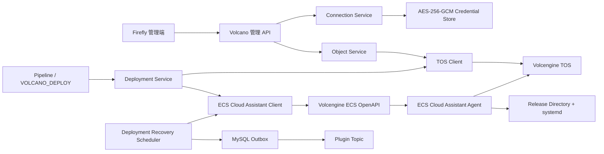
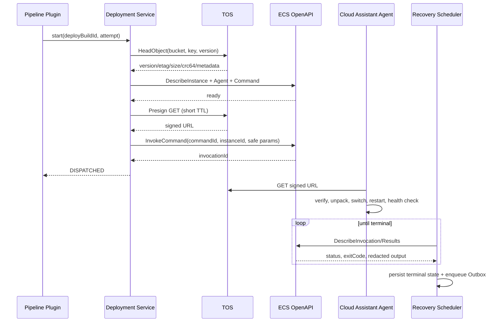

# Firefly Volcano 模块技术设计

> 状态：Implementation Ready  
> 版本：v1.0  
> 日期：2026-08-28  
> 目标代码库：Firefly（Java 25、Spring Boot 3.5、Maven 多模块）

## 1. 背景与目标

当前仓库没有独立的 `firefly-volcano` Maven 模块。火山引擎相关代码只存在于
`firefly-app`：

- `volcano_engine`、`volcano_config` 和 `volcano_trigger` 保存 AK/SK，其中部分表和
  消息模型直接保存或传递明文凭据。
- `VolcanoTriggerOriginServiceImpl` 只负责把 AK/SK 放入触发消息，不调用火山引擎
  OpenAPI。
- 没有 TOS 对象查询、流式读取、文件下载、校验、ECS 实例检查、云助手命令执行和
  部署状态恢复能力。

本设计新增独立的 `firefly-volcano` 集成模块，并在 `firefly-app` 中接入持久化、HTTP
管理接口和 Pipeline Plugin，使 Firefly 能够：

1. 使用 AK/SK 调用火山引擎 API，支持可选的 STS Session Token。
2. 查询 TOS 对象元数据和对象列表。
3. 以流方式读取对象内容，或安全下载为本地文件。
4. 将 TOS 中的二进制制品部署到指定 ECS 实例。
5. 对下载、命令执行、健康检查和回滚全过程进行持久化审计和失败恢复。

### 1.1 MVP 范围

- 中国区火山引擎，单个 Connection 可访问多个 Region。
- 私有 TOS Bucket。
- Linux ECS、单实例、systemd 服务。
- 制品类型：`JAR`、`TAR_GZ`、`ZIP`、`RAW_BINARY`。
- TOS 对象读取、下载和单对象部署。
- 使用已有且经过审核的云助手自定义命令，通过 `InvokeCommand` 执行。
- Pipeline Plugin 类型 `VOLCANO_DEPLOY`。
- 部署超时、重试、状态查询、停止执行、健康检查和自动回滚。

### 1.2 不在 MVP 范围

- 创建、启动、停止或删除 ECS 实例。
- Windows 实例。
- 多实例滚动发布、灰度发布、负载均衡摘挂、Auto Scaling Group。
- 在 Firefly 页面中提供任意 Shell 脚本输入。
- TOS 上传、删除、覆盖对象。
- Firefly User/Tenant/RBAC 模型；管理 API 仍由部署层管理员认证保护。
- 把 SSH 私钥或长期 AK/SK 下发到 ECS。

## 2. 核心设计决策

### 2.1 云协议与 Firefly 业务分层

`firefly-volcano` 只实现火山引擎协议适配、标准模型、错误转换和 Spring Boot
自动装配，不依赖 `firefly-app`。数据库、Pipeline、Plugin、任务调度和管理 HTTP API
继续放在 `firefly-app`。

这与现有 `firefly-github` 的模块边界一致，也便于在单元测试中替换 TOS/ECS Client。

### 2.2 部署时由 ECS 直拉 TOS 对象

部署主链路不采用“Firefly 下载后再上传到 ECS”，而是：

1. Firefly 用 AK/SK 调用 TOS `HeadObject`，锁定对象版本和校验信息。
2. Firefly 生成短期、只允许 `GET` 指定对象的预签名 URL。
3. Firefly 调用 ECS 云助手 `InvokeCommand`。
4. ECS 内的固定部署脚本使用预签名 URL 下载制品，校验 SHA-256，完成原子切换。

这样可以避免大文件占用 Firefly 的磁盘、内存和出口带宽，并确保 ECS 永远拿不到长期
AK/SK。管理端“下载对象”接口仍由 Firefly 以流式代理方式提供，满足人工下载和调试
需求。

### 2.3 使用 `InvokeCommand`，不使用 `RunCommand`

运行期只允许执行管理员预先创建、审计并记录 Command ID 的云助手自定义命令。
Firefly 仅调用 `InvokeCommand` 并传递严格校验后的参数。

不使用 `RunCommand`，原因是它可以直接提交任意命令内容，难以用 IAM Policy 把权限
限制到一条固定命令。生产运行 AK/SK 也不授予 `CreateCommand`、`ModifyCommand` 或
`DeleteCommand`。

### 2.4 Volcano 是部署 Plugin，不是凭据型 Trigger

“从 TOS 取制品并部署 ECS”属于 Job 的执行动作，应新增 `VOLCANO_DEPLOY` Plugin。
Trigger 只说明 Pipeline 为什么启动，不应携带云凭据。现有 `VOLCANO` Trigger 在兼容
期内保留，但必须移除 AK/SK 在触发消息和 `volcano_trigger` 运行记录中的传播。

### 2.5 异步执行，不阻塞 Kafka Listener

`InvokeCommand` 返回 Invocation ID 后立即结束当前数据库事务。后台恢复调度器轮询
`DescribeInvocations` / `DescribeInvocationResults`，识别终态后通过现有 Outbox 写入
`TriggerPluginMessage`。

禁止在 Kafka Consumer 线程中等待几分钟甚至几小时，否则会占用 Listener、触发
`max.poll.interval.ms` 风险，并使进程重启后的任务无法恢复。

## 3. 总体架构



职责边界：

| 组件 | 职责 | 禁止事项 |
| --- | --- | --- |
| `firefly-volcano` | SDK Client、请求/响应模型、Endpoint、超时、错误标准化 | 数据库、Pipeline 状态、HTTP Controller |
| `firefly-app` Connection | 加密保存 AK/SK、轮换、连接验证 | 把明文凭据返回给 API |
| `firefly-app` Object | 列表、元数据、流式读取和本地下载编排 | 将整个对象读入 `byte[]` |
| `firefly-app` Deployment | 锁定制品、调用云助手、状态机、恢复和回滚结果 | 接收任意 Shell |
| ECS 固定命令 | 下载、校验、解包、切换、重启、健康检查、回滚 | 输出预签名 URL 或任何凭据 |

## 4. Maven 模块设计

### 4.1 Reactor

根 `pom.xml`：

```xml
<modules>
    <module>firefly-github</module>
    <module>firefly-volcano</module>
    <module>firefly-app</module>
</modules>
```

`firefly-app/pom.xml` 新增对 `firefly-volcano` 的依赖。

### 4.2 SDK 依赖

建议以属性集中锁定版本，并通过 Maven Enforcer 做依赖收敛：

```xml
<properties>
    <volcengine.openapi.sdk.version>2.0.24</volcengine.openapi.sdk.version>
    <volcengine.tos.sdk.version>2.9.8</volcengine.tos.sdk.version>
</properties>

<dependencyManagement>
    <dependencies>
        <dependency>
            <groupId>com.volcengine</groupId>
            <artifactId>volcengine-java-sdk-bom</artifactId>
            <version>${volcengine.openapi.sdk.version}</version>
            <type>pom</type>
            <scope>import</scope>
        </dependency>
    </dependencies>
</dependencyManagement>
```

`firefly-volcano/pom.xml`：

```xml
<dependencies>
    <dependency>
        <groupId>com.volcengine</groupId>
        <artifactId>ve-tos-java-sdk</artifactId>
        <version>${volcengine.tos.sdk.version}</version>
    </dependency>
    <dependency>
        <groupId>com.volcengine</groupId>
        <artifactId>volcengine-java-sdk-ecs</artifactId>
    </dependency>
    <dependency>
        <groupId>javax.annotation</groupId>
        <artifactId>javax.annotation-api</artifactId>
        <version>1.3.2</version>
    </dependency>
    <dependency>
        <groupId>org.springframework.boot</groupId>
        <artifactId>spring-boot-autoconfigure</artifactId>
    </dependency>
    <dependency>
        <groupId>org.springframework.boot</groupId>
        <artifactId>spring-boot-starter-test</artifactId>
        <scope>test</scope>
    </dependency>
</dependencies>
```

实施前在 Java 25 下执行 `mvn dependency:tree`。TOS SDK 自带较旧 Jackson 版本时，应
排除其 Jackson 传递依赖并使用 Spring Boot BOM 管理的版本；只有通过 SDK 合同测试后
才能合并，不能在没有验证时静默保留多个 Jackson 版本。

### 4.3 包结构

```text
firefly-volcano/src/main/java/firefly/volcano
├── api
│   ├── VolcanoObjectStorageClient.java
│   └── VolcanoEcsCommandClient.java
├── auth
│   ├── VolcanoCredentials.java
│   └── VolcanoCredentialsProvider.java
├── config
│   ├── FireflyVolcanoAutoConfiguration.java
│   └── VolcanoClientProperties.java
├── ecs
│   ├── VolcengineEcsCommandClient.java
│   └── model/...
├── tos
│   ├── VolcengineTosObjectStorageClient.java
│   └── model/...
└── error
    ├── VolcanoIntegrationException.java
    ├── VolcanoErrorCode.java
    └── VolcanoRequestMetadata.java
```

Spring 自动装配文件：

```text
META-INF/spring/org.springframework.boot.autoconfigure.AutoConfiguration.imports
```

## 5. 公共 Java 接口

Vendor SDK 类型不得穿透到 `firefly-app`。模块对外只暴露 Firefly 自己的模型。

### 5.1 凭据

```java
public record VolcanoCredentials(
    String accessKeyId,
    String secretAccessKey,
    String sessionToken
) {
    // 禁止生成包含字段值的 toString。
}

@FunctionalInterface
public interface VolcanoCredentialsProvider {
    VolcanoCredentials resolve();
}
```

Client 按 `(connectionId, region, endpoint profile)` 缓存底层 SDK 实例，但凭据 Provider
必须支持轮换。连接池和 HTTP Client 复用，凭据明文只在一次调用所需的最短时间存在。

### 5.2 对象存储接口

```java
public interface VolcanoObjectStorageClient extends AutoCloseable {
    ObjectPage listObjects(ListObjectsCommand command);

    ObjectMetadata headObject(HeadObjectCommand command);

    ObjectContent getObject(GetObjectCommand command);

    DownloadedObject downloadObject(DownloadObjectCommand command);

    PresignedDownload presignGet(PresignGetCommand command);
}
```

模型要求：

- `ObjectContent` 同时持有元数据和可关闭的 `InputStream`，实现 `AutoCloseable`。
- `DownloadedObject` 返回最终路径、字节数、ETag、Version ID、CRC64、SHA-256 和
  TOS Request ID。
- `DownloadObjectCommand.destination` 必须是调用方传入的已解析绝对路径。
- `PresignedDownload` 的 `toString()` 只输出过期时间，不输出 URL。
- `GetObjectCommand` 支持可选 `versionId`、`rangeStart`、`rangeEnd` 和 `ifMatch`。
- 对象 Key 是不透明字符串，不能转换成本地路径，也不能用 `Path.resolve(key)`。

### 5.3 ECS 云助手接口

```java
public interface VolcanoEcsCommandClient {
    EcsInstance describeInstance(DescribeInstanceCommand command);

    CloudAssistantStatus describeCloudAssistant(
        DescribeCloudAssistantCommand command);

    CommandDefinition describeCommand(DescribeCommand command);

    CommandInvocation invokeCommand(InvokeCommand command);

    InvocationStatus describeInvocation(DescribeInvocation command);

    InvocationResult describeInvocationResult(
        DescribeInvocationResultCommand command);

    StopInvocationResult stopInvocation(StopInvocationCommand command);
}
```

`InvokeCommand` 只包含 Command ID、Instance ID、固定参数映射、超时和 Deployment ID，
不提供命令正文。

### 5.4 SDK 错误转换

所有 SDK 异常统一转换为：

```java
public final class VolcanoIntegrationException extends RuntimeException {
    private final VolcanoErrorCode code;
    private final Integer httpStatus;
    private final String providerCode;
    private final String requestId;
    private final boolean retryable;
}
```

日志和 API 可以输出 `requestId`、Firefly `deploymentId` 和已脱敏资源标识；不得输出
AK、SK、Session Token、Authorization Header、预签名 URL 或完整云助手参数。

## 6. 凭据和连接管理

### 6.1 Connection 模型

一个 Connection 表示一组火山引擎身份，不与某条 Pipeline 绑定。Pipeline Plugin
通过不可猜测的 `public_id` 引用 Connection。

```sql
CREATE TABLE `firefly`.`volcano_connection`
(
    `id`                    BIGINT(20) NOT NULL AUTO_INCREMENT,
    `public_id`             VARCHAR(64) NOT NULL,
    `connection_name`       VARCHAR(128) NOT NULL,
    `credential_ciphertext` TEXT NOT NULL,
    `credential_nonce`      VARBINARY(32) NOT NULL,
    `encryption_key_version` VARCHAR(64) NOT NULL,
    `default_region`        VARCHAR(64) NOT NULL,
    `tos_endpoint`          VARCHAR(512) NOT NULL DEFAULT '',
    `ecs_endpoint`          VARCHAR(512) NOT NULL DEFAULT '',
    `status`                VARCHAR(32) NOT NULL,
    `last_validated_at`     DATETIME(6) NULL,
    `last_error`            VARCHAR(2048) NOT NULL DEFAULT '',
    `created_at`            DATETIME(6) NOT NULL,
    `updated_at`            DATETIME(6) NOT NULL,
    PRIMARY KEY (`id`),
    UNIQUE INDEX `uidx_volcano_connection_public` (`public_id`),
    UNIQUE INDEX `uidx_volcano_connection_name` (`connection_name`),
    INDEX `idx_volcano_connection_status` (`status`)
);
```

`credential_ciphertext` 加密前是带版本的内部 JSON：

```json
{
  "schemaVersion": 1,
  "accessKeyId": "AKLT...",
  "secretAccessKey": "...",
  "sessionToken": null
}
```

### 6.2 加密要求

- 使用 AES-256-GCM，每次写入生成新的 12 字节随机 Nonce。
- 环境变量 `VOLCANO_ENCRYPTION_KEY` 是 Base64 编码的 32 字节密钥。
- 使用 AAD 绑定 `public_id`、记录用途 `volcano-credential` 和 Key Version，防止密文
  被复制到其他记录后仍可解密。
- API 读取 Connection 时仅返回 `accessKeyIdMask`，例如 `AKLT****82KD`。
- 新建/轮换请求 DTO 禁止 Lombok `@Data`、`@ToString`；显式实现脱敏 `toString()`。
- 密钥轮换采用“新 Key Version 可读写、旧 Key Version 只读、后台重加密、确认完成后
  移除旧密钥”的两阶段流程。
- 生产环境后续优先接入 KMS Envelope Encryption 或 STS；数据库结构无需改变。

### 6.3 Connection API

| 方法 | 路径 | 说明 |
| --- | --- | --- |
| `POST` | `/api/volcano/connections` | 加密保存 AK/SK |
| `GET` | `/api/volcano/connections` | 分页查询脱敏 Connection |
| `GET` | `/api/volcano/connections/{id}` | 查询单个脱敏 Connection |
| `PUT` | `/api/volcano/connections/{id}/credentials` | 原子轮换 AK/SK |
| `POST` | `/api/volcano/connections/{id}/validate` | 对指定 TOS/ECS 资源做最小权限验证 |
| `DELETE` | `/api/volcano/connections/{id}` | 无活动配置引用时禁用并删除密文 |

不能通过 `ListBuckets` 或其他宽权限接口判断凭据“是否有效”。Validate 请求应携带管理员
明确选择的 `region`、`bucket`、`objectKey`、`instanceId` 和 `commandId`，分别执行
`HeadObject`、`DescribeInstances`、`DescribeCloudAssistantStatus` 和 `DescribeCommands`。

## 7. TOS 对象读取与下载

### 7.1 管理 API

| 方法 | 路径 | 说明 |
| --- | --- | --- |
| `GET` | `/api/volcano/connections/{id}/tos/objects` | 按 Bucket/Prefix 分页列举对象 |
| `GET` | `/api/volcano/connections/{id}/tos/object-metadata` | 查询单个对象元数据 |
| `GET` | `/api/volcano/connections/{id}/tos/object-content` | 流式读取或下载单个对象 |

使用 Query Parameter 传递 `bucket`、`key`、`region` 和可选 `versionId`。不要把 Object
Key 放在 Path Variable 中，因为 Key 可以包含 `/`、空格和编码字符，代理层也可能错误
归一化路径。

`object-content`：

- Spring 使用 `StreamingResponseBody`，固定 64 KiB 缓冲区，不构造 `byte[]` 全量内容。
- 透传安全的 `Content-Type`、`Content-Length`、`ETag` 和 `Last-Modified`。
- `Content-Disposition` 文件名取 Object Key 最后一段，经 CR/LF、引号和路径字符清洗。
- 支持单段 HTTP Range；多段 Range MVP 返回 `416`。
- 客户端断开时立即关闭 TOS InputStream，不继续后台下载。
- 默认限制对象最大 5 GiB，可由 `firefly.volcano.tos.max-download-size` 调整。
- Controller 和 Access Log 不记录包含敏感 Query 的预签名 URL；管理下载接口本身不把
  预签名 URL返回浏览器。

### 7.2 下载到 Firefly 本地文件

内部下载过程：

1. 调用 `HeadObject` 获取大小、ETag、Version ID、CRC64、自定义元数据和存储类型。
2. 校验对象大小、存储类型和允许的 Content Type。
3. 在配置的工作目录下创建随机 `.part` 文件；目录不得由 API 调用者指定。
4. 使用 TOS SDK `downloadFile` 进行大文件断点续传，或用 `GetObject` 流式写入小文件。
5. 同步计算 SHA-256；如果 TOS 返回 CRC64，同时执行 CRC64 一致性检查。
6. 校验成功后使用同一文件系统内的原子移动发布最终文件。
7. 失败时保留 checkpoint 供同一任务续传，删除不完整最终文件。
8. 任务结束或超过 TTL 后由清理器删除 `.part`、checkpoint 和本地制品。

不能把 ETag 一律当作 MD5。分片上传或对象修改后 ETag 的语义可能不同；部署完整性使用
SHA-256，CRC64 只作为额外的传输一致性校验。

### 7.3 对象版本锁定

部署不能只记录 Bucket + Key，因为同名对象可能在部署中被覆盖。创建部署尝试时必须
保存以下快照：

- Bucket、Key、Region。
- Version ID；未启用版本控制时保存 HeadObject 返回的 ETag。
- Content Length、ETag、CRC64。
- 预期 SHA-256。

下载时设置 `versionId`；没有 Version ID 时设置 `If-Match: <etag>`。若条件不再满足，
部署以 `TOS_OBJECT_CHANGED` 失败，不能悄悄部署新内容。

### 7.4 SHA-256 来源

生产部署要求 SHA-256 必填，优先顺序：

1. TOS 自定义元数据 `x-tos-meta-firefly-sha256`。
2. Pipeline Plugin 配置中的 `expectedSha256`。
3. 仅限管理端人工下载：Firefly 下载完成后计算；不能用于 ECS 直拉前的信任判断。

如果元数据和配置同时存在但不一致，直接失败。SHA-256 必须是 64 位小写十六进制。

## 8. ECS 部署设计

### 8.1 前置条件

- ECS 实例处于 `RUNNING`。
- 已安装并运行云助手 Agent。
- 实例与 TOS Bucket 默认要求同 Region；跨 Region 方案需显式开启并接受公网、费用和
  带宽风险。
- ECS 能访问 TOS Endpoint；优先使用 VPC 内网接入或 VPC Endpoint。
- 已预创建 Firefly 部署自定义命令，并将其 Command ID 配置到 Firefly。
- 目标服务由 systemd 管理，服务名在管理员允许列表中。
- 目标机安装 `curl`、`sha256sum`、`flock`，按包类型安装 `tar` 或 `unzip`。

### 8.2 Plugin 配置

`PluginType` 新增 `VOLCANO_DEPLOY`。Pipeline 请求示例：

```json
{
  "uuid": "<64-char-job-uuid>",
  "name": "deploy-order-service",
  "pluginType": "VOLCANO_DEPLOY",
  "pluginRaw": {
    "connectionId": "vc_01J...",
    "artifact": {
      "region": "cn-beijing",
      "bucket": "firefly-artifacts",
      "key": "order-service/1.8.2/order-service.tar.gz",
      "versionId": null,
      "expectedSha256": "<64 lowercase hex>"
    },
    "target": {
      "instanceId": "i-yc...",
      "commandId": "cmd-yc..."
    },
    "release": {
      "applicationName": "order-service",
      "packageType": "TAR_GZ",
      "deployRoot": "/opt/firefly/apps/order-service",
      "systemdService": "order-service.service",
      "healthCheckUrl": "http://127.0.0.1:8080/actuator/health",
      "healthCheckTimeoutSeconds": 60,
      "commandTimeoutSeconds": 900,
      "retainReleases": 5
    }
  }
}
```

配置中不再接受 `ak` 或 `sk`。MVP 使用固定 Object Key；动态消费上游 Job 产物需要先
设计 Pipeline Artifact Contract，不在本次通过任意字符串模板拼接实现。

字段校验：

- `applicationName`：`[a-z][a-z0-9-]{1,62}`。
- `instanceId`、`commandId`：按火山资源 ID 格式和长度白名单校验。
- `deployRoot`：必须位于管理员配置的根目录，例如 `/opt/firefly/apps/`，规范化后仍在
  根目录内；禁止 `..`、NUL 和符号链接逃逸。
- `systemdService`：只允许 `[A-Za-z0-9_.@-]+\.service`，且必须在服务允许列表中。
- `healthCheckUrl`：MVP 只允许 `http://127.0.0.1` 或 `http://localhost`，禁止 SSRF。
- 超时范围 30～86400 秒，且预签名 URL TTL 大于命令超时和调度余量。
- `retainReleases` 范围 2～20。

### 8.3 部署命令参数

固定自定义命令只接受以下参数：

```text
deployment_id
artifact_url_b64
artifact_sha256
artifact_size
package_type
application_name
deploy_root_b64
systemd_service
health_url_b64
health_timeout_seconds
retain_releases
```

URL 和路径以 Base64 传入是为了减少命令参数替换导致的 Shell 解析问题，但 Base64
不是安全校验。脚本解码后仍需执行长度、字符、协议、主机和路径边界校验。脚本禁止
`eval`，禁止 `set -x`，所有变量引用必须加双引号。

### 8.4 实例内目录

```text
/opt/firefly/apps/<application>/
├── current -> releases/<deployment-id>
├── previous -> releases/<previous-deployment-id>
├── releases/
│   ├── <deployment-id>/
│   └── ...
└── shared/

/var/lib/firefly/artifacts/<deployment-id>.part
/var/lock/firefly-deploy-<application>.lock
```

### 8.5 固定脚本执行步骤

1. `set -Eeuo pipefail`、`umask 027`，关闭命令回显。
2. 校验全部参数，确认目标目录在允许根目录内。
3. 使用 `flock -n` 获取应用级部署锁；冲突返回明确退出码。
4. 创建新的 Release 目录，拒绝覆盖已存在且内容不匹配的目录。
5. 使用 `curl --fail --location --retry 3 --connect-timeout 10` 下载到 `.part`。
6. 校验实际文件大小和 `sha256sum`，不一致立即删除 `.part` 并失败。
7. 解包前列出归档内容，拒绝绝对路径、`..`、设备文件和越界符号链接。
8. 解包时禁止保留原 UID/GID；`RAW_BINARY` 只写到约定文件名并设置固定权限。
9. 执行包结构检查，例如 JAR 存在、启动文件存在、目录不为空。
10. 记录旧 `current`，创建新软链接并在同一目录原子替换 `current`。
11. `systemctl restart <allowlisted-service>`。
12. 在限定时间内轮询本机健康检查；要求连续 2 次成功。
13. 健康检查失败时把 `current` 切回旧 Release，再次 restart 并检查旧版本。
14. 输出单行、无敏感字段的结果 JSON；保留当前和前一版本，清理更老 Release。

成功输出示例：

```json
{"schemaVersion":1,"deploymentId":"dep_...","status":"SUCCESS","release":"/opt/firefly/apps/order-service/releases/dep_...","rolledBack":false}
```

脚本使用约定退出码：

| 退出码 | 含义 |
| --- | --- |
| `10` | 参数或路径校验失败 |
| `11` | 部署锁冲突 |
| `20` | 下载失败或 URL 过期 |
| `21` | 文件大小不一致 |
| `22` | SHA-256 不一致 |
| `30` | 包格式或解包安全校验失败 |
| `40` | systemd 重启失败 |
| `41` | 新版本健康检查失败但回滚成功 |
| `42` | 回滚也失败，需要人工介入 |

### 8.6 部署顺序



## 9. 部署持久化和状态机

### 9.1 配置表

```sql
CREATE TABLE `firefly`.`volcano_deploy_config`
(
    `id`                           BIGINT(20) NOT NULL AUTO_INCREMENT,
    `job_config_id`                BIGINT(20) NOT NULL,
    `connection_id`                BIGINT(20) NOT NULL,
    `region`                       VARCHAR(64) NOT NULL,
    `bucket_name`                  VARCHAR(255) NOT NULL,
    `object_key`                   VARCHAR(2048) NOT NULL,
    `object_version_id`            VARCHAR(512) NOT NULL DEFAULT '',
    `expected_sha256`              CHAR(64) NOT NULL,
    `instance_id`                  VARCHAR(128) NOT NULL,
    `command_id`                   VARCHAR(128) NOT NULL,
    `application_name`             VARCHAR(64) NOT NULL,
    `package_type`                 VARCHAR(32) NOT NULL,
    `deploy_root`                  VARCHAR(1024) NOT NULL,
    `systemd_service`              VARCHAR(255) NOT NULL,
    `health_check_url`             VARCHAR(2048) NOT NULL,
    `health_check_timeout_seconds` INT NOT NULL,
    `command_timeout_seconds`      INT NOT NULL,
    `retain_releases`              INT NOT NULL,
    `created_at`                   DATETIME(6) NOT NULL,
    `updated_at`                   DATETIME(6) NOT NULL,
    PRIMARY KEY (`id`),
    UNIQUE INDEX `uidx_volcano_deploy_job` (`job_config_id`),
    INDEX `idx_volcano_deploy_connection` (`connection_id`)
);
```

### 9.2 Plugin Build 与 Attempt

```sql
CREATE TABLE `firefly`.`volcano_deploy_build`
(
    `id`                    BIGINT(20) NOT NULL AUTO_INCREMENT,
    `plugin_id`             BIGINT(20) NOT NULL,
    `job_build_id`          BIGINT(20) NOT NULL,
    `deploy_status`         VARCHAR(32) NOT NULL,
    `execution_attempt`     INT NOT NULL DEFAULT 0,
    `current_attempt_id`    BIGINT(20) NULL,
    `created_at`            DATETIME(6) NOT NULL,
    `updated_at`            DATETIME(6) NOT NULL,
    PRIMARY KEY (`id`),
    UNIQUE INDEX `uidx_volcano_deploy_build_job` (`job_build_id`),
    INDEX `idx_volcano_deploy_build_plugin` (`plugin_id`)
);

CREATE TABLE `firefly`.`volcano_deployment_attempt`
(
    `id`                   BIGINT(20) NOT NULL AUTO_INCREMENT,
    `public_id`            VARCHAR(64) NOT NULL,
    `deploy_build_id`      BIGINT(20) NOT NULL,
    `execution_attempt`    INT NOT NULL,
    `phase`                VARCHAR(32) NOT NULL,
    `status`               VARCHAR(32) NOT NULL,
    `region`               VARCHAR(64) NOT NULL,
    `bucket_name`          VARCHAR(255) NOT NULL,
    `object_key`           VARCHAR(2048) NOT NULL,
    `object_version_id`    VARCHAR(512) NOT NULL DEFAULT '',
    `object_etag`          VARCHAR(512) NOT NULL DEFAULT '',
    `object_crc64`         VARCHAR(64) NOT NULL DEFAULT '',
    `object_sha256`        CHAR(64) NOT NULL,
    `object_size`          BIGINT NOT NULL,
    `instance_id`          VARCHAR(128) NOT NULL,
    `command_id`           VARCHAR(128) NOT NULL,
    `invocation_id`        VARCHAR(128) NULL,
    `provider_request_id`  VARCHAR(128) NOT NULL DEFAULT '',
    `remote_release_path`  VARCHAR(1024) NOT NULL DEFAULT '',
    `rolled_back`          TINYINT(1) NOT NULL DEFAULT 0,
    `exit_code`            INT NULL,
    `output_excerpt`       VARCHAR(8192) NOT NULL DEFAULT '',
    `error_code`           VARCHAR(64) NOT NULL DEFAULT '',
    `error_message`        VARCHAR(2048) NOT NULL DEFAULT '',
    `processor_id`         VARCHAR(128) NOT NULL DEFAULT '',
    `lease_expires_at`     DATETIME(6) NULL,
    `next_poll_at`         DATETIME(6) NULL,
    `started_at`           DATETIME(6) NULL,
    `finished_at`          DATETIME(6) NULL,
    `created_at`           DATETIME(6) NOT NULL,
    `updated_at`           DATETIME(6) NOT NULL,
    PRIMARY KEY (`id`),
    UNIQUE INDEX `uidx_volcano_deployment_public` (`public_id`),
    UNIQUE INDEX `uidx_volcano_deployment_attempt`
        (`deploy_build_id`, `execution_attempt`),
    UNIQUE INDEX `uidx_volcano_deployment_invocation` (`invocation_id`),
    INDEX `idx_volcano_deployment_recovery`
        (`status`, `next_poll_at`, `lease_expires_at`)
);
```

与现有项目风格一致，表之间使用逻辑引用，不创建数据库外键。应用服务校验引用存在性、
归属关系和删除顺序；不使用 `findFirst` 掩盖重复或悬空数据。

### 9.3 状态

Attempt `phase`：

```text
CREATED
VALIDATING_ARTIFACT
VALIDATING_TARGET
DISPATCHING
DISPATCH_UNKNOWN
WAITING_AGENT
DOWNLOADING
INSTALLING
HEALTH_CHECKING
ROLLING_BACK
FINISHED
```

云助手在命令结束前不保证返回可解析的实时阶段，所以 Firefly 在运行期间通常保持
`WAITING_AGENT`。`DOWNLOADING` 到 `ROLLING_BACK` 用于解析终态结果、错误定位，或未来
接入可信 Agent 心跳后表达更细粒度进度；MVP 不根据不完整 stdout 猜测阶段。

Attempt `status`：

```text
PENDING -> RUNNING -> SUCCESS
                   -> FAILURE
                   -> ROLLED_BACK
                   -> CANCELLED
                   -> MANUAL_INTERVENTION_REQUIRED
```

`ROLLED_BACK` 对 Pipeline 是失败，因为目标版本未成功上线；它与
`MANUAL_INTERVENTION_REQUIRED` 分开，便于值班人员判断线上是否已经恢复旧版本。

所有状态更新必须带当前 `execution_attempt` 和期望旧状态条件，更新行数不是 1 时按并发
冲突处理。Plugin 终态消息的 UUID 继续使用现有 `BusinessMessageUUID.plugin(...)` 规则，
依靠 Inbox/Outbox 保证重复消息不重复推进 Job。

### 9.4 调度与恢复

- Scheduler 每 10 秒领取 `next_poll_at <= now` 且未被有效 Lease 占用的记录。
- 使用 `processor_id + lease_expires_at` 抢占任务；默认 Lease 60 秒。
- Poll 间隔从 2 秒指数退避到 30 秒，并增加抖动。
- Firefly 重启后继续依据持久化 `invocation_id` 查询，不重新调用 `InvokeCommand`。
- `InvokeCommand` 请求超时但没有收到 Invocation ID 时进入 `DISPATCH_UNKNOWN`。恢复器先按
  Deployment ID 可用的任务标记查询云助手任务；无法唯一确认时停止自动重发并告警，
  不能直接再次部署。
- 超过命令超时后先调用 `StopInvocation`，再把 Attempt 标记为失败。
- 已到终态的 Attempt 不再访问云 API；Outbox 可独立恢复终态消息发布。

## 10. Firefly Plugin 接入

新增类：

```text
firefly-app/src/main/java/firefly/volcano
├── config/VolcanoAppProperties.java
├── controller/VolcanoConnectionController.java
├── controller/VolcanoObjectController.java
├── controller/VolcanoDeploymentController.java
├── security/VolcanoCredentialCipher.java
├── service/VolcanoConnectionService.java
├── service/VolcanoObjectService.java
├── service/VolcanoDeploymentService.java
├── service/VolcanoDeploymentRecoveryScheduler.java
├── service/VolcanoDeploymentStateService.java
├── model/...
└── dao/...

firefly-app/src/main/java/firefly/service/pluginconfig/impl/
└── VolcanoDeployPluginConfigService.java

firefly-app/src/main/java/firefly/service/pluginbuild/impl/
└── VolcanoDeployPluginBuildService.java
```

修改点：

1. `PluginType` 增加 `VOLCANO_DEPLOY`。
2. `VolcanoDeployPluginConfigService` 实现 `IPluginConfig`，保存并查询
   `volcano_deploy_config`。
3. `VolcanoDeployPluginBuildService` 实现 `IPluginBuild`；`executePluginBuild` 只创建
   Attempt、校验并分发云助手命令，不同步等待结果。
4. Recovery Scheduler 收到终态后在同一事务更新 Attempt、Plugin Build，并向现有
   Plugin Topic 写 Outbox。
5. `PipelineWorkspaceService` 删除 Pipeline 时先校验没有运行中的部署，再按逻辑引用顺序
   删除 Volcano Plugin 配置；Connection 不随 Pipeline 删除。

当前静态 `PluginServiceParser.PLUGIN_MAP` / `PLUGIN_BUILD_MAP` 可先兼容，但建议改为构造器
注入后生成不可变 Map，并在启动时检测重复 `PluginType`，避免静态可变状态影响测试。

## 11. 管理与查询 API

### 11.1 Deployment API

| 方法 | 路径 | 说明 |
| --- | --- | --- |
| `GET` | `/api/volcano/deployments/{publicId}` | 查询部署快照和当前状态 |
| `GET` | `/api/volcano/deployments` | 按状态、实例、应用分页查询 |
| `POST` | `/api/volcano/deployments/{publicId}/stop` | 停止仍在运行的 Invocation |

部署重试沿用 `/pipeline-builds/{pipelineBuildID}/retry`，不另建绕过 Pipeline 状态机的
重试入口。

响应只包含安全输出摘要：

```json
{
  "id": "dep_01J...",
  "status": "SUCCESS",
  "phase": "FINISHED",
  "artifact": {
    "region": "cn-beijing",
    "bucket": "firefly-artifacts",
    "key": "order-service/1.8.2/order-service.tar.gz",
    "versionId": "...",
    "sha256": "...",
    "size": 18342190
  },
  "target": {
    "instanceId": "i-yc...",
    "commandId": "cmd-yc...",
    "invocationId": "ivk-yc..."
  },
  "rolledBack": false,
  "startedAt": "2026-08-28T10:00:00Z",
  "finishedAt": "2026-08-28T10:01:12Z",
  "error": null
}
```

## 12. 配置项

```yaml
firefly:
  volcano:
    storage:
      encryption-key: ${VOLCANO_ENCRYPTION_KEY:}
      key-version: ${VOLCANO_ENCRYPTION_KEY_VERSION:v1}
    tos:
      connect-timeout: ${VOLCANO_TOS_CONNECT_TIMEOUT:3s}
      read-timeout: ${VOLCANO_TOS_READ_TIMEOUT:60s}
      max-download-size: ${VOLCANO_TOS_MAX_DOWNLOAD_SIZE:5GB}
      multipart-threshold: ${VOLCANO_TOS_MULTIPART_THRESHOLD:100MB}
      part-size: ${VOLCANO_TOS_PART_SIZE:20MB}
      task-count: ${VOLCANO_TOS_TASK_COUNT:4}
      workspace: ${VOLCANO_TOS_WORKSPACE:/var/lib/firefly/tos}
    ecs:
      connect-timeout: ${VOLCANO_ECS_CONNECT_TIMEOUT:3s}
      read-timeout: ${VOLCANO_ECS_READ_TIMEOUT:15s}
      allowed-command-ids: ${VOLCANO_ALLOWED_COMMAND_IDS:}
      allowed-deploy-roots: ${VOLCANO_ALLOWED_DEPLOY_ROOTS:/opt/firefly/apps}
      allowed-systemd-services: ${VOLCANO_ALLOWED_SYSTEMD_SERVICES:}
    deployment:
      presign-grace: ${VOLCANO_PRESIGN_GRACE:5m}
      max-presign-ttl: ${VOLCANO_MAX_PRESIGN_TTL:1h}
      recovery-interval: ${VOLCANO_RECOVERY_INTERVAL:10s}
      lease-timeout: ${VOLCANO_LEASE_TIMEOUT:60s}
      max-poll-interval: ${VOLCANO_MAX_POLL_INTERVAL:30s}
      output-excerpt-bytes: ${VOLCANO_OUTPUT_EXCERPT_BYTES:8192}
```

Endpoint 默认按 SDK 的 Region 规则生成。自定义 Endpoint 只允许 `https`，Host 必须在
管理员 allowlist 中，防止通过 Connection 配置制造 SSRF。测试环境可显式开启 HTTP。

## 13. IAM 最小权限

建议创建 Firefly 专用子用户和专用 AK/SK，不使用主账号 AK/SK。

TOS 只授予目标 Bucket/Prefix：

```text
tos:ListObjects            仅管理页面需要
tos:HeadObject
tos:GetObject
tos:GetObjectVersion      使用版本控制时
```

ECS 只授予：

```text
ecs:DescribeInstances
ecs:DescribeCloudAssistantStatus
ecs:DescribeCommands
ecs:InvokeCommand
ecs:DescribeInvocations
ecs:DescribeInvocationResults
ecs:StopInvocation
```

`ecs:InvokeCommand` 的 Resource 限制到批准的 Command ID；如账号策略能力支持，再限制到
目标实例或项目。运行 AK/SK 不授予 `ecs:RunCommand`、`ecs:CreateCommand`、
`ecs:ModifyCommand`、`ecs:DeleteCommand`，也不授予任何 ECS 创建、删除或关机权限。

TOS Bucket 保持私有。预签名 URL 的有效期设置为：

```text
min(commandTimeout + presignGrace, maxPresignTtl)
```

如果命令最大时长超过 `maxPresignTtl`，配置校验失败，不自动生成更长 URL。

## 14. 重试和错误处理

### 14.1 重试规则

| 操作 | 自动重试 | 规则 |
| --- | --- | --- |
| `ListObjects` / `HeadObject` / `GetObject` | 是 | 网络错误、429、部分 5xx；指数退避和抖动 |
| 本地断点下载 | 是 | 使用同一 Version ID/ETag 和 checkpoint |
| `Describe*` | 是 | 网络错误、429、部分 5xx |
| `InvokeCommand` | 否，除非能证明未创建 | 超时进入 `DISPATCH_UNKNOWN` 并先对账 |
| `StopInvocation` | 可重试 | 已终态视为幂等成功 |
| 实例内 `curl` | 是 | 固定 3 次，只在原 URL TTL 内 |

403、404、参数错误、校验失败和脚本安全校验失败不自动重试。

### 14.2 Firefly 错误码

```text
VOLCANO_ENCRYPTION_NOT_CONFIGURED
VOLCANO_CONNECTION_NOT_FOUND
VOLCANO_CREDENTIAL_INVALID
VOLCANO_ACCESS_DENIED
VOLCANO_ENDPOINT_REJECTED
TOS_OBJECT_NOT_FOUND
TOS_OBJECT_ARCHIVED
TOS_OBJECT_TOO_LARGE
TOS_OBJECT_CHANGED
TOS_CHECKSUM_MISSING
TOS_CHECKSUM_MISMATCH
ECS_INSTANCE_NOT_FOUND
ECS_INSTANCE_NOT_RUNNING
ECS_CLOUD_ASSISTANT_UNAVAILABLE
ECS_COMMAND_NOT_ALLOWED
DEPLOYMENT_LOCKED
DEPLOYMENT_DISPATCH_UNKNOWN
DEPLOYMENT_TIMEOUT
DEPLOYMENT_DOWNLOAD_FAILED
DEPLOYMENT_INSTALL_FAILED
DEPLOYMENT_HEALTH_CHECK_FAILED
DEPLOYMENT_ROLLED_BACK
DEPLOYMENT_ROLLBACK_FAILED
```

外部 API 错误响应：

```json
{
  "code": "TOS_OBJECT_NOT_FOUND",
  "message": "The requested artifact does not exist",
  "requestId": "provider-request-id",
  "retryable": false
}
```

Provider 原始响应体只可写入受限 Debug 日志，且必须先做凭据和 URL 脱敏。

## 15. 可观测性和审计

结构化日志统一字段：

```text
connectionPublicId
pipelineBuildId
jobBuildId
deployBuildId
deploymentPublicId
executionAttempt
region
bucketHash
objectKeyHash
instanceId
invocationId
providerRequestId
phase
status
durationMs
```

Bucket/Key 默认以 Hash 记录，查询审计表时才展示完整值。严禁记录凭据和预签名 URL。

指标：

```text
firefly_volcano_api_requests_total{service,operation,result}
firefly_volcano_api_latency_seconds{service,operation}
firefly_volcano_download_bytes_total
firefly_volcano_deployments_total{status,phase}
firefly_volcano_deployment_duration_seconds{status}
firefly_volcano_deployments_active
firefly_volcano_recovery_lag_seconds
firefly_volcano_rollback_total{result}
```

告警：

- `MANUAL_INTERVENTION_REQUIRED > 0` 立即告警。
- `DISPATCH_UNKNOWN` 超过 2 分钟告警。
- Recovery Lag 超过 60 秒告警。
- 同一 Connection 连续 5 次鉴权失败告警并暂停新部署。
- 同一应用连续 3 次健康检查失败告警。

## 16. 测试策略

### 16.1 `firefly-volcano` 单元测试

- AK/SK 不出现在 `toString()`、异常和日志中。
- Region/Endpoint 构造和 allowlist。
- TOS SDK 响应到 Firefly 模型的映射。
- TOS 404、403、429、5xx、网络超时和 Request ID 映射。
- Range、Version ID、If-Match 和预签名 TTL。
- ECS Invocation 状态、退出码和输出映射。
- SDK 重试只覆盖幂等操作。

### 16.2 `firefly-app` 集成测试

使用 Testcontainers MySQL/Kafka，并使用 Fake `VolcanoObjectStorageClient` 和
`VolcanoEcsCommandClient`：

- Connection 加密落库、解密、轮换和错误 Key Version。
- API 永不返回明文 AK/SK。
- Object Content 大文件流式传输和客户端中断关闭。
- Plugin Config 保存和读取。
- Pipeline Build 创建 Volcano Deploy Build。
- `InvokeCommand` 成功、失败、超时和未知结果。
- Scheduler Lease 抢占，两个实例不能重复处理同一 Attempt。
- Firefly 重启后根据 Invocation ID 恢复。
- 终态 Outbox 重放不重复推进 Job/Stage/Pipeline。
- Pipeline Retry 创建新的 Attempt 且不覆盖旧 Attempt 审计。
- 删除 Pipeline/Connection 时的活动部署和逻辑引用校验。

### 16.3 部署脚本测试

在临时 Linux 容器中测试：

- JAR、tar.gz、zip 和 raw binary 成功安装。
- 错误 SHA-256、错误大小、URL 过期、磁盘空间不足。
- 归档中的绝对路径、`../`、危险符号链接和设备文件被拒绝。
- 两个并发部署只能有一个取得 `flock`。
- systemd 模拟重启失败。
- 新版本健康检查失败后回滚成功。
- 新旧版本健康检查都失败时返回人工介入。
- 预签名 URL 不出现在 stdout/stderr。

### 16.4 火山引擎 Staging 合同测试

准备专用测试账号、私有 Bucket、测试 ECS 和受限 Command：

1. List/Head/Get/Range/Download/Presign。
2. 版本对象和 If-Match 失败。
3. 100 MB 以上对象断点续传及 CRC64/SHA-256。
4. Describe Instance、Agent、Command。
5. Invoke、Describe Result、Stop。
6. 真实部署、健康检查、回滚和进程重启恢复。
7. 用 IAM 明确验证未授权 Bucket、实例和 Command 均被拒绝。

最终必须执行：

```bash
mvn clean verify
```

Docker/Testcontainers 的完整 `verify` 是后端合并前的权威结果。

## 17. 数据迁移与兼容

现有明文表不能直接继续使用。迁移采用三阶段：

### 阶段 A：新增能力

- 新建 `firefly-volcano` 模块和上述新表。
- 新代码只写加密的 `volcano_connection`。
- 新 Pipeline 使用 `VOLCANO_DEPLOY` 和 `connectionId`。
- 旧 `VOLCANO` Trigger 暂时只读兼容。

### 阶段 B：凭据迁移

- 提供一次性、可审计的应用迁移任务，读取 `volcano_engine` / `volcano_config` 中的
  明文 AK/SK，加密写入 Connection。
- 迁移任务输出记录数和 Hash，不输出凭据。
- Pipeline 配置切换到 Connection 引用。
- 完成业务核对和回滚快照后，清空旧表 AK/SK 字段。

SQL 不能完成应用级 AES-GCM 和 AAD，所以不得只靠 DDL 把明文复制到新表。

### 阶段 C：删除遗留传播

- 从 `VolcanoMessageEntity`、`VolcanoTriggerDto`、`VolcanoTriggerEntity` 删除 AK/SK。
- 删除 `volcano_trigger.idx_ak`。
- 确认没有旧版本实例后，删除 `volcano_engine` / `volcano_config` 的凭据列或整表。
- 更新 README 和前端，禁止 `originInfo` 再提交 AK/SK。

迁移完成前，任何读取旧明文凭据的路径都必须标记 Deprecated，并在日志中告警，但不能
打印凭据。

## 18. 实施顺序

### Milestone 1：基础模块与安全凭据

- 创建 `firefly-volcano` Maven 模块和自动装配。
- 实现 Connection、AES-GCM、Endpoint 校验和错误模型。
- 引入 TOS/ECS SDK并通过 Java 25 构建。

验收：能加密保存 Connection，能对指定对象和实例进行只读验证，无明文泄露。

### Milestone 2：TOS 读取与下载

- 实现 List、Head、Get、Range、Download、Presign。
- 实现管理 API、限流、大小限制、CRC64/SHA-256 和临时文件清理。

验收：小对象可流式读取，大对象可断点下载，版本和校验不一致能明确失败。

### Milestone 3：ECS 云助手与固定脚本

- 管理员创建并审核固定 Command。
- 实现 Describe、Invoke、Result、Stop。
- 完成安全解包、原子切换、systemd、健康检查和回滚脚本测试。

验收：测试 ECS 能从私有 TOS 直拉并完成部署，实例内不存在长期 AK/SK。

### Milestone 4：Pipeline Plugin 与恢复

- 新增 `VOLCANO_DEPLOY` 配置/build/attempt 表和服务。
- 接入现有 Plugin、Outbox、Inbox 和 Pipeline Retry。
- 实现 Recovery Scheduler、Lease、状态查询和告警指标。

验收：Firefly 在部署中重启后仍能恢复结果；重复消息和重试不造成重复发布。

### Milestone 5：旧数据迁移与生产灰度

- 加密迁移旧 AK/SK，移除消息与审计表中的凭据。
- 使用非生产 Connection、Bucket 和 ECS 做完整合同测试。
- 生产先开放一个应用和一台实例，观察失败率、耗时和回滚结果，再扩大范围。

## 19. 完成标准

以下条件全部满足，才认为 `firefly-volcano` 完成：

- `firefly-volcano` 是独立 Maven 模块，`firefly-app` 不直接引用 Vendor SDK 类型。
- AK/SK 只以 AES-256-GCM 密文落库，不存在于 Pipeline JSON、Kafka、日志或运行审计中。
- 可分页列举、Head、流式读取和下载 TOS 对象。
- 下载支持对象版本锁定、大小限制、断点续传和完整性校验。
- ECS 通过固定 `InvokeCommand` 从私有 TOS 直拉制品，实例不接收 AK/SK。
- 部署具有应用级锁、路径/归档安全检查、原子切换、健康检查和回滚。
- Invocation 和每次 Pipeline Retry 都有独立、可恢复的持久化审计。
- Firefly 或 Kafka 重启不造成任务丢失或重复部署。
- IAM 权限只覆盖指定 TOS Prefix、Command 和必要的只读/查询 API。
- 单元、集成、脚本安全、Staging 合同测试全部通过，`mvn clean verify` 成功。

## 20. 官方资料基线

- 火山引擎 Java OpenAPI SDK：<https://github.com/volcengine/volcengine-java-sdk>
- TOS Java SDK：<https://github.com/volcengine/ve-tos-java-sdk>
- TOS Java SDK 快速入门：<https://www.volcengine.com/docs/6349/79896>
- TOS Java SDK 断点续传下载：<https://www.volcengine.com/docs/6349/158830>
- TOS 数据一致性校验：<https://www.volcengine.com/docs/6349/136729>
- 云助手 API 概览：<https://api.volcengine.com/api-docs/view/115526>
- 创建自定义命令：<https://www.volcengine.com/docs/6396/170743>
- 查看命令执行结果：<https://www.volcengine.com/docs/6396/170924>
- 云助手运维概述：<https://www.volcengine.com/docs/6396/164682>
- 自定义命令 IAM 权限：<https://www.volcengine.com/docs/6396/1153135>

SDK 版本和 API 参数在实施时必须再次以 Maven Central、官方仓库和 API Explorer 为准；
本文的架构边界、安全规则、数据状态机和验收标准不依赖某个生成 SDK 的具体方法名。
