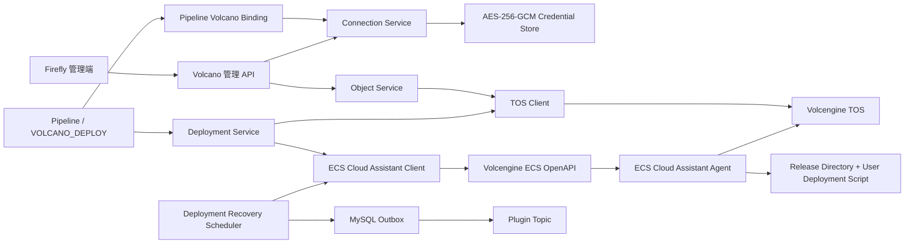
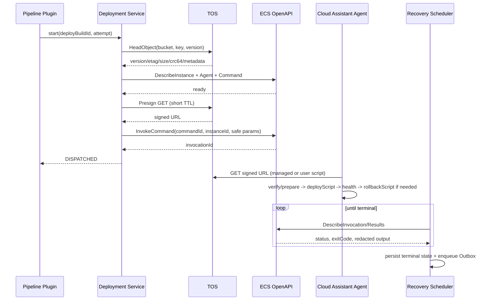

# Firefly Volcano 模块技术设计

> 状态：Implementation Ready  
> 版本：v1.4
> 日期：2026-09-01
> 目标代码库：Firefly（Java 25、Spring Boot 3.5、Maven 多模块）

## 1. 背景与目标

当前仓库没有独立的 `firefly-volcano` Maven 模块。火山引擎相关代码只存在于
`firefly-app`：

- `volcano_engine`、`volcano_config` 和 `volcano_trigger` 保存 AK/SK，其中部分表和
  消息模型直接保存或传递明文凭据。
- `VolcanoTriggerOriginServiceImpl` 只负责把 AK/SK 放入触发消息，不调用火山引擎
  OpenAPI。
- 没有 TOS 对象查询、流式读取、文件下载、校验、ECS 实例检查、云助手命令执行和
  部署状态恢复能力。

本设计新增独立的 `firefly-volcano` 集成模块，并在 `firefly-app` 中接入持久化、HTTP
管理接口和 Pipeline Plugin，使 Firefly 能够：

1. 在创建 Pipeline 时配置流水线级火山引擎身份，支持长期 AK/SK、直接输入 STS
   临时凭证或通过 AssumeRole 动态获取 STS。
2. 查询 TOS 对象元数据和对象列表。
3. 以流方式读取对象内容，或安全下载为本地文件。
4. 将 TOS 中的压缩包或二进制文件部署到指定 ECS 实例，并执行用户配置的部署指令。
5. 对下载、准备制品、用户指令执行、健康检查和回滚全过程进行持久化审计和失败恢复。

### 1.1 MVP 范围

- 中国区火山引擎；创建 Pipeline 时建立一个全局 Volcano Binding，所有 Volcano Plugin
  共享该身份。
- 凭据模式：`STATIC_AK_SK`、`STS_SESSION` 和 `STS_ASSUME_ROLE`。
- 私有 TOS Bucket。
- Linux ECS、单实例、systemd 服务。
- 制品处理类型：`FILE`、`TAR_GZ`、`ZIP`；`FILE` 覆盖 JAR 和其他原始二进制。
- TOS 对象读取、下载和单对象部署。
- 用户可为 Plugin 提供部署指令；Firefly 为每个脚本版本创建不可变的云助手自定义命令，
  运行期通过 `InvokeCommand` 执行。
- Pipeline Plugin 类型 `VOLCANO_DEPLOY`。
- 部署 Job 配置只保存 TOS Region + Bucket + Prefix 制品范围，不保存具体制品。
- 用户真正手动执行 Pipeline 时，每个部署 Job 必须从该 Prefix 当前层按
  `LastModified` 倒序的最近 10 个制品中选择一个。
- 部署插件按 Region 查询可部署 ECS，使用 `Region + InstanceId` 保存目标。
- 部署插件允许配置 `tos://<bucket>/<prefix>/` 和受控的 ECS 部署路径；手动执行
  时再选择 Prefix 下的具体对象，Bootstrap 把经过校验的制品原子发布到该路径
  后再执行用户脚本。
- 部署超时、重试、状态查询、停止执行、健康检查和可选用户回滚指令。

### 1.2 不在 MVP 范围

- 创建、启动、停止或删除 ECS 实例。
- Windows 实例。
- 多实例滚动发布、灰度发布、负载均衡摘挂、Auto Scaling Group。
- Windows Bat、PowerShell 或 Python 部署脚本；MVP 只支持 Linux Bash。
- TOS 上传、删除、覆盖对象。
- Firefly User/Tenant/RBAC 模型；管理 API 仍由部署层管理员认证保护。
- 把 SSH 私钥或长期 AK/SK 下发到 ECS。

## 2. 核心设计决策

### 2.1 云协议与 Firefly 业务分层

`firefly-volcano` 只实现火山引擎协议适配、标准模型、错误转换和 Spring Boot
自动装配，不依赖 `firefly-app`。数据库、Pipeline、Plugin、任务调度和管理 HTTP API
继续放在 `firefly-app`。

这与现有 `firefly-github` 的模块边界一致，也便于在单元测试中替换 TOS/ECS Client。

### 2.2 部署时由 ECS 直拉 TOS 对象

部署主链路不采用“Firefly 下载后再上传到 ECS”，而是：

1. Firefly 用 AK/SK 调用 TOS `HeadObject`，锁定对象版本和校验信息。
2. Firefly 生成短期、只允许 `GET` 指定对象的预签名 URL。
3. Firefly 调用 ECS 云助手 `InvokeCommand`。
4. ECS 内经过 Firefly 包装的不可变命令使用预签名 URL 下载制品并校验 SHA-256。
5. 包装命令按配置安全解压压缩包或准备原始文件，再执行用户给定的部署指令。

这样可以避免大文件占用 Firefly 的磁盘、内存和出口带宽，并确保 ECS 永远拿不到长期
AK/SK。管理端“下载对象”接口仍由 Firefly 以流式代理方式提供，满足人工下载和调试
需求。

### 2.3 用户指令固化为 Command Revision，再使用 `InvokeCommand`

用户保存 Plugin 时，Firefly 校验部署脚本，将可信 Bootstrap 与用户脚本组合成完整 Bash
内容，通过 `CreateCommand` 创建一条不可变的云助手自定义命令，并保存 Command ID、用户
脚本 SHA-256 和渲染后命令 SHA-256。修改脚本必须创建新的 Command Revision，禁止
`ModifyCommand` 原地覆盖，确保已经创建的 Deployment Attempt 始终指向相同代码。

运行期只调用 `InvokeCommand`，传递严格校验后的制品参数；不会在每次部署时创建或修改
命令。Firefly 页面必须显示脚本内容、Hash、创建人和最后批准时间，保存前明确提示：拥有
脚本编辑权限等价于拥有目标 ECS 上指定 `runAsUser` 的代码执行权限。

不使用 `RunCommand`，原因是它可以直接提交任意命令内容，难以用 IAM Policy 把权限
限制到已持久化的脚本版本。`CreateCommand` / `DeleteCommand` 只允许在配置发布和垃圾
回收路径使用；执行 Deployment 的运行角色只需要 `InvokeCommand` 等运行权限。

### 2.4 Volcano 是部署 Plugin，不是凭据型 Trigger

“从 TOS 取制品并部署 ECS”属于 Job 的执行动作，应新增 `VOLCANO_DEPLOY` Plugin。
Trigger 只说明 Pipeline 为什么启动，不应携带云凭据。现有 `VOLCANO` Trigger 在兼容
期内保留，但必须移除 AK/SK 在触发消息和 `volcano_trigger` 运行记录中的传播。

### 2.5 异步执行，不阻塞 Kafka Listener

`InvokeCommand` 返回 Invocation ID 后立即结束当前数据库事务。后台恢复调度器轮询
`DescribeInvocations` / `DescribeInvocationResults`，识别终态后通过现有 Outbox 写入
`TriggerPluginMessage`。

禁止在 Kafka Consumer 线程中等待几分钟甚至几小时，否则会占用 Listener、触发
`max.poll.interval.ms` 风险，并使进程重启后的任务无法恢复。

### 2.6 凭据在创建 Pipeline 时输入，但不嵌入 Pipeline JSON

Pipeline 创建向导必须提供“火山引擎全局配置”步骤。用户可以新输入 AK/SK、输入一组
STS 临时 AK/SK/Session Token，或配置 AssumeRole。后端验证后创建加密 Connection，
再把 `pipeline_id -> connection_id` 写入 `volcano_pipeline_binding`。

Pipeline、Job 的 `plugin_raw`、Kafka 消息和查询响应只保存或返回 Connection 引用与
脱敏信息，不保存明文凭据。这样既满足“创建流水线时输入”，又允许在不修改 Pipeline
拓扑的情况下独立轮换密钥。

### 2.7 ECS 目标使用 `Region + InstanceId`

无公网 IP 不影响云助手部署。Firefly 调用的是火山引擎 ECS OpenAPI，不会连接 ECS 的
公网或私网 IP；云助手服务根据 Instance ID 把命令下发给实例内 Agent。因此持久化目标
必须是 `(connectionId, region, instanceId)`，其中 `connectionId` 确定账号身份，Region
确定 API Endpoint，Instance ID 确定实例。

私网 IP 只用于 UI 展示和运行前一致性检查，不能作为主标识：IP 可能变化、释放或在不同
VPC 中重复。无公网 IP 的实例仍必须满足两个网络条件：云助手 Agent 能出站访问云助手
服务，实例能通过内网 Endpoint/VPC Endpoint 访问 TOS。完全无出站能力时，Instance ID
也无法让云助手工作，此时需另行部署 Firefly Agent，不属于 MVP。

### 2.8 下载与用户部署脚本分层

默认使用 `MANAGED_DOWNLOAD`：可信 Bootstrap 负责预签名 URL 下载、大小/SHA-256 校验、
安全解压和工作目录准备，随后才执行用户的 `deployScript`。用户脚本只接收本地路径环境
变量，不接触 AK/SK 或预签名 URL。这是生产推荐模式。

确实需要自定义下载工具或完整安装流程时，可选择 `CUSTOM_FULL_SCRIPT`。该模式把短期
预签名 URL 作为环境变量提供给脚本，由脚本自行下载、校验、解压和部署。Firefly 只能
审计脚本及退出码，不能保证其完整性校验、原子切换或自动回滚，因此必须由管理员显式
开启并再次确认风险。两种模式都不会把长期 AK/SK 或 STS 凭据发送到实例。

### 2.9 Job 配置制品范围，手动执行锁定具体制品

Plugin 配置可以让用户输入 `tos://<bucket>/<prefix>/`，但只持久化规范化的
Region、Bucket、Prefix、当前层规则和允许的制品处理类型。Job 配置中不允许出现
Object Key、Version ID、ETag、大小、LastModified 或 SHA-256 快照，因为这些字段在配置
时尚未选定。系统不保存预签名 URL，也不接受任意 `http://` / `https://`
地址。

具体 Object 只能在用户提交手动执行时选择。后端必须根据 Job 中的 Prefix 重新校验
Key，再执行 `HeadObject` 生成不可变的运行快照。该快照归属 Pipeline Build，不回写
Pipeline 或 Job 配置。对象 Key 始终是不透明标识，不能直接拼成本地路径。

用户配置的“部署路径”拆成管理员允许的绝对 `deployRoot`、用户可选的相对
`relativePath` 和明确的 `layout`。后端生成并展示最终路径预览，ECS Bootstrap 再次执行
相同校验。制品不能直接写入正在使用的目标：必须先下载到目标文件系统内的独占临时
目录，完成大小、SHA-256 和归档安全校验后，再通过原子 rename 或版本目录发布，最后才
执行用户脚本。这样“自动下载到指定路径”不会退化成任意路径覆盖能力。

## 3. 总体架构



职责边界：

| 组件 | 职责 | 禁止事项 |
| --- | --- | --- |
| `firefly-volcano` | SDK Client、请求/响应模型、Endpoint、超时、错误标准化 | 数据库、Pipeline 状态、HTTP Controller |
| `firefly-app` Connection | 加密保存 AK/SK、轮换、连接验证 | 把明文凭据返回给 API |
| `firefly-app` Object | 列表、元数据、流式读取和本地下载编排 | 将整个对象读入 `byte[]` |
| `firefly-app` Deployment | 锁定制品、版本化用户脚本、调用云助手、状态机和恢复 | 运行未持久化、未审计的临时命令 |
| ECS Command Revision | 下载/校验/准备制品，执行固定版本的用户部署和回滚指令 | 获取长期云凭据；运行其他脚本版本 |

## 4. Maven 模块设计

### 4.1 Reactor

根 `pom.xml`：

```xml
<modules>
    <module>firefly-github</module>
    <module>firefly-volcano</module>
    <module>firefly-app</module>
</modules>
```

`firefly-app/pom.xml` 新增对 `firefly-volcano` 的依赖。

### 4.2 SDK 依赖

建议以属性集中锁定版本，并通过 Maven Enforcer 做依赖收敛：

```xml
<properties>
    <volcengine.openapi.sdk.version>2.0.24</volcengine.openapi.sdk.version>
    <volcengine.tos.sdk.version>2.9.8</volcengine.tos.sdk.version>
</properties>

<dependencyManagement>
    <dependencies>
        <dependency>
            <groupId>com.volcengine</groupId>
            <artifactId>volcengine-java-sdk-bom</artifactId>
            <version>${volcengine.openapi.sdk.version}</version>
            <type>pom</type>
            <scope>import</scope>
        </dependency>
    </dependencies>
</dependencyManagement>
```

`firefly-volcano/pom.xml`：

```xml
<dependencies>
    <dependency>
        <groupId>com.volcengine</groupId>
        <artifactId>ve-tos-java-sdk</artifactId>
        <version>${volcengine.tos.sdk.version}</version>
    </dependency>
    <dependency>
        <groupId>com.volcengine</groupId>
        <artifactId>volcengine-java-sdk-ecs</artifactId>
    </dependency>
    <dependency>
        <groupId>javax.annotation</groupId>
        <artifactId>javax.annotation-api</artifactId>
        <version>1.3.2</version>
    </dependency>
    <dependency>
        <groupId>org.springframework.boot</groupId>
        <artifactId>spring-boot-autoconfigure</artifactId>
    </dependency>
    <dependency>
        <groupId>org.springframework.boot</groupId>
        <artifactId>spring-boot-starter-test</artifactId>
        <scope>test</scope>
    </dependency>
</dependencies>
```

实施前在 Java 25 下执行 `mvn dependency:tree`。TOS SDK 自带较旧 Jackson 版本时，应
排除其 Jackson 传递依赖并使用 Spring Boot BOM 管理的版本；只有通过 SDK 合同测试后
才能合并，不能在没有验证时静默保留多个 Jackson 版本。

### 4.3 包结构

```text
firefly-volcano/src/main/java/firefly/volcano
├── api
│   ├── VolcanoObjectStorageClient.java
│   └── VolcanoEcsCommandClient.java
├── auth
│   ├── VolcanoCredentials.java
│   └── VolcanoCredentialsProvider.java
├── config
│   ├── FireflyVolcanoAutoConfiguration.java
│   └── VolcanoClientProperties.java
├── ecs
│   ├── VolcengineEcsCommandClient.java
│   └── model/...
├── tos
│   ├── VolcengineTosObjectStorageClient.java
│   └── model/...
└── error
    ├── VolcanoIntegrationException.java
    ├── VolcanoErrorCode.java
    └── VolcanoRequestMetadata.java
```

Spring 自动装配文件：

```text
META-INF/spring/org.springframework.boot.autoconfigure.AutoConfiguration.imports
```

## 5. 公共 Java 接口

Vendor SDK 类型不得穿透到 `firefly-app`。模块对外只暴露 Firefly 自己的模型。

### 5.1 凭据

```java
public record VolcanoCredentials(
    String accessKeyId,
    String secretAccessKey,
    String sessionToken
) {
    // 禁止生成包含字段值的 toString。
}

@FunctionalInterface
public interface VolcanoCredentialsProvider {
    VolcanoCredentials resolve();
}
```

Client 按 `(connectionId, region, endpoint profile)` 缓存底层 SDK 实例，但凭据 Provider
必须支持轮换。连接池和 HTTP Client 复用，凭据明文只在一次调用所需的最短时间存在。

### 5.2 对象存储接口

```java
public interface VolcanoObjectStorageClient extends AutoCloseable {
    ObjectPage listObjects(ListObjectsCommand command);

    ObjectMetadata headObject(HeadObjectCommand command);

    ObjectContent getObject(GetObjectCommand command);

    DownloadedObject downloadObject(DownloadObjectCommand command);

    PresignedDownload presignGet(PresignGetCommand command);
}
```

模型要求：

- `ObjectContent` 同时持有元数据和可关闭的 `InputStream`，实现 `AutoCloseable`。
- `DownloadedObject` 返回最终路径、字节数、ETag、Version ID、CRC64、SHA-256 和
  TOS Request ID。
- `DownloadObjectCommand.destination` 必须是调用方传入的已解析绝对路径。
- `PresignedDownload` 的 `toString()` 只输出过期时间，不输出 URL。
- `GetObjectCommand` 支持可选 `versionId`、`rangeStart`、`rangeEnd` 和 `ifMatch`。
- 对象 Key 是不透明字符串，不能转换成本地路径，也不能用 `Path.resolve(key)`。

### 5.3 ECS 云助手接口

```java
public interface VolcanoEcsCommandClient {
    InstancePage listInstances(ListInstancesCommand command);

    EcsInstance describeInstance(DescribeInstanceCommand command);

    CloudAssistantStatus describeCloudAssistant(
        DescribeCloudAssistantCommand command);

    CommandDefinition describeCommand(DescribeCommand command);

    CreatedCommand createCommand(CreateCommand command);

    DeleteCommandResult deleteCommand(DeleteCommand command);

    CommandInvocation invokeCommand(InvokeCommand command);

    InvocationStatus describeInvocation(DescribeInvocation command);

    InvocationResult describeInvocationResult(
        DescribeInvocationResultCommand command);

    StopInvocationResult stopInvocation(StopInvocationCommand command);
}
```

`CreateCommand` 只在 Plugin 配置发布时调用，输入包含已验证的完整 Bash、参数定义、
`runAsUser`、工作目录、超时和 Firefly Tag；命令正文编码前不得超过火山引擎当前限制
16 KiB。`InvokeCommand` 只包含已持久化 Command ID、Instance ID、固定参数映射、超时
和 Deployment ID，不提供命令正文。`DeleteCommand` 只能由引用计数为零且没有活动
Attempt 的垃圾回收任务调用。

### 5.4 SDK 错误转换

所有 SDK 异常统一转换为：

```java
public final class VolcanoIntegrationException extends RuntimeException {
    private final VolcanoErrorCode code;
    private final Integer httpStatus;
    private final String providerCode;
    private final String requestId;
    private final boolean retryable;
}
```

日志和 API 可以输出 `requestId`、Firefly `deploymentId` 和已脱敏资源标识；不得输出
AK、SK、Session Token、Authorization Header、预签名 URL 或完整云助手参数。

## 6. 凭据和连接管理

### 6.1 Connection 与 Pipeline Binding 模型

一个 Connection 表示一组火山引擎身份。创建 Pipeline 时可以创建新 Connection，也可
选择已有 Connection；随后通过 `volcano_pipeline_binding` 绑定到 Pipeline。Plugin 不再
单独选择凭据，而是根据所属 Pipeline 解析唯一的全局 Binding。

```sql
CREATE TABLE `firefly`.`volcano_connection`
(
    `id`                    BIGINT(20) NOT NULL AUTO_INCREMENT,
    `public_id`             VARCHAR(64) NOT NULL,
    `connection_name`       VARCHAR(128) NOT NULL,
    `credential_type`       VARCHAR(32) NOT NULL,
    `credential_ciphertext` TEXT NOT NULL,
    `credential_nonce`      VARBINARY(32) NOT NULL,
    `encryption_key_version` VARCHAR(64) NOT NULL,
    `credential_expires_at` DATETIME(6) NULL,
    `default_region`        VARCHAR(64) NOT NULL,
    `tos_endpoint`          VARCHAR(512) NOT NULL DEFAULT '',
    `ecs_endpoint`          VARCHAR(512) NOT NULL DEFAULT '',
    `status`                VARCHAR(32) NOT NULL,
    `last_validated_at`     DATETIME(6) NULL,
    `last_error`            VARCHAR(2048) NOT NULL DEFAULT '',
    `created_at`            DATETIME(6) NOT NULL,
    `updated_at`            DATETIME(6) NOT NULL,
    PRIMARY KEY (`id`),
    UNIQUE INDEX `uidx_volcano_connection_public` (`public_id`),
    UNIQUE INDEX `uidx_volcano_connection_name` (`connection_name`),
    INDEX `idx_volcano_connection_status` (`status`)
);

CREATE TABLE `firefly`.`volcano_pipeline_binding`
(
    `id`                    BIGINT(20) NOT NULL AUTO_INCREMENT,
    `pipeline_id`           BIGINT(20) NOT NULL,
    `connection_id`         BIGINT(20) NOT NULL,
    `default_region`        VARCHAR(64) NOT NULL,
    `project_name`          VARCHAR(128) NOT NULL DEFAULT '',
    `created_at`            DATETIME(6) NOT NULL,
    `updated_at`            DATETIME(6) NOT NULL,
    PRIMARY KEY (`id`),
    UNIQUE INDEX `uidx_volcano_binding_pipeline` (`pipeline_id`),
    INDEX `idx_volcano_binding_connection` (`connection_id`)
);
```

`credential_type`：

| 类型 | 创建时输入 | 运行方式 | 适用性 |
| --- | --- | --- | --- |
| `STATIC_AK_SK` | AK、SK | 直接签名 TOS/ECS API | 简单，但必须定期轮换 |
| `STS_SESSION` | 临时 AK、临时 SK、Session Token、Expires At | 有效期内直接签名 | 仅适合短期/一次性 Pipeline；过期后必须更新 |
| `STS_ASSUME_ROLE` | IAM 子用户 AK/SK、Role TRN、Session Name、Duration | 每次运行前调用 `AssumeRole`，缓存临时凭据到过期前 | 生产推荐 |

`credential_ciphertext` 加密前是带版本的内部 JSON。静态模式示例：

```json
{
  "schemaVersion": 1,
  "accessKeyId": "AKLT...",
  "secretAccessKey": "...",
  "sessionToken": null
}
```

STS AssumeRole 模式示例：

```json
{
  "schemaVersion": 1,
  "sourceAccessKeyId": "AKLT...",
  "sourceSecretAccessKey": "...",
  "roleTrn": "trn:iam::<account-id>:role/FireflyDeployRole",
  "roleSessionName": "firefly",
  "durationSeconds": 3600
}
```

STS Provider 必须在临时凭据过期前 5 分钟刷新，并用 Connection 级互斥避免并发请求同时
刷新。刷新失败时已有未过期凭据可继续使用；凭据已经过期则阻止新的对象查询和部署。

### 6.2 加密要求

- 使用 AES-256-GCM，每次写入生成新的 12 字节随机 Nonce。
- 环境变量 `VOLCANO_ENCRYPTION_KEY` 是 Base64 编码的 32 字节密钥。
- 使用 AAD 绑定 `public_id`、记录用途 `volcano-credential` 和 Key Version，防止密文
  被复制到其他记录后仍可解密。
- API 读取 Connection 时仅返回 `accessKeyIdMask`，例如 `AKLT****82KD`。
- 新建/轮换请求 DTO 禁止 Lombok `@Data`、`@ToString`；显式实现脱敏 `toString()`。
- 密钥轮换采用“新 Key Version 可读写、旧 Key Version 只读、后台重加密、确认完成后
  移除旧密钥”的两阶段流程。
- `STS_SESSION` 的 `expiresAt` 必须落在密文中，同时单独保存非敏感的
  `credential_expires_at` 便于状态提示和调度，但 API 不返回 Token。
- 生产环境优先使用 `STS_ASSUME_ROLE`；后续可接入 KMS Envelope Encryption，数据库
  结构无需改变。

### 6.3 Pipeline 创建契约

创建请求在 Pipeline 顶层增加全局 `volcanoConfig`，不能放在某个 Deploy Plugin 内：

```json
{
  "uuid": "<pipeline-uuid>",
  "name": "order-service-pipeline",
  "volcanoConfig": {
    "connectionName": "order-service-prod",
    "credential": {
      "type": "STS_ASSUME_ROLE",
      "sourceAccessKeyId": "<ak>",
      "sourceSecretAccessKey": "<sk>",
      "roleTrn": "trn:iam::<account-id>:role/FireflyDeployRole",
      "roleSessionName": "firefly",
      "durationSeconds": 3600
    },
    "defaultRegion": "cn-beijing",
    "projectName": "production"
  },
  "stageConfigs": []
}
```

后端处理顺序：

1. 校验字段和 Endpoint allowlist。
2. 使用输入身份调用 STS（如适用），再对管理员选择的 TOS/ECS 资源执行最小权限验证。
3. 加密凭据；开启数据库事务。
4. 保存 Connection、Pipeline、Binding、Stage、Job 和 Plugin 配置。
5. 任一步失败则整体回滚，不产生只有凭据或只有 Pipeline 的半成品。

查询 Pipeline 时只返回：

```json
{
  "connectionId": "vc_01J...",
  "connectionName": "order-service-prod",
  "credentialType": "STS_ASSUME_ROLE",
  "accessKeyIdMask": "AKLT****82KD",
  "defaultRegion": "cn-beijing",
  "credentialStatus": "ACTIVE"
}
```

### 6.4 Connection API

| 方法 | 路径 | 说明 |
| --- | --- | --- |
| `POST` | `/api/volcano/connections` | 加密保存 AK/SK、STS Session 或 AssumeRole 配置 |
| `GET` | `/api/volcano/connections` | 分页查询脱敏 Connection |
| `GET` | `/api/volcano/connections/{id}` | 查询单个脱敏 Connection |
| `PUT` | `/api/volcano/connections/{id}/credentials` | 原子轮换凭据或切换凭据类型 |
| `POST` | `/api/volcano/connections/{id}/validate` | 对指定 TOS/ECS 资源做最小权限验证 |
| `DELETE` | `/api/volcano/connections/{id}` | 无活动配置引用时禁用并删除密文 |

不能通过 `ListBuckets` 或其他宽权限接口判断凭据“是否有效”。Validate 请求应携带管理员
明确选择的 `region`、`bucket`、`objectKey`、`instanceId`，分别执行 `HeadObject`、
`DescribeInstances` 和 `DescribeCloudAssistantStatus`。如果校验已有 Command，可以额外传
`commandId` 执行 `DescribeCommands`；`CreateCommand` 权限在第一次发布 Plugin 时以真实
创建结果验证，不能为了探测权限创建不可追踪的测试命令。

## 7. TOS 对象读取与下载

### 7.1 管理 API

| 方法 | 路径 | 说明 |
| --- | --- | --- |
| `GET` | `/api/volcano/connections/{id}/tos/objects` | 按 Bucket/Prefix 分页列举对象 |
| `GET` | `/api/volcano/connections/{id}/tos/object-metadata` | 查询单个对象元数据 |
| `GET` | `/api/volcano/connections/{id}/tos/object-content` | 流式读取或下载单个对象 |
| `GET` | `/api/volcano/pipelines/{pipelineId}/jobs/{jobUuid}/artifacts/recent` | 手动执行弹窗查询该 Job 允许的最近制品 |

使用 Query Parameter 传递 `bucket`、`key`、`region` 和可选 `versionId`。不要把 Object
Key 放在 Path Variable 中，因为 Key 可以包含 `/`、空格和编码字符，代理层也可能错误
归一化路径。

### 7.2 “当前路径最近 10 个制品”语义

手动执行弹窗在已保存的 Pipeline 上按 Job 调用：

```http
GET /api/volcano/pipelines/{pipelineId}/jobs/{jobUuid}/artifacts/recent?limit=10
```

固定规则：

- Connection 从 Pipeline Binding 解析，Region、Bucket、Prefix 和当前层规则从
  `{pipelineId} + {jobUuid}` 对应的 `VOLCANO_DEPLOY` Job 配置解析。前端不能传
  `connectionId`、`region`、`bucket` 或 `prefix` 切换资源范围。
- `prefix` 表示 TOS 当前目录，后端调用 `ListObjectsV2` 时设置 `delimiter=/`，只返回
  当前层对象，不递归进入 `CommonPrefixes` 子目录。
- 排除以 `/` 结尾的目录占位对象、0 字节对象、不支持的扩展名、归档未恢复对象和缺少
  SHA-256 元数据的对象。
- 以 `LastModified DESC, Key ASC` 排序，最多返回 10 条。
- 返回供人阅读的 `key`、`versionId`、`etag`、`sha256`、`size`、`lastModified`、
  `storageClass` 和 `displayName`。提交手动执行时前端只回传选中的 `key`、可选
  `versionId` 和 `handling`；后端不信任客户端回传的 ETag、大小或校验和。

TOS List API 根据 Key 字典序分页，而不是按 `LastModified` 倒序，`max-keys=10` 不能保证
得到“最新 10 个”。MVP 后端必须遍历该 Prefix 的所有分页，并用大小为 10 的最小堆计算
Top-K；设置 `max-artifact-scan`（默认 10,000）和 30 秒缓存。超过扫描上限返回
`ARTIFACT_SCAN_LIMIT_EXCEEDED`，不能把不完整结果标为“最近 10 个”。

当单 Prefix 长期超过扫描上限时，生产方案二选一：

1. 由制品发布流程写入 Firefly `volcano_artifact` 索引表，查询直接按
   `(pipeline_id, prefix, last_modified)` 索引取 10 条。
2. 强制 Key 使用可排序时间/版本前缀，并维护一个受签名保护的 `manifest.json`。

用户提交手动执行后，后端对选中对象立即调用 `HeadObject` 并以服务端响应为准生成
不可变快照。MVP 是“运行时显式选择”，不是隐式部署最新对象；手动执行记录和
后续重试始终引用该快照，因此 Pipeline 配置本身不锁定制品也不会牺牲可审计性。

### 7.3 对象内容流式读取

`object-content`：

- Spring 使用 `StreamingResponseBody`，固定 64 KiB 缓冲区，不构造 `byte[]` 全量内容。
- 透传安全的 `Content-Type`、`Content-Length`、`ETag` 和 `Last-Modified`。
- `Content-Disposition` 文件名取 Object Key 最后一段，经 CR/LF、引号和路径字符清洗。
- 支持单段 HTTP Range；多段 Range MVP 返回 `416`。
- 客户端断开时立即关闭 TOS InputStream，不继续后台下载。
- 默认限制对象最大 5 GiB，可由 `firefly.volcano.tos.max-download-size` 调整。
- Controller 和 Access Log 不记录包含敏感 Query 的预签名 URL；管理下载接口本身不把
  预签名 URL返回浏览器。

### 7.4 下载到 Firefly 本地文件

内部下载过程：

1. 调用 `HeadObject` 获取大小、ETag、Version ID、CRC64、自定义元数据和存储类型。
2. 校验对象大小、存储类型和允许的 Content Type。
3. 在配置的工作目录下创建随机 `.part` 文件；目录不得由 API 调用者指定。
4. 使用 TOS SDK `downloadFile` 进行大文件断点续传，或用 `GetObject` 流式写入小文件。
5. 同步计算 SHA-256；如果 TOS 返回 CRC64，同时执行 CRC64 一致性检查。
6. 校验成功后使用同一文件系统内的原子移动发布最终文件。
7. 失败时保留 checkpoint 供同一任务续传，删除不完整最终文件。
8. 任务结束或超过 TTL 后由清理器删除 `.part`、checkpoint 和本地制品。

不能把 ETag 一律当作 MD5。分片上传或对象修改后 ETag 的语义可能不同；部署完整性使用
SHA-256，CRC64 只作为额外的传输一致性校验。

### 7.5 对象版本锁定

部署不能只记录 Bucket + Key，因为同名对象可能在部署中被覆盖。创建部署尝试时必须
保存以下快照：

- Bucket、Key、Region。
- Version ID；未启用版本控制时保存 HeadObject 返回的 ETag。
- Content Length、ETag、CRC64。
- 预期 SHA-256。

下载时设置 `versionId`；没有 Version ID 时设置 `If-Match: <etag>`。若条件不再满足，
部署以 `TOS_OBJECT_CHANGED` 失败，不能悄悄部署新内容。

### 7.6 SHA-256 来源

生产部署要求 SHA-256 必填，优先顺序：

1. TOS 自定义元数据 `x-tos-meta-firefly-sha256`。
2. 手动执行选择流程中由服务端受信任的制品索引提供，并写入运行快照。
3. 仅限管理端人工下载：Firefly 下载完成后计算；不能用于 ECS 直拉前的信任判断。

如果元数据和受信任索引同时存在但不一致，直接失败。SHA-256 必须是 64 位小写
十六进制。Job 配置不接受 `expectedSha256`，避免把某个具体制品的快照重新引入配置层。

## 8. ECS 部署设计

### 8.1 前置条件

- ECS 实例处于 `RUNNING`。
- 已安装并运行云助手 Agent。
- 实例与 TOS Bucket 默认要求同 Region；跨 Region 方案需显式开启并接受公网、费用和
  带宽风险。
- ECS 能访问 TOS Endpoint；优先使用 VPC 内网接入或 VPC Endpoint。
- Connection 的配置发布身份有权创建 Firefly 管理的云助手 Command，运行身份有权执行
  该 Command；禁止 `RunCommand` 和原地 `ModifyCommand`。
- 目标机存在 allowlist 中的 `runAsUser`，且该用户具备用户部署指令实际需要的最小权限；
  是否使用 systemd、容器或自定义进程管理器由部署指令决定。
- 目标机安装 `curl`、`sha256sum`、`flock`，按包类型安装 `tar` 或 `unzip`。

### 8.2 无公网 IP 的实例发现与选择

Plugin 编辑器通过 Pipeline Binding 查询目标账号下的 ECS：

```http
GET /api/volcano/pipelines/{pipelineId}/ecs/instances
    ?region=cn-beijing
    &projectName=production
    &vpcId=vpc-xxx
    &status=RUNNING
    &pageNumber=1
    &pageSize=50
```

后端先调用 `DescribeInstances`，再批量调用 `DescribeCloudAssistantStatus`，只将以下实例
标记为 `deployable=true`：

- 与所选 TOS Bucket 位于允许的 Region。
- 实例状态为 `RUNNING`。
- 操作系统为 MVP 支持的 Linux。
- 云助手 Agent 已安装且在线。
- Instance ID、Project、VPC/Tag 满足 Connection 的 IAM 和管理员 allowlist。

选择框不能只展示 Instance ID。推荐显示：

```text
order-prod-01 | 10.0.12.34 | cn-beijing-a | production-vpc | i-ycxxxx
```

返回模型：

```json
{
  "region": "cn-beijing",
  "instanceId": "i-ycxxxx",
  "instanceName": "order-prod-01",
  "privateIp": "10.0.12.34",
  "vpcId": "vpc-xxx",
  "subnetId": "subnet-xxx",
  "zoneId": "cn-beijing-a",
  "projectName": "production",
  "tags": {"env": "prod", "app": "order-service"},
  "status": "RUNNING",
  "cloudAssistantStatus": "ONLINE",
  "deployable": true,
  "unavailableReason": null
}
```

保存时以 `Region + InstanceId` 为真实目标，同时保存名称、私网 IP、VPC 和 Zone 快照供
审计。执行前再次 `DescribeInstances(instanceId)`：实例不存在、Region 不匹配、已停止、
Agent 离线或关键 Tag 已改变时停止部署。私网 IP 变化只产生审计告警，不改变目标身份。

网络路径如下：

```text
Firefly --HTTPS--> ecs.<region>.volcengineapi.com --控制面--> Cloud Assistant Agent
ECS VM  --内网/出站 HTTPS--> TOS Endpoint
```

Firefly 不通过公网 IP 或私网 IP SSH/复制文件到实例，因此目标 ECS 没有公网 IP是正常且
推荐的部署形态。若安全组禁止所有入站也不影响本方案；但不能阻断 Agent 和 TOS 所需的
出站或 VPC Endpoint。

### 8.3 Plugin 配置

`PluginType` 新增 `VOLCANO_DEPLOY`。Pipeline 请求示例：

```json
{
  "uuid": "<64-char-job-uuid>",
  "name": "deploy-order-service",
  "pluginType": "VOLCANO_DEPLOY",
  "pluginRaw": {
    "artifactSource": {
      "selectionMode": "MANUAL_AT_RUN",
      "tosUri": "tos://firefly-artifacts/order-service/releases/",
      "region": "cn-beijing",
      "bucket": "firefly-artifacts",
      "prefix": "order-service/releases/",
      "currentLevelOnly": true,
      "allowedHandling": ["TAR_GZ", "ZIP", "FILE"],
      "defaultHandling": "TAR_GZ"
    },
    "target": {
      "region": "cn-beijing",
      "instanceId": "i-yc...",
      "instanceNameSnapshot": "order-prod-01",
      "privateIpSnapshot": "10.0.12.34",
      "vpcIdSnapshot": "vpc-xxx",
      "zoneIdSnapshot": "cn-beijing-a"
    },
    "destination": {
      "applicationName": "order-service",
      "deployRoot": "/opt/firefly/apps/order-service",
      "relativePath": "releases",
      "layout": "VERSIONED_DIRECTORY",
      "outputFileName": null,
      "executable": false,
      "retainReleases": 5
    },
    "execution": {
      "mode": "MANAGED_DOWNLOAD",
      "interpreter": "BASH",
      "runAsUser": "firefly-deploy",
      "workingDirectory": "RELEASE_DIR",
      "deployScript": "install -m 0755 \"$FIREFLY_ARTIFACT_PATH/bin/order-service\" /opt/order-service/bin/order-service\nsudo -n systemctl restart order-service.service",
      "rollbackScript": "sudo -n systemctl restart order-service.service",
      "commandTimeoutSeconds": 900,
      "healthCheck": {
        "mode": "HTTP",
        "url": "http://127.0.0.1:8080/actuator/health",
        "timeoutSeconds": 60,
        "successCount": 2
      }
    }
  }
}
```

配置中不再接受 `connectionId`、`ak`、`sk` 或 Session Token；Connection 只能从所属
Pipeline Binding 得到。`artifactSource` 只定义可选制品的范围；不包含 `key`、
`versionId`、`etag`、`size`、`lastModified` 或 `expectedSha256`。动态消费上游 Job
产物需要先设计 Pipeline Artifact Contract，不在本次通过任意字符串模板拼接实现。

`artifactSource.tosUri` 是创建/编辑界面的便捷输入，后端以 `region + bucket +
prefix` 为权威配置。URI 只接受 `tos` Scheme，Bucket 位于 Authority，路径按 UTF-8
Prefix 解析；拒绝 UserInfo、Port、Fragment、Query 和重复百分号解码。保存时只验证 Prefix
属于 Pipeline Binding 允许范围，并使用 `ListObjectsV2` 确认凭据具有必要的列举权限；
不对某个具体 Object 执行 `HeadObject`。

`destination.layout`：

| 类型 | 最终部署路径 | 适用制品 |
| --- | --- | --- |
| `VERSIONED_DIRECTORY` | `<deployRoot>/<relativePath>/<deploymentId>/` | `TAR_GZ`、`ZIP`、`FILE`，生产推荐 |
| `FIXED_FILE` | `<deployRoot>/<relativePath>` | 仅 `FILE`，兼容必须使用固定文件名的服务 |

`VERSIONED_DIRECTORY` 中，压缩包解压到最终版本目录，普通文件以 `outputFileName` 放入
版本目录。`FIXED_FILE` 的 `relativePath` 本身包含文件名；发布时先生成同目录临时文件，
校验后用原子 rename 替换，并保留一个受控的 previous 文件提供给用户回滚脚本；不能
仅凭文件恢复就声称业务回滚成功。MVP 不支持覆盖非空固定目录，因为跨目录树无法可靠
原子替换。

`handling` 必须在手动执行时由用户确认，且必须位于 Job 配置的
`allowedHandling` 内，不能只根据扩展名自动决定：

| 类型 | 准备结果 | `FIREFLY_ARTIFACT_PATH` |
| --- | --- | --- |
| `TAR_GZ` | 校验归档成员后解压到新 Release 目录 | 解压后的 Release 目录 |
| `ZIP` | 校验归档成员后解压到新 Release 目录 | 解压后的 Release 目录 |
| `FILE` | 按 Destination Layout 放入版本目录或固定文件路径 | 最终文件绝对路径 |

`FILE` 同时覆盖 JAR、ELF、Go/Rust 可执行文件和其他不可解压的二进制。只有
`destination.executable=true` 时 Bootstrap 才把模式设置为 `0750`，否则使用 `0640`；
文件名必须是单个安全文件名，不能包含 `/`、`..` 或控制字符。UI 可以根据 `.tar.gz`、
`.zip`、`.jar` 给出建议，但保存前必须让用户确认。

字段校验：

- `applicationName`：`[a-z][a-z0-9-]{1,62}`。
- `instanceId`：按火山资源 ID 格式和长度白名单校验。
- `artifactSource.tosUri` 解析结果必须与 `bucket`、`prefix` 一致；Bucket 和 Prefix
  必须落在 Pipeline Binding 的 IAM/管理员 allowlist 内。
- Artifact Region 与 Target Region 必须一致，除非管理员显式开启跨 Region 部署。
- `deployRoot`：必须位于管理员配置的根目录，例如 `/opt/firefly/apps/`，规范化后仍在
  根目录内；禁止 `..`、NUL 和符号链接逃逸。
- `relativePath`：必须是非空相对路径，禁止前导 `/`、`.`/`..` 段、NUL、控制字符、Shell
  模板和 `${...}`；UTF-8 编码后最长 1024 字节。
- 最终路径按组件检查现有父目录，任何组件是符号链接都拒绝；执行用户必须对受控临时
  目录和目标父目录有权限，但不能写 allowlist 之外的目录。
- `FIXED_FILE` 要求 `allowedHandling` 和 `defaultHandling` 均为 `FILE`；
  `VERSIONED_DIRECTORY` 允许包含 `FILE`，但必须提供安全的 `outputFileName`，不能包含
  `/`、`..` 或控制字符。
- `runAsUser`：不能由普通 Plugin 任意填写，必须来自管理员 allowlist；默认禁止 `root`。
- `deployScript` 必填，UTF-8、无 NUL，和可信 Bootstrap 合并后的命令正文不得超过
  16 KiB；`rollbackScript` 可选，并应用相同校验。
- `healthCheck.url`：MVP 只允许 `http://127.0.0.1` 或 `http://localhost`，禁止 SSRF。
- 超时范围 30～86400 秒，且预签名 URL TTL 大于命令超时和调度余量。
- `retainReleases` 范围 2～20。

编辑器交互顺序固定为：

1. 读取 Pipeline 全局 Volcano Binding；凭据无效或 STS 已过期时禁用 Plugin 保存。
2. 选择 Region、Bucket 和 Prefix，设置当前层规则、允许的处理类型和默认值。编辑器
   不查询“最近 10 个制品”，也不展示具体 Object 选择器。
3. 请求同 Region 的 ECS 列表，默认只显示 `deployable=true`，可切换查看不可用原因。
4. 用户根据实例名、私网 IP、Zone、VPC、Tag 和 Instance ID 选择一台机器。
5. 配置 Deploy Root、相对路径和 Layout；后端返回规范化 Prefix URI 和最终路径
   预览，页面明确区分临时下载路径与用户脚本看到的最终路径。
6. 填写部署指令、可选回滚指令、执行用户、超时和健康检查。
7. 页面显示“该指令将在目标实例执行”的高风险确认，同时展示生成的 Script SHA-256。
8. 保存前后端校验 Prefix 访问权限、Describe Instance 和 Agent，不要求用户选择制品。
9. 后端渲染并校验命令，通过 `CreateCommand` 创建不可变 Command Revision；只有云端命令
   和本地配置均保存成功后 Plugin 才进入 `READY`。失败时删除孤儿命令或交给 GC 回收。

MVP 的管理 API 已由部署层管理员认证保护，因此管理员保存脚本即视为批准，
`created_by` 和 `approved_by` 可以相同；接入 Firefly RBAC 后再扩展为编写人与批准人分离，
数据结构无需改变。系统不提供脱离 Pipeline/Plugin 的“立即执行任意脚本”接口。

数据库和 ECS OpenAPI 不能组成一个事务，Command 发布采用可恢复 Saga：

1. 数据库事务写入 `PROVISIONING` Revision，保存渲染 Hash 和唯一操作 ID。
2. 事务外调用 `CreateCommand`；命令名限制为 32 字符内的
   `firefly-<hash12>-<suffix>`，Tag 保存完整操作 ID 和 Hash。
3. 第二个数据库事务写入 Command ID、把 Revision 改为 `READY` 并绑定 Plugin Config。
4. 请求超时或进程崩溃时，恢复器按 Tag + Hash 查询云端命令：唯一匹配则补写，多个匹配
   则告警并禁止发布，没有匹配才允许重试创建。
5. 只有 `READY` Revision 可以执行；失败 Revision 标记 `ORPHANED`，24 小时后由 GC 在
   确认零引用、零活动 Attempt 且 Tag 匹配后删除。

### 8.4 手动执行时选择制品

现有代码中手动执行入口是 `POST /manual_trigger/pipeline`，请求类为
`PipelineBuildRequest`。当前请求只包含 `pipelineId`、`uuid`、`triggerModel`、
`triggerMatch` 和 `triggerOrigin`，本设计在保持路径兼容的前提下增加按 Job UUID 索引的
`jobInputs`：

```json
{
  "pipelineId": 1001,
  "uuid": "<64-char-request-uuid>",
  "triggerModel": "MANUAL",
  "triggerMatch": "ACCURATE",
  "triggerOrigin": "VOLCANO",
  "jobInputs": {
    "<64-char-volcano-job-uuid>": {
      "artifact": {
        "key": "order-service/releases/order-service-1.8.2.tar.gz",
        "versionId": null,
        "handling": "TAR_GZ"
      }
    }
  }
}
```

`jobInputs` 使用 Job 的稳定 64 位 UUID，不使用前端拖拽节点 ID 或数据库自增 ID。一个
Pipeline 有多个 `VOLCANO_DEPLOY` Job 时，弹窗逐个调用 7.2 的最近制品接口，并要求
每个 Job 各选一个制品。运行时选择不修改已保存 Pipeline，也不触发“编辑 Pipeline”
状态。

后端在调度任何 Stage 前必须完成以下校验：

1. `triggerModel` 必须为 `MANUAL`，并且 Pipeline 属于当前用户可执行范围。
2. 通过 Job UUID 解析唯一 `JobConfig`，确认其 `PluginType=VOLCANO_DEPLOY`。拒绝未知 Job、
   重复选择、非 Volcano Job 输入和漏选。
3. 从 Pipeline Binding 和 Job 配置解析 Connection、Region、Bucket、Prefix 和允许处理
   类型，不从请求体接受这些边界字段。
4. 规范化 `key`，确认其在配置的 Prefix/当前层内，并重新计算该 Job 的最近 10 个
   制品，选中 Key 必须仍在集合中；列表已变化时返回 `VOLCANO_ARTIFACT_SELECTION_INVALID`
   并要求刷新。`handling` 必须属于 `allowedHandling`，且扩展名与处理方式没有明显冲突。
5. 使用服务端凭据调用 `HeadObject`，获得并校验 Version ID/ETag、CRC64、大小、
   LastModified 和 SHA-256。请求中即使出现这些字段也必须拒绝，不能接受客户端快照。
6. 一次数据库事务中创建 `PipelineBuild`、`StageBuild`、`JobBuild`、`PluginBuild`
   和每个 Job 的制品选择快照。任一校验/落库失败则不创建半成品 Build；事务提交
   后再通过现有 Dispatch/Outbox 启动执行。

当前 `PipelineBuildServiceImpl.parsePipelineBuildRequest` 没有把 `triggerModel` 和 `triggerMatch`
复制到 `PipelineBuildDto`，`PipelineBuildDto`、`PipelineBuild` 和 `JobBuildContext` 也没有运行输入。
实现时必须显式补齐这条传递链：`PipelineBuildRequest -> PipelineBuildDto -> PipelineBuild`
持久化触发模式，并且由 `JobBuildContext` 携带 `artifactSelectionId`，或由 Volcano
Build Service 按 `(pipelineBuildId, jobConfigId)` 唯一解析选择记录。不能在
`IPluginBuild.savePluginBuild(JobBuildContext)` 之后再从临时 HTTP 请求中取值。

包含 `MANUAL_AT_RUN` Job 的 Pipeline 在 MVP 中不允许被 GitHub Webhook 等自动触发启动，
因为自动触发没有人工制品选择。系统在创建 Build 前返回
`VOLCANO_MANUAL_ARTIFACT_SELECTION_ONLY`，不得隐式取最新对象。未来只能通过受信任的上游
Artifact Contract/制品索引为自动触发提供显式输入。

### 8.5 部署命令参数

每个 Command Revision 的命令正文由“可信 Bootstrap + 固定用户脚本”组成，运行时只接受
以下参数：

```text
deployment_id
artifact_url_b64_chunk_count
artifact_url_b64_1 ... artifact_url_b64_4
artifact_sha256
artifact_size
artifact_handling
destination_output_name_b64
application_name
deploy_root_b64
destination_relative_path_b64
destination_layout
destination_executable
execution_mode
health_url_b64
health_timeout_seconds
retain_releases
```

云助手 String 自定义参数单值最大 1000 字符。预签名 URL 使用标准 Base64 后按每段最多
900 字符拆成 1～4 个只含 Base64 字符的参数；Bootstrap 校验段数、拼接、解码并检查
`https`、TOS Host allowlist 和长度。超出总容量则配置失败，不能截断 URL。路径也使用
Base64 传入以减少参数替换造成的 Shell 解析风险，但 Base64 不是安全校验。

Bootstrap 自身禁止 `eval` 和 `set -x`，所有变量引用加双引号。用户的 `deployScript` 和
`rollbackScript` 是 Command Revision 的静态正文，不通过 `{{parameter}}` 或字符串替换
拼入参数值。`MANAGED_DOWNLOAD` 在进入用户脚本前执行 `unset FIREFLY_ARTIFACT_URL`；
`CUSTOM_FULL_SCRIPT` 才导出短期 URL，并将该 URL 的原文和 Base64 值都加入本次日志
精确脱敏集合。

### 8.6 实例内目录

```text
/opt/firefly/apps/<application>/
├── current -> releases/<deployment-id>
├── previous -> releases/<previous-deployment-id>
├── .firefly-staging/
│   └── <deployment-id>/
│       ├── artifact.part
│       └── prepared/
├── releases/
│   ├── <deployment-id>/
│   └── ...
└── shared/

/var/lock/firefly-deploy-<application>.lock
```

临时目录放在 `deployRoot` 所在文件系统，是为了保证发布阶段可以使用同文件系统原子
rename。若管理员把 TOS 下载缓存放在 `/var/lib/firefly`，缓存只能作为下载源，最终仍需
先复制到目标父目录的临时文件并完成校验，不能假设跨文件系统 rename 具有原子性。

用户部署脚本只依赖稳定环境变量：

```text
FIREFLY_DEPLOYMENT_ID
FIREFLY_APPLICATION_NAME
FIREFLY_ARTIFACT_TYPE
FIREFLY_DOWNLOAD_FILE       # MANAGED_DOWNLOAD 下已校验的原始下载文件
FIREFLY_RELEASE_DIR         # 本次独占的新 Release 目录
FIREFLY_ARTIFACT_PATH       # 压缩包为解压目录，FILE 为最终文件
FIREFLY_DESTINATION_PATH    # 规范化后的最终文件或版本目录
FIREFLY_CURRENT_LINK
FIREFLY_PREVIOUS_RELEASE
FIREFLY_PREVIOUS_FILE      # FIXED_FILE 被替换前的受控备份；首次部署为空
FIREFLY_SHARED_DIR
```

`CUSTOM_FULL_SCRIPT` 额外提供 `FIREFLY_ARTIFACT_URL`、`FIREFLY_ARTIFACT_SHA256` 和
`FIREFLY_ARTIFACT_SIZE`。环境变量名构成版本化契约；新增变量允许向后兼容，删除或修改
语义必须提升 Command Schema Version。

### 8.7 Bootstrap 与用户指令执行步骤

1. `set -Eeuo pipefail`、`umask 027`，关闭命令回显。
2. 解码并校验全部参数，按 `deployRoot + relativePath + layout` 重新计算最终路径，确认它和
   Plugin 保存的规范化预览一致且仍位于允许根目录内；检查现有父目录不存在符号链接。
3. 使用 `flock -n` 获取应用级部署锁；冲突返回明确退出码。
4. 在 `deployRoot/.firefly-staging/<deployment-id>` 创建权限为 `0700` 的独占临时目录；
   相同 Deployment ID 已存在时先核对 Attempt 和内容，禁止复用未知残留目录。
5. `MANAGED_DOWNLOAD` 使用 `curl --fail --location --retry 3 --connect-timeout 10` 下载到
   `.part`，校验实际大小和 `sha256sum` 后原子改名为 `.artifact`；失败立即清理。
6. `TAR_GZ` / `ZIP` 先列出全部归档成员，拒绝绝对路径、`..`、设备文件和越界符号链接，
   解包到临时 `prepared/` 时不保留原 UID/GID；`FILE` 在临时目录生成安全文件并设置
   `0640` 或 `0750`。
7. 对文件执行 `fsync`，再按 Layout 发布：`VERSIONED_DIRECTORY` 把 `prepared/` 原子
   rename 为带 Deployment ID 的最终目录；`FIXED_FILE` 在同一父目录原子替换目标并保留
   previous。发布后设置 `FIREFLY_DESTINATION_PATH` 和 `FIREFLY_ARTIFACT_PATH`。
8. 设置稳定环境变量并切换到配置的工作目录，执行 Command Revision 中固定的
   `deployScript`；以其退出码作为 `USER_DEPLOY` 结果，不使用 `eval` 包装用户正文。
9. `CUSTOM_FULL_SCRIPT` 跳过托管下载、准备和发布步骤，向用户脚本提供短期 URL、期望
   大小、SHA-256 和规范化 Destination；
   用户脚本必须自行下载和准备制品，Firefly 在页面和审计中标记 `integrityManaged=false`。
10. 用户脚本成功后执行配置的本机健康检查。Firefly 不假设服务由 systemd 管理，重启、
   容器更新、软链接切换等业务动作都由用户指令明确完成。
11. 部署指令或健康检查失败时执行可选 `rollbackScript`。未配置回滚，或回滚失败时进入
    `MANUAL_INTERVENTION_REQUIRED`；不能声称已经自动恢复。
12. 仅在全部成功后清理超过 `retainReleases` 的旧 Release；活动版本、上一版本和任何
    Attempt 正在引用的目录不得删除。
13. 输出 Firefly 结果信封和用户 stdout/stderr 的受限摘要；对 URL 做精确脱敏，单次输出
    截断到配置上限，完整输出不得进入 Kafka 消息。

成功输出示例：

```json
{"schemaVersion":1,"deploymentId":"dep_...","status":"SUCCESS","destination":"/opt/firefly/apps/order-service/releases/dep_...","rolledBack":false}
```

脚本使用约定退出码：

| 退出码 | 含义 |
| --- | --- |
| `10` | 参数或路径校验失败 |
| `11` | 部署锁冲突 |
| `20` | 下载失败或 URL 过期 |
| `21` | 文件大小不一致 |
| `22` | SHA-256 不一致 |
| `30` | 包类型、文件名或解包安全校验失败 |
| `40` | 用户部署指令失败 |
| `41` | 部署或健康检查失败，但用户回滚指令成功 |
| `42` | 用户回滚指令失败，需要人工介入 |
| `43` | 用户指令输出超限或结果信封无效 |

### 8.8 用户指令的安全边界

允许用户 Bash 意味着该用户能够以 `runAsUser` 权限在目标实例执行代码。正则校验、Shell
lint 或关键字黑名单都不能把任意脚本变成安全脚本，因此本设计不宣称对恶意脚本提供
沙箱。安全边界必须由权限和运行环境保证：

- 只有部署管理员可以创建或修改脚本；每次修改生成新 Revision 和新 Hash。
- 使用无登录、最小权限的专用 `firefly-deploy` 用户；仅通过受控 `sudoers` 允许必要动作，
  例如重启指定服务，禁止通配符命令和任意 root Shell。
- 实例上不保存 AK/SK、STS Token；`MANAGED_DOWNLOAD` 也不向用户脚本暴露预签名 URL。
- `CUSTOM_FULL_SCRIPT` 的作者能够读取并输出短期 URL。精确脱敏只能防止意外打印，不能
  防止编码、拆分或网络外传，因此该模式只能授予可信管理员并尽量使用无公网出口实例。
- stdout/stderr 属于不可信数据，必须截断、脱敏并作为纯文本展示，不能当 JSON、HTML、
  Shell 或后续 Pipeline 参数再次执行。
- 脚本执行前展示完整 diff；运行审计固定记录 Revision、Hash、批准人和 Instance ID。

### 8.9 部署顺序



## 9. 部署持久化和状态机

### 9.1 配置表

```sql
CREATE TABLE `firefly`.`volcano_command_revision`
(
    `id`                       BIGINT(20) NOT NULL AUTO_INCREMENT,
    `public_id`                VARCHAR(64) NOT NULL,
    `connection_id`            BIGINT(20) NOT NULL,
    `region`                   VARCHAR(64) NOT NULL,
    `command_id`               VARCHAR(128) NOT NULL,
    `command_schema_version`   INT NOT NULL,
    `execution_mode`           VARCHAR(32) NOT NULL,
    `run_as_user`              VARCHAR(64) NOT NULL,
    `working_directory`        VARCHAR(32) NOT NULL,
    `deploy_script`            TEXT NOT NULL,
    `rollback_script`          TEXT NOT NULL,
    `deploy_script_sha256`     CHAR(64) NOT NULL,
    `rendered_command_sha256`  CHAR(64) NOT NULL,
    `status`                   VARCHAR(32) NOT NULL,
    `created_by`               VARCHAR(128) NOT NULL,
    `approved_by`              VARCHAR(128) NOT NULL DEFAULT '',
    `approved_at`              DATETIME(6) NULL,
    `created_at`               DATETIME(6) NOT NULL,
    `updated_at`               DATETIME(6) NOT NULL,
    PRIMARY KEY (`id`),
    UNIQUE INDEX `uidx_volcano_command_revision_public` (`public_id`),
    UNIQUE INDEX `uidx_volcano_command_revision_cloud`
        (`connection_id`, `region`, `command_id`),
    INDEX `idx_volcano_command_revision_hash`
        (`connection_id`, `region`, `rendered_command_sha256`)
);

CREATE TABLE `firefly`.`volcano_deploy_config`
(
    `id`                           BIGINT(20) NOT NULL AUTO_INCREMENT,
    `job_config_id`                BIGINT(20) NOT NULL,
    `region`                       VARCHAR(64) NOT NULL,
    `bucket_name`                  VARCHAR(255) NOT NULL,
    `artifact_prefix`              VARCHAR(2048) NOT NULL,
    `artifact_selection_mode`      VARCHAR(32) NOT NULL,
    `current_level_only`           TINYINT(1) NOT NULL DEFAULT 1,
    `allowed_artifact_handling`    VARCHAR(128) NOT NULL,
    `default_artifact_handling`    VARCHAR(32) NOT NULL,
    `destination_output_file_name` VARCHAR(255) NOT NULL DEFAULT '',
    `destination_executable`       TINYINT(1) NOT NULL DEFAULT 0,
    `instance_id`                  VARCHAR(128) NOT NULL,
    `instance_name_snapshot`       VARCHAR(255) NOT NULL DEFAULT '',
    `private_ip_snapshot`          VARCHAR(64) NOT NULL DEFAULT '',
    `vpc_id_snapshot`              VARCHAR(128) NOT NULL DEFAULT '',
    `zone_id_snapshot`             VARCHAR(128) NOT NULL DEFAULT '',
    `command_revision_id`          BIGINT(20) NOT NULL,
    `application_name`             VARCHAR(64) NOT NULL,
    `deploy_root`                  VARCHAR(1024) NOT NULL,
    `destination_relative_path`    VARCHAR(1024) NOT NULL,
    `destination_layout`           VARCHAR(32) NOT NULL,
    `health_check_mode`            VARCHAR(32) NOT NULL,
    `health_check_url`             VARCHAR(2048) NOT NULL,
    `health_check_timeout_seconds` INT NOT NULL,
    `health_check_success_count`   INT NOT NULL,
    `command_timeout_seconds`      INT NOT NULL,
    `retain_releases`              INT NOT NULL,
    `created_at`                   DATETIME(6) NOT NULL,
    `updated_at`                   DATETIME(6) NOT NULL,
    PRIMARY KEY (`id`),
    UNIQUE INDEX `uidx_volcano_deploy_job` (`job_config_id`),
    INDEX `idx_volcano_deploy_instance` (`region`, `instance_id`),
    INDEX `idx_volcano_deploy_command` (`command_revision_id`)
);

CREATE TABLE `firefly`.`volcano_artifact_selection`
(
    `id`                    BIGINT(20) NOT NULL AUTO_INCREMENT,
    `public_id`             VARCHAR(64) NOT NULL,
    `pipeline_build_id`     BIGINT(20) NOT NULL,
    `job_config_id`         BIGINT(20) NOT NULL,
    `region`                VARCHAR(64) NOT NULL,
    `bucket_name`           VARCHAR(255) NOT NULL,
    `object_key`            VARCHAR(2048) NOT NULL,
    `object_version_id`     VARCHAR(512) NOT NULL DEFAULT '',
    `object_etag`           VARCHAR(512) NOT NULL,
    `object_crc64`          VARCHAR(64) NOT NULL DEFAULT '',
    `object_sha256`         CHAR(64) NOT NULL,
    `object_size`           BIGINT NOT NULL,
    `object_last_modified`  DATETIME(6) NOT NULL,
    `artifact_handling`     VARCHAR(32) NOT NULL,
    `selection_source`      VARCHAR(32) NOT NULL,
    `selected_by`           VARCHAR(128) NOT NULL,
    `selected_at`           DATETIME(6) NOT NULL,
    `created_at`            DATETIME(6) NOT NULL,
    `updated_at`            DATETIME(6) NOT NULL,
    PRIMARY KEY (`id`),
    UNIQUE INDEX `uidx_volcano_artifact_selection_public` (`public_id`),
    UNIQUE INDEX `uidx_volcano_artifact_selection_build_job`
        (`pipeline_build_id`, `job_config_id`),
    INDEX `idx_volcano_artifact_selection_object`
        (`region`, `bucket_name`, `object_key`(255))
);
```

`volcano_deploy_config` 只保存可选制品范围，`artifact_selection_mode` 在 MVP 中只能为
`MANUAL_AT_RUN`。`allowed_artifact_handling` 使用排序后的受控枚举集合序列化，不接受
任意字符串。`volcano_artifact_selection` 是手动执行创建的不可变快照；
`selection_source=MANUAL`，且 `(pipeline_build_id, job_config_id)` 唯一约束保证每个部署
Job 在一次 Build 中恰好选择一个制品。

### 9.2 Plugin Build 与 Attempt

```sql
CREATE TABLE `firefly`.`volcano_deploy_build`
(
    `id`                    BIGINT(20) NOT NULL AUTO_INCREMENT,
    `plugin_id`             BIGINT(20) NOT NULL,
    `job_build_id`          BIGINT(20) NOT NULL,
    `artifact_selection_id` BIGINT(20) NOT NULL,
    `deploy_status`         VARCHAR(32) NOT NULL,
    `execution_attempt`     INT NOT NULL DEFAULT 0,
    `current_attempt_id`    BIGINT(20) NULL,
    `created_at`            DATETIME(6) NOT NULL,
    `updated_at`            DATETIME(6) NOT NULL,
    PRIMARY KEY (`id`),
    UNIQUE INDEX `uidx_volcano_deploy_build_job` (`job_build_id`),
    UNIQUE INDEX `uidx_volcano_deploy_build_selection` (`artifact_selection_id`),
    INDEX `idx_volcano_deploy_build_plugin` (`plugin_id`)
);

CREATE TABLE `firefly`.`volcano_deployment_attempt`
(
    `id`                    BIGINT(20) NOT NULL AUTO_INCREMENT,
    `public_id`             VARCHAR(64) NOT NULL,
    `deploy_build_id`       BIGINT(20) NOT NULL,
    `artifact_selection_id` BIGINT(20) NOT NULL,
    `execution_attempt`     INT NOT NULL,
    `phase`                 VARCHAR(32) NOT NULL,
    `status`                VARCHAR(32) NOT NULL,
    `region`                VARCHAR(64) NOT NULL,
    `bucket_name`           VARCHAR(255) NOT NULL,
    `object_key`            VARCHAR(2048) NOT NULL,
    `object_version_id`     VARCHAR(512) NOT NULL DEFAULT '',
    `object_etag`           VARCHAR(512) NOT NULL DEFAULT '',
    `object_crc64`          VARCHAR(64) NOT NULL DEFAULT '',
    `object_sha256`         CHAR(64) NOT NULL,
    `object_size`           BIGINT NOT NULL,
    `object_last_modified`  DATETIME(6) NOT NULL,
    `instance_id`           VARCHAR(128) NOT NULL,
    `command_revision_id`   BIGINT(20) NOT NULL,
    `command_id`            VARCHAR(128) NOT NULL,
    `deploy_script_sha256`  CHAR(64) NOT NULL,
    `execution_mode`        VARCHAR(32) NOT NULL,
    `integrity_managed`     TINYINT(1) NOT NULL,
    `invocation_id`         VARCHAR(128) NULL,
    `provider_request_id`   VARCHAR(128) NOT NULL DEFAULT '',
    `destination_layout`    VARCHAR(32) NOT NULL,
    `destination_path`      VARCHAR(1024) NOT NULL,
    `rolled_back`           TINYINT(1) NOT NULL DEFAULT 0,
    `exit_code`             INT NULL,
    `output_excerpt`        VARCHAR(8192) NOT NULL DEFAULT '',
    `error_code`            VARCHAR(64) NOT NULL DEFAULT '',
    `error_message`         VARCHAR(2048) NOT NULL DEFAULT '',
    `processor_id`          VARCHAR(128) NOT NULL DEFAULT '',
    `lease_expires_at`      DATETIME(6) NULL,
    `next_poll_at`          DATETIME(6) NULL,
    `started_at`            DATETIME(6) NULL,
    `finished_at`           DATETIME(6) NULL,
    `created_at`            DATETIME(6) NOT NULL,
    `updated_at`            DATETIME(6) NOT NULL,
    PRIMARY KEY (`id`),
    UNIQUE INDEX `uidx_volcano_deployment_public` (`public_id`),
    UNIQUE INDEX `uidx_volcano_deployment_attempt`
        (`deploy_build_id`, `execution_attempt`),
    UNIQUE INDEX `uidx_volcano_deployment_invocation` (`invocation_id`),
    INDEX `idx_volcano_deployment_selection` (`artifact_selection_id`),
    INDEX `idx_volcano_deployment_recovery`
        (`status`, `next_poll_at`, `lease_expires_at`)
);
```

与现有项目风格一致，表之间使用逻辑引用，不创建数据库外键。应用服务校验引用存在性、
归属关系和删除顺序；不使用 `findFirst` 掩盖重复或悬空数据。

`volcano_deployment_attempt` 保留对象字段的副本用于独立审计，但其值必须从
`volcano_artifact_selection` 复制，不得再从 Job 配置或 HTTP 请求解析。同时在现有
`pipeline_build` 中增加并持久化 `trigger_model`，以便在数据库层审计手动/自动执行边界。

### 9.3 状态

Attempt `phase`：

```text
CREATED
VALIDATING_ARTIFACT
VALIDATING_TARGET
DISPATCHING
DISPATCH_UNKNOWN
WAITING_AGENT
DOWNLOADING
PREPARING_ARTIFACT
RUNNING_DEPLOY_SCRIPT
HEALTH_CHECKING
RUNNING_ROLLBACK_SCRIPT
FINISHED
```

云助手在命令结束前不保证返回可解析的实时阶段，所以 Firefly 在运行期间通常保持
`WAITING_AGENT`。`DOWNLOADING` 到 `RUNNING_ROLLBACK_SCRIPT` 用于解析终态结果、错误
定位，或未来接入可信 Agent 心跳后表达更细粒度进度；MVP 不根据不完整 stdout 猜测阶段。

Attempt `status`：

```text
PENDING -> RUNNING -> SUCCESS
                   -> FAILURE
                   -> ROLLED_BACK
                   -> CANCELLED
                   -> MANUAL_INTERVENTION_REQUIRED
```

`ROLLED_BACK` 对 Pipeline 是失败，因为目标版本未成功上线；它与
`MANUAL_INTERVENTION_REQUIRED` 分开，便于值班人员判断线上是否已经恢复旧版本。

所有状态更新必须带当前 `execution_attempt` 和期望旧状态条件，更新行数不是 1 时按并发
冲突处理。Plugin 终态消息的 UUID 继续使用现有 `BusinessMessageUUID.plugin(...)` 规则，
依靠 Inbox/Outbox 保证重复消息不重复推进 Job。

### 9.4 调度与恢复

- Scheduler 每 10 秒领取 `next_poll_at <= now` 且未被有效 Lease 占用的记录。
- 使用 `processor_id + lease_expires_at` 抢占任务；默认 Lease 60 秒。
- Poll 间隔从 2 秒指数退避到 30 秒，并增加抖动。
- Firefly 重启后继续依据持久化 `invocation_id` 查询，不重新调用 `InvokeCommand`。
- `InvokeCommand` 请求超时但没有收到 Invocation ID 时进入 `DISPATCH_UNKNOWN`。恢复器先按
  Deployment ID 可用的任务标记查询云助手任务；无法唯一确认时停止自动重发并告警，
  不能直接再次部署。
- 超过命令超时后先调用 `StopInvocation`，再把 Attempt 标记为失败。
- 已到终态的 Attempt 不再访问云 API；Outbox 可独立恢复终态消息发布。

## 10. Firefly Plugin 接入

新增类：

```text
firefly-app/src/main/java/firefly/volcano
├── config/VolcanoAppProperties.java
├── controller/VolcanoConnectionController.java
├── controller/VolcanoObjectController.java
├── controller/VolcanoDeploymentController.java
├── security/VolcanoCredentialCipher.java
├── service/VolcanoConnectionService.java
├── service/VolcanoObjectService.java
├── service/VolcanoCommandRevisionService.java
├── service/VolcanoCommandGarbageCollector.java
├── service/VolcanoArtifactSelectionService.java
├── service/VolcanoDeploymentService.java
├── service/VolcanoDeploymentRecoveryScheduler.java
├── service/VolcanoDeploymentStateService.java
├── model/...
└── dao/...

firefly-app/src/main/java/firefly/service/pluginconfig/impl/
└── VolcanoDeployPluginConfigService.java

firefly-app/src/main/java/firefly/service/pluginbuild/impl/
└── VolcanoDeployPluginBuildService.java
```

修改点：

1. `PluginType` 增加 `VOLCANO_DEPLOY`。
2. `VolcanoDeployPluginConfigService` 实现 `IPluginConfig`，保存并查询
   `volcano_deploy_config` 中的制品范围；脚本发生变化时调用
   `VolcanoCommandRevisionService` 创建新的不可变 Command Revision。
3. `VolcanoArtifactSelectionService` 查询每个 Job 的最近制品，并在手动执行创建
   Build 前完成 Job/Prefix/HeadObject 校验与快照持久化。
4. `PipelineBuildRequest`、`PipelineBuildDto`、`PipelineBuild` 和 `JobBuildContext` 增加手动运行
   输入传递所需字段；`PipelineBuildServiceImpl.buildPipeline` 在创建 Plugin Build 前为每个
   Volcano Job 解析唯一 `artifactSelectionId`。
5. `VolcanoDeployPluginBuildService` 实现 `IPluginBuild`；`executePluginBuild` 只创建
   Attempt、校验并分发云助手命令，不同步等待结果。
6. Recovery Scheduler 收到终态后在同一事务更新 Attempt、Plugin Build，并向现有
   Plugin Topic 写 Outbox。
7. `PipelineWorkspaceService` 删除 Pipeline 时先校验没有运行中的部署，再按逻辑引用顺序
   删除 Volcano Plugin 配置和 Pipeline Binding；Command Revision 先标记 `ORPHANED`，待
   没有配置和 Attempt 引用后由 GC 删除云端 Command；仅当 Connection 标记为 Pipeline
   私有且不再被其他 Binding 引用时，才删除其凭据密文。

当前静态 `PluginServiceParser.PLUGIN_MAP` / `PLUGIN_BUILD_MAP` 可先兼容，但建议改为构造器
注入后生成不可变 Map，并在启动时检测重复 `PluginType`，避免静态可变状态影响测试。

## 11. 管理与查询 API

### 11.1 手动执行 API

| 方法 | 路径 | 说明 |
| --- | --- | --- |
| `GET` | `/api/volcano/pipelines/{pipelineId}/jobs/{jobUuid}/artifacts/recent?limit=10` | 手动执行弹窗查询该 Job 范围内的最近制品 |
| `POST` | `/manual_trigger/pipeline` | 提交手动执行及每个 Volcano Job 的制品选择，成功返回 Pipeline Build ID |

弹窗打开时先读取 Pipeline 中所有 `MANUAL_AT_RUN` Job，并行请求各自的最近 10 个
制品。确认页必须展示 Job 名称、TOS Prefix、Key、大小、LastModified、Version ID/ETag、
SHA-256 和 handling。任一 Job 没有选择或制品被替换时，整个手动执行失败，不部分创建
Build。

### 11.2 Deployment API

| 方法 | 路径 | 说明 |
| --- | --- | --- |
| `GET` | `/api/volcano/deployments/{publicId}` | 查询部署快照和当前状态 |
| `GET` | `/api/volcano/deployments` | 按状态、实例、应用分页查询 |
| `POST` | `/api/volcano/deployments/{publicId}/stop` | 停止仍在运行的 Invocation |

部署重试沿用 `/pipeline-builds/{pipelineBuildID}/retry`，不另建绕过 Pipeline 状态机的
重试入口。重试必须复用原 Build 的 `volcano_artifact_selection` 和对象 Version ID/ETag，
不再展示制品选择器，也不重新计算“最近制品”。若需部署另一制品，用户必须发起新的
手动执行。

响应只包含安全输出摘要：

```json
{
  "id": "dep_01J...",
  "status": "SUCCESS",
  "phase": "FINISHED",
  "artifact": {
    "tosUri": "tos://firefly-artifacts/order-service/1.8.2/order-service.tar.gz",
    "region": "cn-beijing",
    "bucket": "firefly-artifacts",
    "key": "order-service/1.8.2/order-service.tar.gz",
    "versionId": "...",
    "sha256": "...",
    "size": 18342190
  },
  "target": {
    "instanceId": "i-yc...",
    "commandRevisionId": "vcr_01J...",
    "commandId": "cmd-yc...",
    "invocationId": "ivk-yc..."
  },
  "execution": {
    "mode": "MANAGED_DOWNLOAD",
    "deployScriptSha256": "...",
    "integrityManaged": true
  },
  "destination": {
    "layout": "VERSIONED_DIRECTORY",
    "path": "/opt/firefly/apps/order-service/releases/dep_01J..."
  },
  "rolledBack": false,
  "startedAt": "2026-08-28T10:00:00Z",
  "finishedAt": "2026-08-28T10:01:12Z",
  "error": null
}
```

### 11.3 Command Revision API

| 方法 | 路径 | 说明 |
| --- | --- | --- |
| `POST` | `/api/volcano/pipelines/{pipelineId}/commands/validate` | 只校验/渲染，不创建云端命令；返回字节数、Hash、风险提示 |
| `GET` | `/api/volcano/command-revisions/{publicId}` | 管理员查询脚本、Hash、Command ID、状态和审计信息 |

创建 Command Revision 是保存 `VOLCANO_DEPLOY` Plugin 的内部原子流程，不提供独立
“创建后立即执行”接口。查询接口默认返回 Script Hash 和摘要；只有具备配置读取权限时才
返回完整脚本正文，且所有读取操作写审计日志。

### 11.4 制品范围与部署路径预检 API

```http
POST /api/volcano/pipelines/{pipelineId}/deploy-config/validate
```

请求携带 `artifactSource`、`target` 和 `destination`，但不创建 Command 或 Deployment。
后端解析 TOS Prefix URI、执行受限 `ListObjectsV2` 权限检查、验证实例和 Agent、规范化
部署路径，不对具体对象执行 Head Object，并返回：

```json
{
  "canonicalPrefixUri": "tos://firefly-artifacts/order-service/releases/",
  "artifactSourceValid": true,
  "destinationPreview": "/opt/firefly/apps/order-service/releases/<deployment-id>",
  "atomicPublishSupported": true,
  "warnings": []
}
```

预检结果只用于交互提示，不能替代保存时的 Prefix/实例校验，也不能替代手动
执行提交时对具体制品的 Head Object 和快照锁定。

## 12. 配置项

```yaml
firefly:
  volcano:
    storage:
      encryption-key: ${VOLCANO_ENCRYPTION_KEY:}
      key-version: ${VOLCANO_ENCRYPTION_KEY_VERSION:v1}
    tos:
      connect-timeout: ${VOLCANO_TOS_CONNECT_TIMEOUT:3s}
      read-timeout: ${VOLCANO_TOS_READ_TIMEOUT:60s}
      max-download-size: ${VOLCANO_TOS_MAX_DOWNLOAD_SIZE:5GB}
      multipart-threshold: ${VOLCANO_TOS_MULTIPART_THRESHOLD:100MB}
      part-size: ${VOLCANO_TOS_PART_SIZE:20MB}
      task-count: ${VOLCANO_TOS_TASK_COUNT:4}
      max-artifact-scan: ${VOLCANO_TOS_MAX_ARTIFACT_SCAN:10000}
      artifact-list-cache-ttl: ${VOLCANO_TOS_ARTIFACT_CACHE_TTL:30s}
      workspace: ${VOLCANO_TOS_WORKSPACE:/var/lib/firefly/tos}
    sts:
      refresh-before-expiry: ${VOLCANO_STS_REFRESH_BEFORE_EXPIRY:5m}
    ecs:
      connect-timeout: ${VOLCANO_ECS_CONNECT_TIMEOUT:3s}
      read-timeout: ${VOLCANO_ECS_READ_TIMEOUT:15s}
      command-provisioning-enabled: ${VOLCANO_COMMAND_PROVISIONING_ENABLED:true}
      command-name-prefix: ${VOLCANO_COMMAND_NAME_PREFIX:firefly-}
      max-user-script-bytes: ${VOLCANO_MAX_USER_SCRIPT_BYTES:12288}
      allowed-run-as-users: ${VOLCANO_ALLOWED_RUN_AS_USERS:firefly-deploy}
      allowed-deploy-roots: ${VOLCANO_ALLOWED_DEPLOY_ROOTS:/opt/firefly/apps}
      allowed-destination-layouts: ${VOLCANO_ALLOWED_DESTINATION_LAYOUTS:VERSIONED_DIRECTORY,FIXED_FILE}
      max-relative-path-bytes: ${VOLCANO_MAX_RELATIVE_PATH_BYTES:1024}
      reject-symlink-path-components: ${VOLCANO_REJECT_SYMLINK_PATH_COMPONENTS:true}
      custom-full-script-enabled: ${VOLCANO_CUSTOM_FULL_SCRIPT_ENABLED:false}
      command-gc-grace-period: ${VOLCANO_COMMAND_GC_GRACE_PERIOD:24h}
    deployment:
      presign-grace: ${VOLCANO_PRESIGN_GRACE:5m}
      max-presign-ttl: ${VOLCANO_MAX_PRESIGN_TTL:1h}
      recovery-interval: ${VOLCANO_RECOVERY_INTERVAL:10s}
      lease-timeout: ${VOLCANO_LEASE_TIMEOUT:60s}
      max-poll-interval: ${VOLCANO_MAX_POLL_INTERVAL:30s}
      output-excerpt-bytes: ${VOLCANO_OUTPUT_EXCERPT_BYTES:8192}
```

Endpoint 默认按 SDK 的 Region 规则生成。自定义 Endpoint 只允许 `https`，Host 必须在
管理员 allowlist 中，防止通过 Connection 配置制造 SSRF。测试环境可显式开启 HTTP。

## 13. IAM 最小权限

建议创建 Firefly 专用子用户和专用 AK/SK，不使用主账号 AK/SK。

TOS 只授予目标 Bucket/Prefix：

```text
tos:ListObjects            仅管理页面需要
tos:HeadObject
tos:GetObject
tos:GetObjectVersion      使用版本控制时
```

部署运行角色只授予：

```text
ecs:DescribeInstances
ecs:DescribeCloudAssistantStatus
ecs:DescribeCommands
ecs:InvokeCommand
ecs:DescribeInvocations
ecs:DescribeInvocationResults
ecs:StopInvocation
```

配置发布/垃圾回收角色额外授予：

```text
ecs:CreateCommand
ecs:DeleteCommand
```

生产推荐在 `STS_ASSUME_ROLE` 下配置独立的 `FireflyCommandProvisionerRole` 和
`FireflyDeployRuntimeRole`；若 MVP 暂时共用一个 Connection，则身份权限是两组权限的
并集，但应用代码仍必须隔离配置发布与运行执行服务。任何角色都不授予
`ecs:RunCommand`、`ecs:ModifyCommand`，也不授予 ECS 创建、删除或关机权限。

`ecs:InvokeCommand` 尽可能用 Resource、项目或 Tag 限制到名称前缀为 `firefly-` 且由
Firefly 创建的 Command 和目标实例。云端 Command 的 Tag 至少包含
`managed-by=firefly`、Pipeline UUID、Plugin UUID 和 Script Hash；删除时必须校验这些 Tag，
禁止 GC 删除非 Firefly 命令。

TOS Bucket 保持私有。预签名 URL 的有效期设置为：

```text
min(commandTimeout + presignGrace, maxPresignTtl)
```

如果命令最大时长超过 `maxPresignTtl`，配置校验失败，不自动生成更长 URL。

## 14. 重试和错误处理

### 14.1 重试规则

| 操作 | 自动重试 | 规则 |
| --- | --- | --- |
| `ListObjects` / `HeadObject` / `GetObject` | 是 | 网络错误、429、部分 5xx；指数退避和抖动 |
| 本地断点下载 | 是 | 使用同一 Version ID/ETag 和 checkpoint |
| `Describe*` | 是 | 网络错误、429、部分 5xx |
| `CreateCommand` | 条件重试 | 超时后先按 Firefly Tag + rendered Hash 对账，确认不存在才重建 |
| `DeleteCommand` | 是 | 仅 GC 调用；Not Found 视为幂等成功 |
| `InvokeCommand` | 否，除非能证明未创建 | 超时进入 `DISPATCH_UNKNOWN` 并先对账 |
| `StopInvocation` | 可重试 | 已终态视为幂等成功 |
| 实例内 `curl` | 是 | 固定 3 次，只在原 URL TTL 内 |

403、404、参数错误、校验失败和脚本安全校验失败不自动重试。

Pipeline Retry 是对原 Pipeline Build 的恢复，不属于新的手动执行：它只能使用原
`volcano_artifact_selection`，并根据该快照重新生成短期预签名 URL。如果无 Version ID
且 ETag 条件已不匹配，重试以 `TOS_OBJECT_CHANGED` 失败，不能要求用户在重试中换制品。

### 14.2 Firefly 错误码

```text
VOLCANO_ENCRYPTION_NOT_CONFIGURED
VOLCANO_CONNECTION_NOT_FOUND
VOLCANO_CREDENTIAL_INVALID
VOLCANO_STS_EXPIRED
VOLCANO_ASSUME_ROLE_FAILED
VOLCANO_ACCESS_DENIED
VOLCANO_ENDPOINT_REJECTED
VOLCANO_PIPELINE_BINDING_NOT_FOUND
VOLCANO_ARTIFACT_SELECTION_REQUIRED
VOLCANO_ARTIFACT_SELECTION_INVALID
VOLCANO_MANUAL_ARTIFACT_SELECTION_ONLY
TOS_OBJECT_NOT_FOUND
TOS_OBJECT_ARCHIVED
TOS_OBJECT_TOO_LARGE
TOS_OBJECT_CHANGED
TOS_CHECKSUM_MISSING
TOS_CHECKSUM_MISMATCH
TOS_URI_INVALID
ARTIFACT_SCAN_LIMIT_EXCEEDED
ECS_INSTANCE_NOT_FOUND
ECS_INSTANCE_NOT_RUNNING
ECS_INSTANCE_REGION_MISMATCH
ECS_CLOUD_ASSISTANT_UNAVAILABLE
ECS_COMMAND_NOT_ALLOWED
ECS_COMMAND_CREATE_FAILED
ECS_COMMAND_CONTENT_TOO_LARGE
ECS_COMMAND_REVISION_NOT_READY
DEPLOYMENT_SCRIPT_INVALID
DEPLOYMENT_CUSTOM_SCRIPT_DISABLED
DEPLOYMENT_PATH_INVALID
DEPLOYMENT_PATH_OUTSIDE_ALLOWLIST
DEPLOYMENT_PATH_SYMLINK_REJECTED
DEPLOYMENT_LAYOUT_INCOMPATIBLE
DEPLOYMENT_ATOMIC_PUBLISH_UNAVAILABLE
DEPLOYMENT_LOCKED
DEPLOYMENT_DISPATCH_UNKNOWN
DEPLOYMENT_TIMEOUT
DEPLOYMENT_DOWNLOAD_FAILED
DEPLOYMENT_ARTIFACT_PREPARE_FAILED
DEPLOYMENT_USER_SCRIPT_FAILED
DEPLOYMENT_OUTPUT_INVALID
DEPLOYMENT_HEALTH_CHECK_FAILED
DEPLOYMENT_ROLLED_BACK
DEPLOYMENT_ROLLBACK_FAILED
```

外部 API 错误响应：

```json
{
  "code": "TOS_OBJECT_NOT_FOUND",
  "message": "The requested artifact does not exist",
  "requestId": "provider-request-id",
  "retryable": false
}
```

Provider 原始响应体只可写入受限 Debug 日志，且必须先做凭据和 URL 脱敏。

## 15. 可观测性和审计

结构化日志统一字段：

```text
connectionPublicId
pipelineBuildId
jobBuildId
deployBuildId
deploymentPublicId
executionAttempt
region
bucketHash
objectKeyHash
instanceId
commandRevisionId
deployScriptSha256
executionMode
invocationId
providerRequestId
phase
status
durationMs
```

Bucket/Key 默认以 Hash 记录，查询审计表时才展示完整值。审计必须记录脚本创建人、批准
人、脚本 Hash、云端 Command ID、目标 Instance ID 和每次 Attempt 的退出码。严禁记录
凭据和预签名 URL；用户脚本正文只在受权限保护的配置查询接口返回，不进入普通运行日志。

指标：

```text
firefly_volcano_api_requests_total{service,operation,result}
firefly_volcano_api_latency_seconds{service,operation}
firefly_volcano_download_bytes_total
firefly_volcano_deployments_total{status,phase}
firefly_volcano_deployment_duration_seconds{status}
firefly_volcano_deployments_active
firefly_volcano_recovery_lag_seconds
firefly_volcano_rollback_total{result}
```

告警：

- `MANUAL_INTERVENTION_REQUIRED > 0` 立即告警。
- `DISPATCH_UNKNOWN` 超过 2 分钟告警。
- Recovery Lag 超过 60 秒告警。
- 同一 Connection 连续 5 次鉴权失败告警并暂停新部署。
- 同一应用连续 3 次健康检查失败告警。

## 16. 测试策略

### 16.1 `firefly-volcano` 单元测试

- AK/SK 不出现在 `toString()`、异常和日志中。
- Region/Endpoint 构造和 allowlist。
- TOS SDK 响应到 Firefly 模型的映射。
- TOS 404、403、429、5xx、网络超时和 Request ID 映射。
- Range、Version ID、If-Match 和预签名 TTL。
- ECS Invocation 状态、退出码和输出映射。
- SDK 重试只覆盖幂等操作。

### 16.2 `firefly-app` 集成测试

使用 Testcontainers MySQL/Kafka，并使用 Fake `VolcanoObjectStorageClient` 和
`VolcanoEcsCommandClient`：

- Connection 加密落库、解密、轮换和错误 Key Version。
- Pipeline 创建时 `STATIC_AK_SK`、`STS_SESSION`、`STS_ASSUME_ROLE` 三种 Binding 的原子保存。
- STS 刷新并发互斥、提前刷新、过期和 AssumeRole 失败。
- API 永不返回明文 AK/SK。
- TOS Prefix 跨多页按 LastModified 计算真实 Top 10、相同时间排序和扫描上限。
- `tos://` URI 规范化、百分号编码、非法 Scheme/Query，以及 Job 配置 URI 与
  Bucket/Prefix 不一致。
- Object Content 大文件流式传输和客户端中断关闭。
- Plugin Config 保存和读取只包含 Region/Bucket/Prefix 范围，提交 Key、Version ID、
  ETag、大小或 SHA-256 快照必须被拒绝。修改用户脚本必须创建新 Command Revision，
  旧 Attempt 仍引用旧 Command ID 和 Script Hash。
- 手动执行对单个/多个 Volcano Job 逐个选择制品；漏选、多选、未知 Job UUID、越出
  Prefix/当前层、不允许 handling 和客户端伪造快照均被拒绝。
- 手动提交的 `HeadObject` 快照与 Pipeline/Stage/Job/Plugin Build 在同一事务中落库；
  中途失败不留半成品 Build。
- 包含 `MANUAL_AT_RUN` Job 的 Pipeline 自动触发被拒绝，不会隐式选择最新制品。
- `CreateCommand` 超时按 Tag + rendered Hash 对账、配置事务补偿和无引用命令 GC。
- 命令总长度 16 KiB、用户脚本长度、URL Base64 分片及超过 4 片时拒绝。
- Pipeline Build 创建 Volcano Deploy Build。
- `InvokeCommand` 成功、失败、超时和未知结果。
- 无公网 IP 实例可按 Region + Instance ID 部署；私网 IP 变化不改变目标，Region/Agent
  状态变化会阻止部署。
- Scheduler Lease 抢占，两个实例不能重复处理同一 Attempt。
- Firefly 重启后根据 Invocation ID 恢复。
- 终态 Outbox 重放不重复推进 Job/Stage/Pipeline。
- Pipeline Retry 创建新的 Attempt、不覆盖旧 Attempt 审计，并且复用原制品选择
  快照，不查询/选择新制品。
- 删除 Pipeline/Connection 时的活动部署和逻辑引用校验。

### 16.3 部署脚本测试

在临时 Linux 容器中测试：

- `MANAGED_DOWNLOAD` 下 tar.gz、zip、JAR 和原始可执行二进制准备正确，并将预期环境变量
  传给用户部署指令。
- `VERSIONED_DIRECTORY` 和 `FIXED_FILE` 的最终路径计算、路径预览与实际 Bootstrap 结果
  一致。
- 绝对 relative path、`..`、控制字符、超长路径、现有符号链接父目录和 allowlist 逃逸
  全部被拒绝。
- 下载/准备失败不会修改最终路径；同文件系统原子 rename 成功，跨文件系统场景不会
  错误声称原子发布。
- `CUSTOM_FULL_SCRIPT` 默认禁用；开启后能执行用户自定义下载/部署指令，并标记
  `integrityManaged=false`。
- 错误 SHA-256、错误大小、URL 过期、磁盘空间不足。
- 归档中的绝对路径、`../`、危险符号链接和设备文件被拒绝。
- 两个并发部署只能有一个取得 `flock`。
- 用户部署指令退出非零、超时、stdout/stderr 超限和特殊字符脚本。
- 健康检查失败后用户回滚指令成功；回滚缺失或失败时返回人工介入。
- 预签名 URL 不出现在 stdout/stderr。

### 16.4 火山引擎 Staging 合同测试

准备专用测试账号、私有 Bucket、测试 ECS 和受限 Command：

1. List/Head/Get/Range/Download/Presign。
2. 版本对象和 If-Match 失败。
3. 100 MB 以上对象断点续传及 CRC64/SHA-256。
4. Create、Describe、Invoke、Describe Result、Stop 和 Delete Command。
5. 验证云助手 16 KiB 命令正文和 String 参数长度边界。
6. 分别使用压缩包、JAR 和原始可执行文件执行用户给定的部署指令。
7. 真实部署、健康检查、用户回滚指令和进程重启恢复。
8. 用 IAM 明确验证未授权 Bucket、实例、RunCommand 和非 Firefly Command 均被拒绝。

最终必须执行：

```bash
mvn clean verify
```

Docker/Testcontainers 的完整 `verify` 是后端合并前的权威结果。

## 17. 数据迁移与兼容

现有明文表不能直接继续使用。迁移采用三阶段：

### 阶段 A：新增能力

- 新建 `firefly-volcano` 模块和上述新表。
- 新代码只写加密的 `volcano_connection`。
- 新 Pipeline 使用全局 Volcano Binding，`VOLCANO_DEPLOY` Plugin 不再携带 Connection。
- 旧 `VOLCANO` Trigger 暂时只读兼容。

### 阶段 B：凭据迁移

- 提供一次性、可审计的应用迁移任务，读取 `volcano_engine` / `volcano_config` 中的
  明文 AK/SK，加密写入 Connection。
- 迁移任务输出记录数和 Hash，不输出凭据。
- Pipeline 配置切换到 `volcano_pipeline_binding`，旧明文凭据按 `STATIC_AK_SK` 迁移。
- 完成业务核对和回滚快照后，清空旧表 AK/SK 字段。

SQL 不能完成应用级 AES-GCM 和 AAD，所以不得只靠 DDL 把明文复制到新表。

### 阶段 C：删除遗留传播

- 从 `VolcanoMessageEntity`、`VolcanoTriggerDto`、`VolcanoTriggerEntity` 删除 AK/SK。
- 删除 `volcano_trigger.idx_ak`。
- 确认没有旧版本实例后，删除 `volcano_engine` / `volcano_config` 的凭据列或整表。
- 更新 README 和前端，禁止 `originInfo` 再提交 AK/SK。

迁移完成前，任何读取旧明文凭据的路径都必须标记 Deprecated，并在日志中告警，但不能
打印凭据。

## 18. 实施顺序

### Milestone 1：基础模块与安全凭据

- 创建 `firefly-volcano` Maven 模块和自动装配。
- 实现三种凭据模式、Pipeline Binding、AES-GCM、STS Provider、Endpoint 校验和错误模型。
- 引入 TOS/ECS SDK并通过 Java 25 构建。

验收：能加密保存 Connection，能对指定对象和实例进行只读验证，无明文泄露。

### Milestone 2：TOS 读取与下载

- 实现 List、Head、Get、Range、Download、Presign。
- 实现按 Pipeline + Job UUID 限定 Prefix 当前层的最近 10 个制品查询、Top-K 和
  扫描上限，该接口只供手动执行交互使用。
- 实现管理 API、限流、大小限制、CRC64/SHA-256 和临时文件清理。

验收：小对象可流式读取，大对象可断点下载，版本和校验不一致能明确失败。

### Milestone 3：ECS 云助手与用户部署指令

- 实现可信 Bootstrap 渲染、用户脚本校验、不可变 Command Revision 创建与垃圾回收。
- 实现 ECS 列表、Region + Instance ID 选择、Agent 过滤、Create、Describe、Invoke、Result、
  Stop 和 Delete。
- 完成压缩包安全解包、原始文件准备、环境变量契约、用户部署/回滚指令和健康检查测试。
- 实现 TOS URI 解析、Destination Layout、路径预检、同文件系统暂存和原子发布。

验收：测试 ECS 能从私有 TOS 直拉压缩包或二进制，执行用户给定指令并完成部署；实例内
不存在长期 AK/SK，运行结果可关联到不可变 Script Hash。

### Milestone 4：Pipeline Plugin 与恢复

- 新增 `VOLCANO_DEPLOY` 配置、运行制品选择、build/attempt 表和服务。
- 扩展 `/manual_trigger/pipeline` 的按 Job UUID 运行输入，在一个事务内固化制品快照并创建
  Build；包含手动选择 Job 时拒绝自动触发。
- 接入现有 Plugin、Outbox、Inbox 和 Pipeline Retry。
- 实现 Recovery Scheduler、Lease、状态查询和告警指标。

验收：Firefly 在部署中重启后仍能恢复结果；重复消息和重试不造成重复发布。

### Milestone 5：旧数据迁移与生产灰度

- 加密迁移旧 AK/SK，移除消息与审计表中的凭据。
- 使用非生产 Connection、Bucket 和 ECS 做完整合同测试。
- 生产先开放一个应用和一台实例，观察失败率、耗时和回滚结果，再扩大范围。

## 19. 完成标准

以下条件全部满足，才认为 `firefly-volcano` 完成：

- `firefly-volcano` 是独立 Maven 模块，`firefly-app` 不直接引用 Vendor SDK 类型。
- 创建 Pipeline 时可输入 AK/SK、STS Session 或 AssumeRole，并只持久化加密 Connection
  与 Pipeline Binding。
- AK/SK 只以 AES-256-GCM 密文落库，不存在于 Pipeline JSON、Kafka、日志或运行审计中。
- 可分页列举、Head、流式读取和下载 TOS 对象。
- Job 配置只保存规范化的 `tos://bucket/prefix/` 制品范围，不包含任何具体 Object
  Key、版本、ETag、大小或校验和。
- 用户手动执行时，每个 Volcano 部署 Job 可在自身 TOS Prefix 中准确选择按
  LastModified 排序的最近 10 个制品之一。
- 后端通过 Head Object 把选中对象的版本、ETag、大小和校验和锁定为归属 Pipeline
  Build 的不可变执行快照；客户端不能提交自己的快照字段。
- 包含 `MANUAL_AT_RUN` Job 的 Pipeline 只能在显式制品选择后手动启动；自动触发不会
  隐式选择最新制品。
- 下载支持对象版本锁定、大小限制、断点续传和完整性校验。
- 用户可提供 Bash 部署指令；每个版本固化为不可变 Command Revision，运行期只通过
  `InvokeCommand` 执行，审计能定位到 Script Hash 和 Command ID。
- `MANAGED_DOWNLOAD` 能从私有 TOS 直拉、校验并安全准备 TAR.GZ、ZIP 或普通文件；
  `CUSTOM_FULL_SCRIPT` 只有管理员显式开启后才能把短期 URL 提供给用户脚本。
- 用户可以配置 allowlist 内的 Deploy Root、相对路径和 Destination Layout；下载失败不
  影响现有版本，成功制品通过同文件系统原子发布后才执行用户脚本。
- 实例不会接收长期 AK/SK 或 STS 凭据。
- 无公网 IP 的 ECS 可按 Region + Instance ID 发现和部署，并在执行前验证实例与 Agent。
- 部署具有应用级锁、路径/归档安全检查、用户指令超时、健康检查和可选用户回滚指令；
  无法证明回滚成功时进入人工介入状态。
- Invocation 和每次 Pipeline Retry 都有独立、可恢复的持久化审计；Retry 始终复用
  原 Build 制品快照，更换制品必须创建新的手动执行。
- Firefly 或 Kafka 重启不造成任务丢失或重复部署。
- IAM 权限只覆盖指定 TOS Prefix、Command 和必要的只读/查询 API。
- 单元、集成、脚本安全、Staging 合同测试全部通过，`mvn clean verify` 成功。

## 20. 官方资料基线

- 火山引擎 Java OpenAPI SDK：<https://github.com/volcengine/volcengine-java-sdk>
- TOS Java SDK：<https://github.com/volcengine/ve-tos-java-sdk>
- TOS Java SDK 快速入门：<https://www.volcengine.com/docs/6349/79896>
- TOS Java SDK 断点续传下载：<https://www.volcengine.com/docs/6349/158830>
- TOS 数据一致性校验：<https://www.volcengine.com/docs/6349/136729>
- TOS ListObjectsV2：<https://www.volcengine.com/docs/6349/74861>
- STS AssumeRole 临时授权：<https://www.volcengine.com/docs/6720/1144521>
- 云助手 API 概览：<https://api.volcengine.com/api-docs/view/115526>
- 云助手 InvokeCommand：<https://www.volcengine.com/docs/6396/170898>
- 创建自定义命令：<https://www.volcengine.com/docs/6396/170743>
- 查看命令执行结果：<https://www.volcengine.com/docs/6396/170924>
- 云助手运维概述：<https://www.volcengine.com/docs/6396/164682>
- 自定义命令 IAM 权限：<https://www.volcengine.com/docs/6396/1153135>

SDK 版本和 API 参数在实施时必须再次以 Maven Central、官方仓库和 API Explorer 为准；
本文的架构边界、安全规则、数据状态机和验收标准不依赖某个生成 SDK 的具体方法名。
