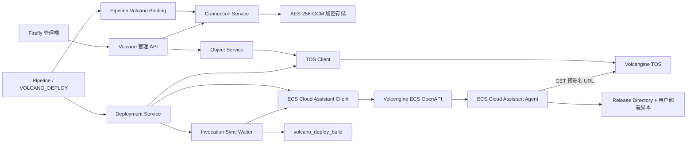

# Firefly Volcano 模块最小技术设计

> 状态：Implementation Ready（最小 MVP）
> 版本：v2.0-minimal
> 日期：2026-09-16
> 目标代码库：Firefly（Java 25、Spring Boot 3.5、Maven 多模块）

## 1. 背景与范围

当前仓库没有独立的 `firefly-volcano` 模块，已有火山相关代码只保存和传递明文 AK/SK，不调用
TOS/ECS OpenAPI。本次只实现 Volcano 部署最小闭环：

1. 凭据加密保存；
2. TOS 制品列举、元数据查询和预签名 GET；
3. ECS 云助手 `RunCommand` 部署；
4. 手动执行 Pipeline 时选择具体制品。

### 1.1 本次必须实现

- 新建 `firefly-volcano` Maven 模块和 Spring Boot 自动装配。
- Pipeline 级 Volcano Connection，AK/SK 使用 AES-256-GCM 加密落库。
- TOS 对象列表、`HeadObject`、预签名 GET URL。
- ECS 实例列表、云助手 Agent 状态检查、`RunCommand`、`DescribeInvocations`、
  `DescribeInvocationResults`。
- Pipeline Plugin 类型 `VOLCANO_DEPLOY`。
- 手动执行时，从 Job 配置的 TOS Prefix 当前层选择最近 10 个制品之一。
- 后端对选中对象执行一次 `HeadObject`，生成不可变制品快照。
- ECS 从预签名 URL 直拉制品，校验 SHA-256，完成 `TAR_GZ`/`ZIP`/`FILE` 准备后执行用户部署脚本。
- 部署 worker 调用 `RunCommand` 后在本地同步等待云助手终态；等待超时直接置 `TIMEOUT`，后台不运行轮询 Scheduler。

### 1.2 明确不做

- 不自动重试、不自动恢复、不自动重派部署；等待超时直接置 `TIMEOUT`，之后 Firefly 不再自动查询。
- 不提供 Pipeline Retry、部署停止、取消或回滚。
- 不实现 TOS 结果对象、结果 Bucket、TOS 事件通知、结果 Kafka、Result Inbox、Deadline Reconciler。
- 不实现健康检查脚本、`rollbackScript`、`CUSTOM_FULL_SCRIPT`。
- 不实现 Firefly 本地流式下载/大文件断点续传。
- 不实现 `STS_SESSION`、`STS_ASSUME_ROLE`、凭据轮换和自动刷新。
- 不实现全仓库 NOT NULL 迁移；只保证 Volcano 新表字段全部 `NOT NULL`。
- 不支持 Windows ECS、多实例滚动发布、自动触发。
- 不承诺停止已派发的 Once 命令。

## 2. 核心设计决策

### 2.1 模块分层

`firefly-volcano` 只放火山协议适配和 Spring Boot 自动装配，不依赖 `firefly-app`；
数据库、Pipeline、Plugin、任务调度和管理 API 放在 `firefly-app`。该边界与现有
`firefly-github` 保持一致。

### 2.2 凭据加密，不嵌入 Pipeline JSON

Pipeline 创建时建立 Pipeline 级 Volcano Binding。Connection 密文只保存 AK/SK，
Pipeline、Job 的 `plugin_raw`、Kafka 消息和查询响应只保存 Connection 引用或脱敏信息。

### 2.3 ECS 直拉 TOS 制品

Firefly 不下载制品后再上传 ECS，而是：

1. Firefly 用 Connection 的 AK/SK 调 `HeadObject` 锁定版本；
2. Firefly 生成短期、只允许 `GET` 指定对象的预签名 URL；
3. Firefly 调 `RunCommand` 执行可信 Bootstrap；
4. ECS 在本地下载、校验、解压和部署。

### 2.4 使用 `RunCommand` + 同步等待，不引入 Command Revision

最小版本不创建和回收云端自定义命令，直接使用 `RunCommand` 提交渲染后的 Bootstrap。
每个部署由独立部署 executor 同步调用 `DescribeInvocations` 查询任务状态，终态后调用
`DescribeInvocationResults` 取退出码和输出；不存在后台 Scheduler、轮询表和自动恢复。

`RunCommand` 的 SDK 自动重试和 HTTP 自动重试必须显式关闭，业务层只发起一次请求。
响应丢失时按 `TIMEOUT` 处理，不重新提交。

`RunCommand` 允许提交任意命令内容，IAM 无法限制到某个已持久化命令版本。本设计接受这一
取舍：脚本只能由部署管理员配置，所有脚本修改、审批和运行 Hash 必须写审计；如果后续要
收紧 IAM，再切换为 `CreateCommand` + `InvokeCommand`。

### 2.5 手动选择制品

`VOLCANO_DEPLOY` Job 只保存制品范围：`Region + Bucket + Prefix`。具体对象只能在
手动执行时选择，后端对选中对象重新 `HeadObject` 并生成快照，配置层不保存具体 Key。

### 2.6 无自动重试

任何失败都只写终态：

- TOS/ECS 调用失败：部署失败；
- `RunCommand` 失败：部署失败；
- 云助手终态非 0：部署失败；
- 同步等待超过截止时间：直接标记 `TIMEOUT`，不继续查询、不重发；
- 用户要重来：重新发起一次手动执行。

系统不自动重发 `RunCommand`，不自动创建新 Attempt，不自动重放任何消息。

## 3. 总体架构



## 4. Maven 模块

根 `pom.xml` 增加：

```xml
<modules>
    <module>firefly-github</module>
    <module>firefly-volcano</module>
    <module>firefly-app</module>
</modules>
```

`firefly-app/pom.xml` 增加对 `firefly-volcano` 的依赖。

`firefly-volcano/pom.xml`：

```xml
<dependencyManagement>
    <dependencies>
        <dependency>
            <groupId>com.volcengine</groupId>
            <artifactId>volcengine-java-sdk-bom</artifactId>
            <version>${volcengine.openapi.sdk.version}</version>
            <type>pom</type>
            <scope>import</scope>
        </dependency>
    </dependencies>
</dependencyManagement>

<dependencies>
    <dependency>
        <groupId>com.volcengine</groupId>
        <artifactId>ve-tos-java-sdk</artifactId>
        <version>${volcengine.tos.sdk.version}</version>
    </dependency>
    <dependency>
        <groupId>com.volcengine</groupId>
        <artifactId>volcengine-java-sdk-ecs</artifactId>
    </dependency>
    <dependency>
        <groupId>org.springframework.boot</groupId>
        <artifactId>spring-boot-autoconfigure</artifactId>
    </dependency>
    <dependency>
        <groupId>org.springframework.boot</groupId>
        <artifactId>spring-boot-starter-test</artifactId>
        <scope>test</scope>
    </dependency>
</dependencies>
```

包结构：

```text
firefly-volcano/src/main/java/firefly/volcano
├── api
│   ├── VolcanoObjectStorageClient.java
│   └── VolcanoEcsCommandClient.java
├── auth
│   └── VolcanoCredentials.java
├── config
│   ├── FireflyVolcanoAutoConfiguration.java
│   └── VolcanoClientProperties.java
├── ecs
│   └── VolcengineEcsCommandClient.java
├── tos
│   └── VolcengineTosObjectStorageClient.java
└── error
    ├── VolcanoIntegrationException.java
    └── VolcanoErrorCode.java
```

## 5. 公共接口

### 5.1 对象存储

```java
public interface VolcanoObjectStorageClient extends AutoCloseable {
    ObjectPage listObjects(ListObjectsCommand command);

    ObjectMetadata headObject(HeadObjectCommand command);

    PresignedDownload presignGet(PresignGetCommand command);
}
```

- `ListObjectsCommand`：bucket、prefix、delimiter、maxKeys、continuationToken。
- `HeadObjectCommand`：bucket、key、可选 versionId。
- `PresignGetCommand`：bucket、key、versionId/etag、过期时间。
- `PresignedDownload.toString()` 只输出过期时间，不输出 URL。
- 对象 Key 是不透明字符串，禁止转成本地路径或使用 `Path.resolve(key)`。

### 5.2 ECS 云助手

```java
public interface VolcanoEcsCommandClient {
    InstancePage listInstances(ListInstancesCommand command);

    EcsInstance describeInstance(DescribeInstanceCommand command);

    CloudAssistantStatus describeCloudAssistant(DescribeCloudAssistantCommand command);

    RunCommandResult runCommand(RunCommand command);

    InvocationStatus describeInvocation(DescribeInvocationCommand command);

    InvocationResult describeInvocationResult(DescribeInvocationResultCommand command);
}
```

- `RunCommand` 输入：InstanceId、命令正文、工作目录、`runAsUser`、超时、InvocationName、
  Tag。
- `DescribeInvocations` 只用于查询任务级状态，取 InvocationId、InvocationStatus 等字段；
  不在这里读取 ExitCode/Output。
- 任务到达终态后调用 `DescribeInvocationResults`，按 InvocationId + InstanceId 查询每个
  实例的 ExitCode 和 Output；单实例 MVP 取目标实例结果。
- 两个查询接口的响应都必须白名单映射，丢弃 `CommandContent`、`Parameters` 等可能包含
  预签名 URL 的字段。
- 不提供 `StopInvocation`、`CreateCommand`、`DeleteCommand`。

### 5.3 错误转换

SDK 异常统一转成 `VolcanoIntegrationException`，包含 Firefly 错误码、HTTP 状态、Provider
错误码、RequestId 和是否可重试标记。日志不输出 AK、SK、Authorization、预签名 URL、
完整命令正文中的 URL 或命令参数。

## 6. 凭据管理

### 6.1 Connection 模型

```sql
CREATE TABLE `firefly`.`volcano_connection`
(
    `id`                      BIGINT(20) NOT NULL AUTO_INCREMENT,
    `public_id`               VARCHAR(64) NOT NULL,
    `connection_name`         VARCHAR(128) NOT NULL,
    `credential_type`         VARCHAR(32) NOT NULL DEFAULT 'STATIC_AK_SK',
    `credential_ciphertext`   TEXT NOT NULL,
    `credential_nonce`        VARBINARY(32) NOT NULL,
    `encryption_key_version`  VARCHAR(64) NOT NULL,
    `default_region`          VARCHAR(64) NOT NULL,
    `tos_endpoint`            VARCHAR(512) NOT NULL DEFAULT '',
    `ecs_endpoint`            VARCHAR(512) NOT NULL DEFAULT '',
    `status`                  VARCHAR(32) NOT NULL DEFAULT 'ACTIVE',
    `created_at`              DATETIME(6) NOT NULL,
    `updated_at`              DATETIME(6) NOT NULL,
    PRIMARY KEY (`id`),
    UNIQUE INDEX `uidx_volcano_connection_public` (`public_id`),
    UNIQUE INDEX `uidx_volcano_connection_name` (`connection_name`)
);
```

`credential_ciphertext` 明文结构：

```json
{
  "schemaVersion": 1,
  "accessKeyId": "AKLT...",
  "secretAccessKey": "..."
}
```

### 6.2 加密要求

- AES-256-GCM，每次写入生成新的 12 字节随机 Nonce。
- 环境变量 `VOLCANO_ENCRYPTION_KEY` 是 Base64 编码的 32 字节密钥。
- AAD 绑定 `public_id + "volcano-credential" + encryption_key_version`。
- API 返回 Connection 时只返回 `accessKeyIdMask`，例如 `AKLT****82KD`。
- 新建/修改 DTO 禁止 Lombok `@Data`/`@ToString`，显式实现脱敏 `toString()`。
- 本次不做凭据轮换、STS/AssumeRole、Connection 自动校验；后续扩展时新增字段或新表。

### 6.3 Pipeline Binding

```sql
CREATE TABLE `firefly`.`volcano_pipeline_binding`
(
    `id`             BIGINT(20) NOT NULL AUTO_INCREMENT,
    `pipeline_id`    BIGINT(20) NOT NULL,
    `connection_id`  BIGINT(20) NOT NULL,
    `default_region` VARCHAR(64) NOT NULL,
    `created_at`     DATETIME(6) NOT NULL,
    `updated_at`     DATETIME(6) NOT NULL,
    PRIMARY KEY (`id`),
    UNIQUE INDEX `uidx_volcano_binding_pipeline` (`pipeline_id`),
    INDEX `idx_volcano_binding_connection` (`connection_id`)
);
```

Pipeline 查询只返回 Connection 引用、名称、`credentialType`、脱敏 AK 和默认 Region。

## 7. TOS 制品能力

### 7.1 对象列表和元数据

管理 API：

| 方法 | 路径 | 说明 |
| --- | --- | --- |
| `GET` | `/api/volcano/connections/{id}/tos/objects` | Bucket/Prefix 分页列举 |
| `GET` | `/api/volcano/connections/{id}/tos/object-metadata` | 查询单个对象元数据 |

Query Parameter 传递 `bucket`、`key`、`region`、`versionId`。

### 7.2 手动选择“最近 10 个制品”

```http
GET /api/volcano/pipelines/{pipelineId}/jobs/{jobUuid}/artifacts/recent?limit=10
```

规则：

- Connection 从 Pipeline Binding 解析，Region/Bucket/Prefix 从 Job 配置解析。
- `delimiter=/`，只返回 Prefix 当前层对象。
- 排除目录占位对象、0 字节对象和不支持的扩展名。
- 按 `LastModified` 倒序、Key 正序排序，最多返回 10 条。
- 返回 `key`、`size`、`lastModified`、`etag`、`displayName`；此阶段不返回 SHA-256。
- 后端最多扫描 10000 个对象，超出返回 `ARTIFACT_SCAN_LIMIT_EXCEEDED`，不返回不完整结果。
- 前端只回传选中 `key` 和可选 `versionId`；后端按扩展名推断 `handling`，不接受客户端
  提交的 ETag、大小、SHA 或 handling。

### 7.3 选中对象快照

用户提交手动执行后，后端按 Job 配置重新校验 Key 仍在 Prefix 当前层内，然后：

1. 调用 `HeadObject` 获取 VersionId、ETag、大小、LastModified 和自定义元数据；
2. 从 `x-tos-meta-firefly-sha256` 读取 SHA-256；
3. SHA-256 必须存在且为 64 位小写十六进制，否则拒绝部署；
4. 按扩展名推断 `artifact_handling`：`.tar.gz`/`.tgz` -> `TAR_GZ`，`.zip` -> `ZIP`，
   其他 -> `FILE`；
5. 生成不可变快照并写入 `volcano_artifact_selection`。

### 7.4 手动执行的创建顺序

`POST /manual_trigger/pipeline` 的每个 Volcano Job 输入只包含选中的 `key`、可选
`versionId`，后端按以下顺序处理：

1. 解析 Pipeline Binding、Job 配置、Prefix 和允许的制品范围；
2. 在数据库事务外调用 `HeadObject`，校验 Key 仍在 Prefix 当前层、读取 VersionId/ETag/
   大小/LastModified/SHA-256；
3. 开启一个数据库建单事务：
   - 创建 `PipelineBuild` 并 flush 获取 ID；
   - 按现有流程创建 `StageBuild`、`JobBuild`；
   - 为每个 Volcano Job 插入 `volcano_artifact_selection`，同时写入
     `pipeline_build_id`、`job_config_id` 和制品快照；
   - 调用 `VolcanoDeployPluginBuildService.savePluginBuild()`，只创建 Plugin Build
     本身，不创建 `volcano_deploy_build`；此阶段不调云 API、不注册派发回调；
   - 提交事务；
4. `JobBuildContext` 增加 `artifactSelectionId`，Plugin Build 从选择快照解析它；
5. 只有 DAG 调度到该 Job、`MessageCenter.onJobMessage()` 调用
   `executePluginBuild()` 时，才创建 `volcano_deploy_build=PENDING`、生成执行快照并登记
   部署回调；前置 Job 未成功时既不会创建部署记录，也不会发生 `RunCommand`。

请求示例（只包含选择一个 Volcano Job 的情况）：

```json
{
  "pipelineId": 1001,
  "uuid": "<64-char-request-uuid>",
  "triggerModel": "MANUAL",
  "triggerMatch": "ACCURATE",
  "triggerOrigin": "VOLCANO",
  "jobInputs": {
    "<64-char-volcano-job-uuid>": {
      "artifact": {
        "key": "order-service/releases/order-service-1.8.2.tar.gz",
        "versionId": null
      }
    }
  }
}
```

任一 HeadObject 校验失败时不创建 Pipeline Build，也不留下孤立选择记录。

### 7.5 预签名 GET

- 制品 Bucket 保持私有。
- TTL 默认 10 分钟，覆盖云助手排队和 ECS 下载时间，不需要覆盖整个部署命令时长。
- 同时设置 VersionId 或 `If-Match`，避免同名对象在部署中被覆盖。
- 预签名 URL 只出现在渲染后的命令中，不落 Firefly 日志、数据库、Kafka 或 API 响应。

## 8. ECS 部署

### 8.1 前置条件

- ECS 处于 `RUNNING`，已安装且在线运行云助手 Agent。
- 目标机存在 allowlist 内的 `runAsUser`，本次默认 `firefly-deploy`，默认禁止 `root`。
- 目标机安装 `curl`、`sha256sum`、`flock`，按包类型安装 `tar` 或 `unzip`。
- ECS 能访问制品 TOS Endpoint，优先使用同 Region 内网或 VPC Endpoint。
- 目标机时钟同步，命令超时使用相对时长。

### 8.2 实例选择

```http
GET /api/volcano/pipelines/{pipelineId}/ecs/instances
    ?region=cn-beijing
    &projectName=production
    &status=RUNNING
    &pageNumber=1
    &pageSize=50
```

后端调用 `DescribeInstances`，再批量调用 `DescribeCloudAssistantStatus`，只展示：

- `RUNNING` 的 Linux 实例；
- 云助手 Agent 在线；
- InstanceId、Project、VPC/Tag 满足管理员 allowlist。

保存目标使用 `Region + InstanceId`，私网 IP、VPC、Zone 只做审计快照和执行前一致性检查。

### 8.3 Plugin 配置

`PluginType` 增加 `VOLCANO_DEPLOY`。配置示例：

```json
{
  "artifactSource": {
    "tosUri": "tos://firefly-artifacts/order-service/releases/",
    "region": "cn-beijing",
    "bucket": "firefly-artifacts",
    "prefix": "order-service/releases/",
    "currentLevelOnly": true
  },
  "target": {
    "region": "cn-beijing",
    "instanceId": "i-yc...",
    "instanceNameSnapshot": "order-prod-01",
    "privateIpSnapshot": "10.0.12.34",
    "vpcIdSnapshot": "vpc-xxx",
    "zoneIdSnapshot": "cn-beijing-a"
  },
  "destination": {
    "applicationName": "order-service",
    "deployRoot": "/opt/firefly/apps",
    "runAsUser": "firefly-deploy"
  },
  "execution": {
    "deployScript": "sudo -n systemctl restart order-service.service",
    "commandTimeoutSeconds": 900
  }
}
```

- Connection 只能从 Pipeline Binding 解析。
- Job 配置不保存具体 Object Key、VersionId、ETag、大小或 SHA。
- 采用唯一目录布局：`<deployRoot>/<applicationName>/releases/<deploymentId>/`。
- `deployRoot` 必须位于管理员配置的 `allowed-deploy-roots` 内。
- `runAsUser` 必须来自 `allowed-run-as-users`。
- 路径校验禁止 `..`、NUL、控制字符和符号链接逃逸。
- `deployScript` 必填，UTF-8、无 NUL。
- 不支持 `FIXED_FILE`、`rollbackScript`、健康检查和 `CUSTOM_FULL_SCRIPT`。

### 8.4 Bootstrap 执行步骤

Firefly 在派发时把 Bootstrap 与用户脚本渲染成一条 Bash：

1. `set -Eeuo pipefail`、`umask 027`；
2. 校验 `deploymentId`、路径和时长配置；
3. `flock -n` 获取应用级部署锁；
4. 在目标目录创建 `0700` 临时目录；
5. 使用 `curl --fail --location` 下载预签名 URL；
6. 校验大小和 SHA-256；
7. `TAR_GZ`/`ZIP` 列出成员，拒绝绝对路径、`..`、设备文件和越界符号链接后解压；
8. `FILE` 按安全文件名放入发布目录；
9. 原子 rename 到 `<deployRoot>/<applicationName>/releases/<deploymentId>`；
10. 注入稳定环境变量，执行用户 `deployScript`；
11. 退出码即命令退出码。

稳定环境变量：

```text
FIREFLY_DEPLOYMENT_ID
FIREFLY_APPLICATION_NAME
FIREFLY_ARTIFACT_PATH
FIREFLY_RELEASE_DIR
FIREFLY_DESTINATION_PATH
FIREFLY_CURRENT_LINK
FIREFLY_PREVIOUS_RELEASE
```

用户在脚本中自行切换 `current` 软链、重启服务或更新容器。Firefly 不假设 systemd。

### 8.5 命令正文大小与 URL

- 渲染后命令正文编码前不得超过云助手限制，默认阈值 16 KiB。
- 预签名 URL 直接作为 shell 变量写入命令正文，渲染时必须做单引号转义并校验 `https` 与 TOS Host。
- Firefly 不持久化完整命令正文，不打印 URL；Cloud Assistant 侧保存的 Invocation 内容由厂商管理。
- ECS 拉取制品后，URL 即可失效，不影响后续部署步骤。

## 9. 持久化设计

### 9.1 部署配置

```sql
CREATE TABLE `firefly`.`volcano_deploy_config`
(
    `id`                      BIGINT(20) NOT NULL AUTO_INCREMENT,
    `job_config_id`           BIGINT(20) NOT NULL,
    `region`                  VARCHAR(64) NOT NULL,
    `bucket_name`             VARCHAR(255) NOT NULL,
    `artifact_prefix`         VARCHAR(2048) NOT NULL,
    `current_level_only`      TINYINT(1) NOT NULL DEFAULT 1,
    `instance_id`             VARCHAR(128) NOT NULL,
    `instance_name_snapshot`  VARCHAR(255) NOT NULL DEFAULT '',
    `private_ip_snapshot`     VARCHAR(64) NOT NULL DEFAULT '',
    `vpc_id_snapshot`         VARCHAR(128) NOT NULL DEFAULT '',
    `zone_id_snapshot`        VARCHAR(128) NOT NULL DEFAULT '',
    `application_name`        VARCHAR(64) NOT NULL,
    `deploy_root`             VARCHAR(512) NOT NULL,
    `run_as_user`             VARCHAR(64) NOT NULL,
    `deploy_script`           TEXT NOT NULL,
    `deploy_script_sha256`    CHAR(64) NOT NULL,
    `command_timeout_seconds` INT NOT NULL,
    `created_by`              VARCHAR(128) NOT NULL,
    `updated_by`              VARCHAR(128) NOT NULL,
    `approved_by`             VARCHAR(128) NOT NULL DEFAULT '',
    `approved_at`             DATETIME(6) NOT NULL DEFAULT '1970-01-01 00:00:00.000000',
    `created_at`              DATETIME(6) NOT NULL,
    `updated_at`              DATETIME(6) NOT NULL,
    PRIMARY KEY (`id`),
    UNIQUE INDEX `uidx_volcano_deploy_config_job` (`job_config_id`),
    INDEX `idx_volcano_deploy_config_target` (`region`, `instance_id`)
);
```

### 9.2 制品选择

```sql
CREATE TABLE `firefly`.`volcano_artifact_selection`
(
    `id`                   BIGINT(20) NOT NULL AUTO_INCREMENT,
    `public_id`            VARCHAR(64) NOT NULL,
    `pipeline_build_id`    BIGINT(20) NOT NULL,
    `job_config_id`        BIGINT(20) NOT NULL,
    `region`               VARCHAR(64) NOT NULL,
    `bucket_name`          VARCHAR(255) NOT NULL,
    `object_key`           VARCHAR(2048) NOT NULL,
    `object_version_id`    VARCHAR(512) NOT NULL DEFAULT '',
    `object_etag`          VARCHAR(512) NOT NULL,
    `object_sha256`        CHAR(64) NOT NULL,
    `object_size`          BIGINT NOT NULL,
    `object_last_modified` DATETIME(6) NOT NULL,
    `artifact_handling`    VARCHAR(32) NOT NULL,
    `selected_by`          VARCHAR(128) NOT NULL,
    `selected_at`          DATETIME(6) NOT NULL,
    `created_at`           DATETIME(6) NOT NULL,
    `updated_at`           DATETIME(6) NOT NULL,
    PRIMARY KEY (`id`),
    UNIQUE INDEX `uidx_volcano_artifact_selection_public` (`public_id`),
    UNIQUE INDEX `uidx_volcano_artifact_selection_build_job`
        (`pipeline_build_id`, `job_config_id`)
);
```

### 9.3 部署执行

```sql
CREATE TABLE `firefly`.`volcano_deploy_build`
(
    `id`                    BIGINT(20) NOT NULL AUTO_INCREMENT,
    `public_id`             VARCHAR(64) NOT NULL,
    `plugin_id`             BIGINT(20) NOT NULL,
    `job_build_id`          BIGINT(20) NOT NULL,
    `artifact_selection_id` BIGINT(20) NOT NULL,
    `deploy_script_sha256`  CHAR(64) NOT NULL,
    `execution_config_sha256` CHAR(64) NOT NULL,
    `execution_snapshot_json` JSON NOT NULL,
    `approved_by`           VARCHAR(128) NOT NULL DEFAULT '',
    `approved_at`           DATETIME(6) NOT NULL DEFAULT '1970-01-01 00:00:00.000000',
    `status`                VARCHAR(32) NOT NULL DEFAULT 'PENDING',
    `invocation_id`         VARCHAR(128) NOT NULL DEFAULT '',
    `exit_code`             INT NOT NULL DEFAULT -1,
    `output_excerpt`        VARCHAR(8192) NOT NULL DEFAULT '',
    `error_code`            VARCHAR(64) NOT NULL DEFAULT '',
    `error_message`         VARCHAR(2048) NOT NULL DEFAULT '',
    `dispatched_at`         DATETIME(6) NOT NULL DEFAULT '1970-01-01 00:00:00.000000',
    `finished_at`           DATETIME(6) NOT NULL DEFAULT '1970-01-01 00:00:00.000000',
    `created_at`            DATETIME(6) NOT NULL,
    `updated_at`            DATETIME(6) NOT NULL,
    PRIMARY KEY (`id`),
    UNIQUE INDEX `uidx_volcano_deploy_build_public` (`public_id`),
    UNIQUE INDEX `uidx_volcano_deploy_build_job` (`job_build_id`),
    UNIQUE INDEX `uidx_volcano_deploy_build_selection` (`artifact_selection_id`),
    INDEX `idx_volcano_deploy_build_status` (`status`, `dispatched_at`)
);
```

- 所有时间按 UTC 保存；API 将 `1970-01-01` 和 `exit_code=-1` 映射为未发生/未知。
- 一个 `job_build_id` 只允许一个 `volcano_deploy_build`，失败后不自动创建第二个。
- `invocation_id=''` 表示尚未拿到云助手 InvocationId，不参与任何云 API 查询。
- `volcano_deploy_build` 只在 DAG 调度到该 Job、调用 `executePluginBuild()` 时创建，
  因此上游失败不会留下未执行的 `PENDING` 记录。
- 创建部署记录时，从 `volcano_deploy_config` 生成 `execution_snapshot_json`，包含脚本正文、
  脚本 Hash、目标 InstanceId、部署路径、`runAsUser`、命令超时和
  `approved_by`/`approved_at`，但不包含预签名 URL。
- `execution_config_sha256` 是 `execution_snapshot_json` 的规范 Hash；`deploy_script_sha256`
  和审批字段同时以独立列冗余保存。快照在 DAG 调度时生成，之后配置表被修改不会改变已创建
  部署的执行内容和审计。
- 部署 executor 只使用 `execution_snapshot_json`，不读取可能已被修改的
  `volcano_deploy_config`。
- 不创建 `volcano_deployment_attempt`、`volcano_command_revision`、结果 Inbox 等表。
- 不持久化包含预签名 URL 的完整命令正文。

## 10. 状态机、事务与同步等待

状态：

```text
PENDING -> RUNNING -> SUCCESS
                  -> FAILURE
                  -> TIMEOUT
```

- `PENDING`：部署记录已创建，尚未拿到云助手 InvocationId。
- `RUNNING`：`RunCommand` 已返回 InvocationId，部署 executor 正在同步等待终态。
- `SUCCESS`：任务终态成功且 `DescribeInvocationResults.ExitCode=0`。
- `FAILURE`：`RunCommand` 明确失败，或任务终态失败且退出码非 0。
- `TIMEOUT`：同步等待超过截止时间，Firefly 不再等待。该状态不证明 ECS 进程已停止，
  也不触发后续自动查询或重发。

### 10.1 事务与线程边界

现有 `KafkaMessageProcessingTransaction.process()` 会在一个 MySQL 事务内执行
`MessageCenter` 插件处理逻辑，而 `MessageListener` 还用共享的 24 个并发许可调度处理
线程。部署流程不能在这个事务和线程里做云调用或同步等待：

1. `buildPipeline()` 的建单事务只创建 Pipeline/Stage/Job Build、Plugin Build 和制品选择；
   不创建 `volcano_deploy_build`，也不注册部署回调。
2. DAG 调度到该 Job、`MessageCenter.onJobMessage()` 调用 `executePluginBuild()` 时，在
   当前消息事务内创建 `volcano_deploy_build=PENDING` 和执行快照，并注册
   `TransactionSynchronization.afterCommit`，然后立即返回，不在消息事务内启动部署。
3. 当前消息事务提交后，`afterCommit` 把任务投递到独立 `VolcanoDeployExecutor`，不复用
   消息处理 worker 的 24 个许可。
4. 部署 executor 调 `RunCommand`、写 InvocationId、同步等待和写终态，整个等待期间不持有
   数据库事务；只使用 `executePluginBuild()` 时保存的 `execution_snapshot_json`，每次状态
   落库使用独立短事务和旧状态 CAS。
5. 终态更新 `volcano_deploy_build` 与写 Outbox 在同一个新短事务中提交。
6. `afterCommit` 投递被 executor 拒绝（队列满）时，在新事务中把 `PENDING` 置 `FAILURE`，
   不重派。
7. 前置 Job 未成功时，现有 DAG 不会调用 `executePluginBuild()`，因此不会创建部署记录、
   不会发生 `RunCommand`；不存在需要收敛的 `PENDING` 记录。

这样既不会让数据库事务跨越部署时长，也不会因为长时间等待占满消息处理许可而阻塞
Kafka poll，也不会让上游失败留下未执行的部署记录。

### 10.2 同步等待规则

1. 生成预签名 URL、渲染 Bootstrap，设置 `InvocationName=部署 public_id`；
2. 部署 executor 调用一次 `RunCommand`；
3. 成功返回 InvocationId：短事务 CAS 写入 `invocation_id`、`dispatched_at=now`，状态置
   `RUNNING`；
4. 在 `dispatched_at + commandTimeoutSeconds + syncWaitGrace` 之前循环调用
   `DescribeInvocations`，每次间隔 `statusQueryInterval`；
5. 任务终态后调用 `DescribeInvocationResults`，按目标 InstanceId 取 ExitCode/Output；
6. `ExitCode=0` 且任务成功：CAS 置 `SUCCESS`；否则置 `FAILURE`；终态与 Outbox 同事务提交；
7. 超过截止时间仍非终态：CAS 将 `volcano_deploy_build.status` 置 `TIMEOUT`，写入
   `error_code=DEPLOYMENT_TIMEOUT`，并在同一短事务写 Outbox。由于现有 `BuildStatus`
   枚举没有 `TIMEOUT`，Outbox 中 `TriggerPluginMessage.status` 使用
   `BuildStatus.FAILURE`，使 Job/Stage/Pipeline 正常进入失败终态；
   `volcano_deploy_build.status` 保持 `TIMEOUT`，后续 `updatePluginBuild()` 不得把它覆盖成
   `FAILURE`；
8. `RunCommand` 请求本身超时且没有 InvocationId：直接置 `TIMEOUT`，不重新提交；
9. `RunCommand` 明确失败：置 `FAILURE`；
10. 部署 executor 或 Firefly 崩溃时不自动恢复等待线程，也不重新查询。`PENDING`/`RUNNING`
    记录保留现场，由人工在云助手控制台核实；系统不自动补查、不自动重发。

`DescribeInvocations` 与 `DescribeInvocationResults` 返回结构可能包含 `CommandContent`、
`Parameters` 等字段，Adapter 必须使用白名单映射，只保留任务状态、退出码、输出和实例 ID。

## 11. Plugin 接入

新增类：

```text
firefly-app/src/main/java/firefly/volcano
├── config/VolcanoAppProperties.java
├── controller/VolcanoConnectionController.java
├── controller/VolcanoObjectController.java
├── controller/VolcanoDeploymentController.java
├── security/VolcanoCredentialCipher.java
├── service/VolcanoConnectionService.java
├── service/VolcanoObjectService.java
├── service/VolcanoDeployService.java
├── service/VolcanoDeployExecutor.java
├── service/VolcanoInvocationWaiter.java
├── model/...
└── dao/...

firefly-app/src/main/java/firefly/service/pluginconfig/impl/
└── VolcanoDeployPluginConfigService.java

firefly-app/src/main/java/firefly/service/pluginbuild/impl/
└── VolcanoDeployPluginBuildService.java
```

修改点：

1. `PluginType` 增加 `VOLCANO_DEPLOY`。
2. `VolcanoDeployPluginConfigService` 实现 `IPluginConfig`，保存 `volcano_deploy_config`；
   保存时校验脚本、计算并持久化 `deploy_script_sha256`，记录 `created_by`/`updated_by`，
   审批后写 `approved_by`/`approved_at`。脚本变更必须产生新的 SHA-256。
3. `PipelineBuildRequest` 增加按 Job UUID 索引的 `jobInputs`，仅包含 `key`/`versionId`。
4. `PipelineBuildServiceImpl.buildPipeline()` 在建单事务中创建 Pipeline/Stage/Job Build、
   `volcano_artifact_selection`，并调用 `savePluginBuild()` 创建 Plugin Build；不创建
   `volcano_deploy_build`；把 `artifactSelectionId` 写入 `JobBuildContext`。
5. `VolcanoDeployPluginBuildService.savePluginBuild()`：
   - 只保存 Plugin Build，不创建部署记录；
   - 不调云 API、不注册部署回调；Plugin Build 在 DAG 调度前已存在。
6. `VolcanoDeployPluginBuildService.executePluginBuild()`：
   - 只会在 DAG 调度到该 Job 时由 `MessageCenter` 调用；
   - 在当前消息事务中创建 `volcano_deploy_build=PENDING`，生成
     `execution_snapshot_json`、`deploy_script_sha256`、`execution_config_sha256` 和审批快照，
     并注册 `TransactionSynchronization.afterCommit` 回调，然后返回；
   - 事务内不调云 API、不等待；
   - 事务提交后投递到独立 `VolcanoDeployExecutor`；
   - executor 只使用本次创建的 `execution_snapshot_json`，不读取运行期间可能已变化的配置；
   - `RunCommand` 只调用一次；明确失败置 `FAILURE`，请求超时且无 InvocationId 置 `TIMEOUT`；
   - 拿到 InvocationId 后短事务 CAS 写入并进入 `RUNNING`，再调用
     `VolcanoInvocationWaiter` 同步等待；
   - 等待到终态写 `SUCCESS`/`FAILURE`，等待超时写 `TIMEOUT`；
   - 不自动重发、不自动创建新记录、不重新启动等待。
7. `VolcanoDeployExecutor` 是独立有界线程池，不复用 `MessageListener` 的 24 个处理许可；
   `VolcanoInvocationWaiter` 只在该线程内循环查询状态和结果，不是后台 Scheduler。
8. Pipeline 删除时校验不存在 `PENDING`/`RUNNING` 部署；`TIMEOUT`/`FAILURE`/`SUCCESS` 视为
   终态，可按逻辑引用顺序删除。上游未调度的 Job 本来就没有部署记录，不会阻塞删除。
9. 在 `PipelineBuildServiceImpl.retryPipeline` 修改任何状态之前，检查该 Pipeline Build 的
   Job 是否包含 `VOLCANO_DEPLOY`；包含则直接返回 `PIPELINE_RETRY_UNSUPPORTED_FOR_VOLCANO`，
   不得进入通用 Stage/Job/Build 重置逻辑。

## 12. API

| 方法 | 路径 | 说明 |
| --- | --- | --- |
| `POST` | `/api/volcano/connections` | 加密保存 AK/SK |
| `GET` | `/api/volcano/connections` | 分页查询脱敏 Connection |
| `GET` | `/api/volcano/connections/{id}` | 查询单个脱敏 Connection |
| `DELETE` | `/api/volcano/connections/{id}` | 无 Pipeline Binding 时删除 |
| `GET` | `/api/volcano/connections/{id}/tos/objects` | 列举 TOS 对象 |
| `GET` | `/api/volcano/connections/{id}/tos/object-metadata` | 查询对象元数据 |
| `GET` | `/api/volcano/pipelines/{pipelineId}/jobs/{jobUuid}/artifacts/recent` | 查询最近 10 个制品 |
| `GET` | `/api/volcano/pipelines/{pipelineId}/ecs/instances` | 查询可部署 ECS |
| `POST` | `/manual_trigger/pipeline` | 提交手动执行和 Job 制品选择 |
| `GET` | `/api/volcano/deployments` | 分页查询部署 |
| `GET` | `/api/volcano/deployments/{publicId}` | 查询详情 |

不新增 Volcano Retry API；已有 `POST /pipeline-builds/{pipelineBuildID}/retry` 必须在修改
任何状态前检查并拒绝包含 `VOLCANO_DEPLOY` 的 Build，返回
`PIPELINE_RETRY_UNSUPPORTED_FOR_VOLCANO`。不提供 `/stop`、Command Revision 查询、对象内容
下载和结果 Inbox 恢复接口。

## 13. 配置项

```yaml
firefly:
  volcano:
    storage:
      encryption-key: ${VOLCANO_ENCRYPTION_KEY:}
      key-version: ${VOLCANO_ENCRYPTION_KEY_VERSION:v1}
    tos:
      connect-timeout: ${VOLCANO_TOS_CONNECT_TIMEOUT:3s}
      read-timeout: ${VOLCANO_TOS_READ_TIMEOUT:60s}
      presign-ttl: ${VOLCANO_TOS_PRESIGN_TTL:10m}
      max-artifact-scan: ${VOLCANO_TOS_MAX_ARTIFACT_SCAN:10000}
    ecs:
      connect-timeout: ${VOLCANO_ECS_CONNECT_TIMEOUT:3s}
      read-timeout: ${VOLCANO_ECS_READ_TIMEOUT:15s}
      run-command-max-retries: ${VOLCANO_RUN_COMMAND_MAX_RETRIES:0}
      max-command-bytes: ${VOLCANO_MAX_COMMAND_BYTES:16384}
      default-run-as-user: ${VOLCANO_DEFAULT_RUN_AS_USER:firefly-deploy}
      allowed-run-as-users: ${VOLCANO_ALLOWED_RUN_AS_USERS:firefly-deploy}
      allowed-deploy-roots: ${VOLCANO_ALLOWED_DEPLOY_ROOTS:/opt/firefly/apps}
    deployment:
      status-query-interval: ${VOLCANO_STATUS_QUERY_INTERVAL:3s}
      sync-wait-grace: ${VOLCANO_SYNC_WAIT_GRACE:30s}
      executor-core-size: ${VOLCANO_DEPLOY_EXECUTOR_CORE_SIZE:4}
      executor-max-size: ${VOLCANO_DEPLOY_EXECUTOR_MAX_SIZE:8}
      executor-queue-capacity: ${VOLCANO_DEPLOY_EXECUTOR_QUEUE_CAPACITY:64}
```

- `run-command-max-retries=0`：`RunCommand` 的 SDK 自动重试和 HTTP 自动重试都关闭，
  防止云端已受理但响应丢失时重复提交。
- `executor-*`：部署 executor 独立有界，不复用消息处理 worker 的 24 个许可。

自定义 Endpoint 只允许 `https`，Host 必须在管理员 allowlist 中。

## 14. IAM 最小权限

TOS：

```text
tos:ListObjects
tos:HeadObject
tos:GetObject
tos:GetObjectVersion
```

ECS：

```text
ecs:DescribeInstances
ecs:DescribeCloudAssistantStatus
ecs:RunCommand
ecs:DescribeInvocations
ecs:DescribeInvocationResults
```

不授予 `ecs:StopInvocation`、`ecs:CreateCommand`、`ecs:DeleteCommand`。`RunCommand` 的
Resource/Tag 限制尽量收敛到目标实例和 `firefly-` Invocation 前缀；脚本编辑权限等价于目标
实例指定用户的代码执行权限，必须由管理员审批并审计。

## 15. 错误码

```text
VOLCANO_ENCRYPTION_NOT_CONFIGURED
VOLCANO_CONNECTION_NOT_FOUND
VOLCANO_CREDENTIAL_INVALID
VOLCANO_ACCESS_DENIED
VOLCANO_ENDPOINT_REJECTED
VOLCANO_PIPELINE_BINDING_NOT_FOUND
ARTIFACT_SCAN_LIMIT_EXCEEDED
TOS_OBJECT_NOT_FOUND
TOS_OBJECT_CHANGED
TOS_CHECKSUM_MISSING
TOS_URI_INVALID
ECS_INSTANCE_NOT_FOUND
ECS_INSTANCE_NOT_RUNNING
ECS_CLOUD_ASSISTANT_UNAVAILABLE
ECS_RUN_COMMAND_FAILED
ECS_COMMAND_TOO_LARGE
DEPLOYMENT_TIMEOUT
PIPELINE_RETRY_UNSUPPORTED_FOR_VOLCANO
DEPLOYMENT_PATH_INVALID
DEPLOYMENT_PATH_OUTSIDE_ALLOWLIST
DEPLOYMENT_SCRIPT_INVALID
DEPLOYMENT_DOWNLOAD_FAILED
DEPLOYMENT_CHECKSUM_MISMATCH
DEPLOYMENT_ARTIFACT_PREPARE_FAILED
DEPLOYMENT_USER_SCRIPT_FAILED
```

错误响应只返回安全错误码、RequestId 和脱敏消息，不返回凭据、URL 或完整命令正文。

## 16. 测试

### 16.1 单元测试

- 凭据加密/解密、AAD、错误密钥版本、`toString()` 不含明文。
- TOS 列表、Head、预签名 TTL、404/403/5xx/网络异常映射。
- 手动选制品 Top-10、前缀边界、客户伪造快照拒绝。
- 命令渲染大小校验、URL shell 转义和 Host allowlist。
- `DescribeInvocations` 只映射任务状态；`DescribeInvocationResults` 才映射 ExitCode/Output，
  两者互换不会误判成功。
- ECS 同步等待截止时间、`TIMEOUT` CAS、`RunCommand` 明确失败和请求超时分支。
- `execution_config_sha256` 对目标配置变化敏感，脚本变更后 `deploy_script_sha256` 改变。

### 16.2 集成测试

- Testcontainers MySQL + Fake TOS/ECS Client。
- Connection、Binding、Deploy Config、Artifact Selection 落库。
- 手动执行缺选、无 SHA、越 Prefix、非当前层被拒绝。
- `RunCommand` 成功、明确失败、请求超时无 InvocationId。
- 同步等待：终态立即返回、超时置 `TIMEOUT`、`RunCommand` 只调用一次、Outbox 幂等。
- 事务边界：`buildPipeline()` 建单事务内 Plugin Build 已存在但不创建 `volcano_deploy_build`；
  只有 DAG 调度到该 Job、`executePluginBuild()` 才创建部署记录并注册 afterCommit；等待期间
  无数据库事务；executor 不复用消息处理许可。
- 前置 Job 未成功时不会调用 `executePluginBuild()`；不存在 `volcano_deploy_build`，
  `RunCommand` 调用次数为 0，Pipeline 可以删除。
- 手动执行顺序：HeadObject 后一次事务创建 Pipeline/Stage/Job Build 和 selection；
  `JobBuildContext.artifactSelectionId` 能唯一解析，失败时不产生孤立记录。
- 部署记录使用 `execution_snapshot_json`：`executePluginBuild()` 创建快照后修改
  `volcano_deploy_config`，executor 仍按原脚本、原目标、原路径执行。
- `TIMEOUT` 时 Plugin 消息使用 `BuildStatus.FAILURE`，Job/Stage/Pipeline 能正常失败，
  但 `volcano_deploy_build.status` 保持 `TIMEOUT`，重复 `updatePluginBuild()` 不会覆盖它。
- 已有 `/pipeline-builds/{id}/retry` 在改状态前拒绝包含 `VOLCANO_DEPLOY` 的 Build。
- Pipeline/Plugin Build 创建和删除路径。

### 16.3 脚本测试

- `TAR_GZ`、`ZIP`、`FILE` 下载、校验、准备和用户脚本执行。
- 错误 SHA、错误大小、磁盘空间不足。
- 归档绝对路径、`..`、危险符号链接和设备文件被拒绝。
- 两个并发部署只能一个取得 `flock`。
- 用户脚本非零退出、超时、输出截断。

### 16.4 合同测试

- TOS Presign GET、VPC Endpoint、VersionId/If-Match。
- Cloud Assistant `RunCommand` 正文 16 KiB 限制、`DescribeInvocations` 任务状态和
  `DescribeInvocationResults` 实例退出码/输出。
- 在真实 HTTP/SDK 层注入“已受理但响应丢失”故障，验证 `RunCommand` 实际只发出一次请求，
  SDK/HTTP 自动重试为 0。
- 100 MB 以上制品直拉；无公网 IP ECS 可部署。
- 明确验证 `StopInvocation`、`CreateCommand` 权限未被授予。

最终执行：

```bash
mvn clean verify
```

## 17. 兼容与迁移

- 新建 `volcano_*` 表，全部字段 `NOT NULL`。
- 旧 `volcano_engine`、`volcano_config`、`volcano_trigger` 的明文 AK/SK 迁移不阻塞本次
  Volcano 最小闭环；新代码只写加密 Connection。
- 旧 `VOLCANO` Trigger 保留只读兼容，不再向消息或审计记录传播 AK/SK。
- 全仓库 NOT NULL 整改是独立项目，不在本最小设计范围内。

## 18. 实施顺序

1. `firefly-volcano` 模块、TOS/ECS Client、错误模型、自动装配。
2. Connection 加密存储和 Pipeline Binding。
3. TOS 列表/Head/预签名和手动选制品 API。
4. ECS 实例查询、Bootstrap 渲染、`RunCommand`。
5. `VOLCANO_DEPLOY` Plugin Config/Build 接入和同步等待。
6. 单元、集成、脚本和 Staging 合同测试。

## 19. 完成标准

- `firefly-volcano` 独立 Maven 模块，`firefly-app` 不直接引用 Vendor SDK 类型。
- AK/SK 只以 AES-256-GCM 密文落库，不出现在 Pipeline JSON、Kafka、日志或 API。
- TOS 对象可列举、Head 和预签名 GET；Firefly 不实现本地制品下载。
- 手动执行时每个 Volcano Job 必须选择一个当前层制品，后端 HeadObject 生成不可变快照。
- ECS 能从私有 TOS 直拉制品，校验 SHA-256 后执行用户部署脚本。
- `RunCommand`、同步 `DescribeInvocations` 和终态 `DescribeInvocationResults` 覆盖成功、
  失败和 `TIMEOUT`；ExitCode 来自结果接口，超时不自动查询、不自动重发。
- 部署事务与等待线程完全分离；Plugin Build 在 DAG 调度前已存在，`volcano_deploy_build`
  只在 DAG 调度时创建；前置 Job 未成功时不存在部署记录，`RunCommand` 请求次数为 0，
  Pipeline 可以删除；已有通用 Pipeline Retry 会拒绝 Volcano Build。
- 部署记录保存 `execution_snapshot_json`，快照创建后配置变更不影响已创建部署的执行和
  审计；executor 使用该快照执行。
- `TIMEOUT` 在部署记录中保留，Outbox 使用 `BuildStatus.FAILURE` 让 Pipeline 正常失败；
  重复终态更新不会把部署记录覆盖为 `FAILURE`。
- 不实现任何自动重试、自动恢复、Pipeline Retry、停止/取消/回滚和结果事件链路；等待超时只写 `TIMEOUT`。
